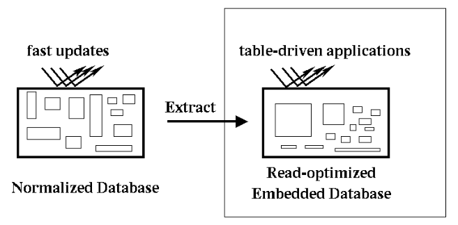
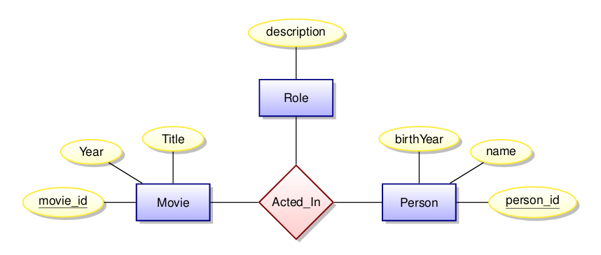
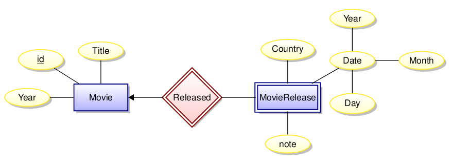
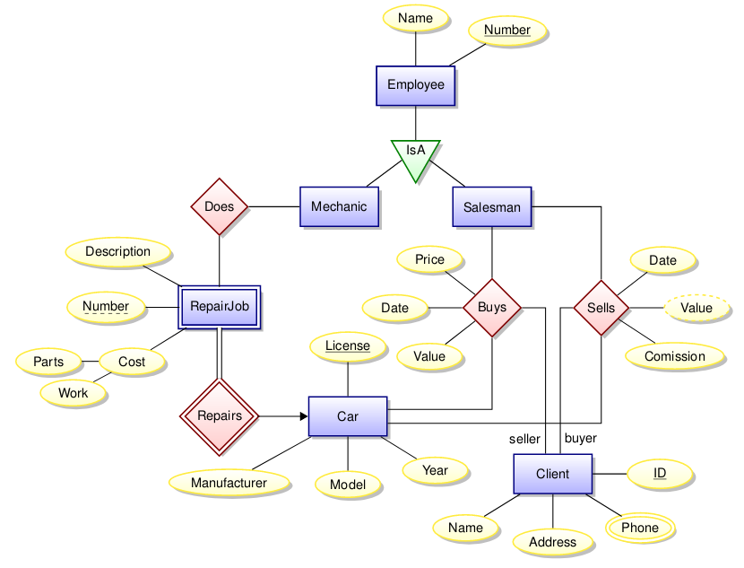
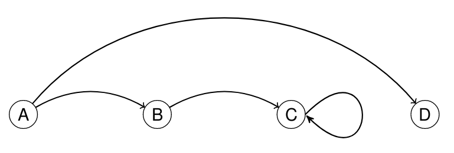
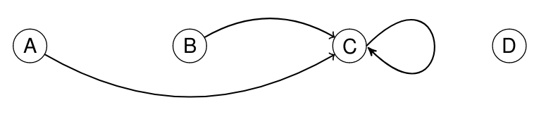
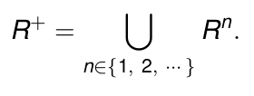

# Databases

## Reading

- Lemahieu, W., Broucke, S. van den, and Baesens, B. Principles of database management. Cambridge University Press. (2018)

## Database Management System (DBMS)

A database management system (DBMS) is a software package designed to define, manipulate, retrieve and manage data in a database. A DBMS generally manipulates the data itself, the data format, field names, record structure and file structure. It also defines rules to validate and manipulate this data.

A DBMS relieves users of framing programs for data maintenance. Query languages, such as SQL, are used along with the DBMS package to interact with a database.

### CRUD operations

The CRUD operations are the four basic functions of persistent storage.

- **Create** - Insert new data items into the database.

- **Read** - Query the database.

- **Update** - Modify objects in the database.

- **Delete** - Remove data from the database.

### ACID transactions

ACID is a set of properties of database transactions intended to guarantee validity even in the event of errors, power failures, etc.

- **Atomicity** - Either all actions of a transaction are carried out, or none are.

- **Consistency** - Every transaction applied to a valid database leaves it in a valid state.

- **Isolation** - Transactions are isolated from the effects of other concurrently executed transactions.

- **Durability** - If a transaction completes successfully, then its effects persist.

### Data Models

This course will look at 3 data models:

- Relational Model - Data is stored in tables. SQL is the main query language.
- Graph-oriented Model - Data is stored as a graph (nodes and edges). Query languages tend to have “path-oriented” capabilities.
- Aggregate-oriented Model - Also called document-oriented database. Optimised for read-oriented databases.

The relational model has been the industry mainstay for the last 35 years, but there is no one system that nicely solves all data problems.

## Redundancy

Informally, data in a database is redundant if it can be deleted and then reconstructed from the data remaining in the database.

Data redundancy is problematic for some applications, but highly desirable for others. For example, if a database supports concurrent updates, then data redundancy leads to problems, since all data relevant to one query must be locked from all the others. However, precomputing the results of common queries can greatly reduce response time.

Types of anomalies that can arise due to data redundancy:

- Insertion anomalies - How can we tell if a newly inserted record is consistent with all other records? We may want to insert a person without knowing if they are a director, or insert a movie without knowing its director(s).

- Deletion anomalies - We will wipe out information about people when the last record containing them is deleted from this table.

- Update anomalies:  What if a director’s name is misspelled? We may update it correctly for one movie but not for another.

### Read-optimised database

Situations where you might use a read-oriented database:

- Your data is seldom updated, but very often read.

- Your read-oriented database can afford to be mildly out-of-date compared to the write-oriented database. Then consider periodically extracting snapshots of the write-oriented database into the read-oriented sytem.



## Entity Relationship Diagrams (ER Diagrams)

Below is an example of an ER diagram.



- **Entities** are represented by **rectangles**. Each entity should have an `id` attribute, and maybe a few others.

- **Attributes** are represented by **ovals**. The attributes which uniquely identify an entity are called *keys*, underlined in the diagram.

- **Relationships** are represented by **diamonds**. They define some relationship between two entities, which can be one-to-one, one-to-many, many-to-one etc.

One-to-`n` relationships are represented by an arrow directed towards `n` (this can be in both directions).

### Weak entities and sub-entities

A weak entity is an entity whose existence depends on the existence of another entity. For example, the entity `Movie Release` depends on the existence of a correponding `Movie`:



Entities may also have *sub-entities*, which inherit the attributes and relationships of the parent entity, as well as having some of their own.

Below is an example of a much more developed ER diagram, based on the dynamics of a car repair shop.



## Relational Algebra (RA)

Suppose that `S` and `T` are sets. The Cartesian product `S×T`, is the set `S×T = {(s,t)|s∈S,t∈T}`. A (binary) relation over `S×T` is any set `R` with `R ⊆ S×T`.

| S   | T   |
| --- | --- |
| u   | v   |
| w   | x   |
| ... | ... |
| y   | z   |

If we have `n` sets (domains) `S1, S2, ..., Sn`, then an `n`-ary relation `R` is a set `R ⊆ S1×S2×...×Sn = {(s1,s2, ...,sn)|si∈Si}`.

| S1  | S2  | ... | Sn  |
| --- | --- | --- | --- |
| o   | p   | ... | q   |
| r   | s   | ... | t   |
| ... | ... | ... | ... |
| u   | v   | ... | w   |

In a database, we associate a name, `Ai` (called an *attribute name*) with each domain `Si`. Instead of tuples, we use records — sets of pairs each associating an attribute name `Ai` with a value in domain `Si`.

A database relation `R` is a finite set `R ⊆ {{(A1,s1),(A2,s2), ...,(An,sn)}|si∈Si}` We specify `R`’s schema as `R(A1:S1,A2:S2,···An:Sn)`. For example, a relational schema:

`Students(name: string, sid: string, age: integer)`

can be implemented like this:

```
Students = {
    {(name,Fatima),(sid,fm21),(age,20)},
    {(name,Eva),(sid,ev77),(age,18)},
    {(name,James),(sid,jj25),(age,19)}
}
```

An equivalent tabular representation:

| name   | sid  | age |
| ------ | ---- | --- |
| Fatima | fm21 | 20  |
| Eva    | ev77 | 18  |
| James  | jj25 | 19  |

### Query Language

Let `Q(R1, R2, ... Rk)` be the result of some query `Q` on a collection of relational instances, i.e. A set of tables. `Q` should return a single relational instance `Rq`.

```
Q ::=
    | R         base relation
    | σ[p](Q)   selection
    | π[X](Q)   projection
    | Q × Q     product
    | Q - Q     difference
    | Q ∪ Q     union
    | Q ∩ Q     intersection
    | ρ[M](Q)   renaming
```
- `Q` is the result of some other query.

- `p` is a simple boolean predicate over attributes values.

- `X = {A1,A2, ...,Ak}` is a set of attributes.

- `M = {A1->B1, A2->B2, ..., Ak->Bk}` is a renaming map.

A query `Q` must be *well-formed*: all column names of result are distinct. So in `Q1 × Q2`, the two sub-queries cannot share any column names; in `Q1 ∪ Q2`, the two sub-queries must share all column names.

We can translate relational algebra directly into SQL, for example:

```
Selection
RA:     σ[A>12](R)
SQL:    SELECT DISTINCT * FROM R WHERE R.A > 12;

Projection
RA:     π[B,C](R)
SQL:    SELECT DISTINCT B, C FROM R;

Renaming
RA:     ρ{B->E,D->F}(R)
SQL:    SELECT A, B AS E, C, D AS F FROM R;

Union
RA:     R ∪ S
SQL:    (SELECT * FROM R) UNION (SELECT * FROM S);

Intersection
RA:     R ∩ S
SQL:    (SELECT * FROM R) INTERSECT (SELECT * FROM S);

Difference
RA:     R-S
SQL:    (SELECT * FROM R) EXCEPT (SELECT * FROM S);

Product
RA:     R × S
SQL:    SELECT A, B, C, D FROM R CROSS JOIN S;
```

### Natural Join

Given `R(A,B)` and `S(B,C)`, we define the natural join, denoted `R ⨝ S`, as a relation over attributes `A`, `B`, `C` defined as

`R ⨝ S ≡ { t | ∃ u∈R, v∈S, u.[B] = v.[B] ∧ t = u.[A] ∪ u.[B] ∪ v.[C] }`

In the relational algebra, this can be written:

`R ⨝ S = π[A,B,C](σ[B=B′](R × ρ[B->B′](S)))`

## Implementation

Both ER entities and ER relationships are implemented as tables. The positive of this approach is that we avoid redundancy and thus update anomalies by breaking tables into smaller tables. The negative is that we have to work hard to combine information in the tables to produce interesting results.

To ensure that one of our tables is genuinely representing a relationship, we use *keys* and *foreign keys*.

### Keys

Suppose `R(X)` is a relational schema with `Z⊆X`. If for any records `u` and `v` in any instance of `R` we have `u`. `[Z] = v.[Z] => u.[X] = v.[X]`, then `Z` is a superkey for `R`. If no proper subset of `Z` is a superkey, then `Z` is a key for `R`. We underline a set of attributes to indicate that it is a key.

In a many to many relationship, the keys of both entities together form a key for the relation. In a one-to-many, or many-to-one relationship, the key of the 'many' entity is also the key of the relation. In a one-to-one relationship, the key of either entity can be used as a key for the relation.

### Foreign Keys

Suppose we have `R(Z,Y)`, where `Z` is a key for R. Furthermore, let `S(W)` be a relational schema with `Z⊆W`. We say that `Z` represents a *foreign key in `S` for `R`* if for any instance we have `π[Z](S) ⊆ π[Z](R)`.

A database is said to have *referential integrity* when each foreign key constraint is satisfied.

### Multisets

The relations in SQL actually don't operate on sets; instead, they operate on *multisets*. A multiset is similar to a set, in that the order of the elements does not matter, however in a multiset, the *amount* of each element is taken into account. So, the multiset `{0, 1}` is distinct from `{0, 0, 1}`, etc. This property is important, because aggregate functions such as `count()` and `avg()` will return different results with different amounts of each element. The `distinct` keyword in SQL is used to ignore duplicates in a mutliset, effectively converting it into a regular set:

```
// returns a multiset
SELECT a, b FROM r
    ...

// returns a set
SELECT DISTINCT a, b FROM r
    ...
```

### Database indexes

An index is a data structure created and maintained within a database system, that can greatly reduce the time needed to locate records. For example, in the implementation of a natural join, the naive method would be to simply iterate over each relation, like so:

```
// Brute force appaoch:
// scan R
for each (a, b) in R {
    // scan S
    for each (b’, c) in S {
        if b = b’ then create (a, b, c)
    }
}
```

This will run in `O(n(R)*n(S))` time, but note that for each record in `R`, there may only be a few matching records in `S`, or only one in the case where `b` represents a foreign key into `S`. An index allows the matching elements from `S` to be found much faster, like this:

```
// scan R
for each (a, b) in R {
    // use an index in S
    for each s in S-INDEX-ON-B(b) {
        create (a, b, s.c)
    }
}
```

There are many ways to implement indexes, such as search trees, hash tables, etc. but there is no SQL standard. Different distributions of SQL may use different methods, but the representation in the language is the same for each:

```
CREATE INDEX index_name ON S(B)

DROP INDEX index_name
```

Indexes can speed up read times, but it will slow down update times, so in some cases it can be helpful to store read-oriented data in a separate database optimised for that purpose.

### NULL

`NULL` is a placeholder - in contrast to C-like languages, it stands for "unknown", rather than "nothing". This means that it can be used in expressions, even though its value is unknown (although it may return `NULL` anyway). For example, The truth table for `AND` including `NULL` is this:

| `AND`  | 0 | 1      | `NULL` |
| ------ | - | ------ | ------ |
| **0**  | 0 | 0      | 0      |
| **1**  | 0 | 1      | `NULL` |
| `NULL` | 0 | `NULL` | `NULL` |

This behaviour leads to some strange results, such as `NULL = NULL -> NULL`. If you want to compare two `NULL` values, you use the `IS` keyword: `NULL IS NULL -> True`.

## Bacon Number

Kevin Bacon has Bacon number 0. Anyone acting in a movie with Kevin Bacon has Bacon number 1. For any other actor, their bacon number is calculated as follows: Look at all of the co-actors from each of the movies the actor acts in. Find the smallest Bacon number `k` among their co-actors. Then the current actor is assigned Bacon number `k + 1`.

### Relation composition

Given two binary relations `R⊆S×T` and `Q⊆T×U`, we can define their *composition* `Q◦R⊆S×U` as
```
Q◦R ≡ {(s,u) | ∃ t∈T, (s,t)∈R ∧ (t,u)∈Q}
```

A (partial) function `f∈S->T` can be thought of as a binary relation where `(s,t)∈f` if and only if `t = f(s)`. Suppose `R` is a relation where if `(s,t1)∈R` and `(s,t2)∈R`, then it follows that if `t1 = t2`, then `R` represents a partial function. Given partial functions `f∈S->T` and `g∈T->U` their composition `g◦f∈S->U` is defined by `g◦f(s) = g(f(s))`. Note that the definition of `◦` for relations and functions is equivalent for relations representing functions. Since we could write `Q◦R` as `R ⨝[2=1] Q` we can see that joins are just a generalisation of function composition.

### Directed Graphs

`G = (V,A)` is a directed graph, where `V` is a finite set of vertices (also called nodes), `A` is a binary relation over `V` (`A⊆V×V`). If the ordered pair `(u,v)∈A`, then we have an arc from `u` to `v`. The arc `(u,v)∈A` is also called a directed edge, or a *relationship of `u` to `v`*. For example, the directed graph with `V = {A,B,C,D}`, and `A = {(A,B),(A,D),(B,C),(C,C)}`, can be represented graphically:



Since `G` contains a binary relation, it can be composed with another directed graph, as long as the set of vertices `V` is the same for both. This also means that it can be composed with itself, for example `G(V, A◦A)` gives `A◦A={(A,C),(B,C),(C,C)}`, which can be drawn like this:



This new graph represents all paths of length 2 between vertices in `V`.

Suppose `R` is a binary relation over `S`: `R⊆S×S`. Define *iterated composition* as

```
R^1 ≡ R
R^(n+1) ≡ R◦R^n
```

Let `G = (V,A)` be a directed graph. Suppose `v[1],v[2],···v[k+1]` is a sequence of vertices. This sequence represents a path in `G` of length `k` when `(v[i],v[i+1])∈A, i∈{1,2,···k}`. We will often write this as `v[1]->v[2]->...->v[k]`.

### R-distance (hop count)

Suppose `s0∈π[1](R)`. The distance from `s0` to `s0` is 0. For any other `s′∈π[2](R)`, the distance from `s0` to `s′` is the least `n` such that `(s0,s′)∈R^n`.

In the case of bacon numbers, we can think of the bacon number as the R-distance where `s0` is Kevin Bacon, and R is the co-actor relation.

### Transitive Closure

Suppose `R` is a binary relation over `S`: `R⊆S×S`. The *transitive closure* of `R`, denoted `R+`, is the smallest binary relation on `S` such that `R⊆R+` and `R+` is *transitive*: `(x,y)∈R+ ∧ (y,z)∈R+ => (x,z)∈R+`. This is equivalent to:



All of our relations are finite, so there must be some `k` with `R+ = R ∪ R^2 ∪ ... ∪ R^k`, but `k` will depend on the contents of `R`. We **cannot** compute transitive closure in the Relational Algebra (or SQL without recursion). This is one of the motivations behind graph-oriented databases.

## Document-oriented database systems

A document-oriented database stores data in the form of *semi-structured objects*, e.g. XML or JSON files. Such database systems are also called *aggregate-oriented databases*.

### Semi-structured data

Semi-structured data is a data type that contains semantic tags, but does not conform to the formal structure associated with typical relational databases.

Semi-structured data is useful for transmitting information between applications, since it is highly versatile.

The purpose of document-oriented databases is to allow access to all data associated with a given key (e.g. a person_id/movie_id) with only a single database lookup. This is not possible using a relational model, since tables corresponding to different relations would have to be joined together, which may be infeasible for large tables (even using indexing), since many rows must be searched to collate all of the data.

A document-oriented database effectively consists of a key-value store, that maps a key to a block of bytes (a semi-structured object or file). The contents of this object are typically ignored by the database system - the interpretation of the data is left to the application. This style of database is highly read-optimised, containing a large amount of redundancy in exchange for very fast gathering of information.
