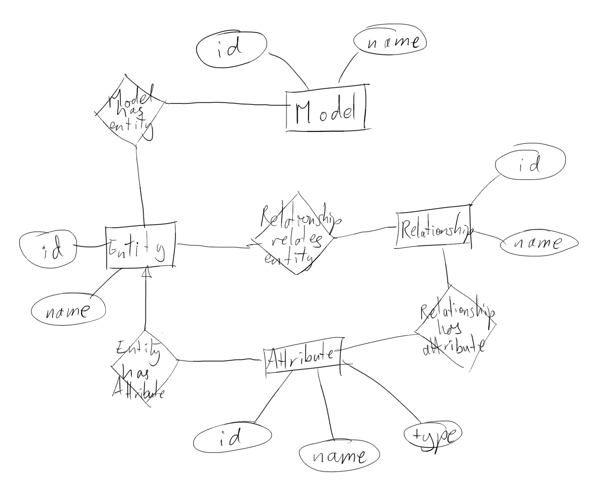

# Databases Supervision work 3

## 2019 - Paper 3 - Question 2 - Databases (tgg22)

*a) This question develops an Entity-Relationship (ER) model for a new database. The database will be called Meta-ER because it contains Entity-Relationship models! The entities of our ER model are:*

| entity name    | description                                     |
| -------------- | ----------------------------------------------- |
| `Model`        | each Model represents an ER model               |
| `Entity`       | each Entity represents an ER entity             |
| `Relationship` | each Relationship represents an ER relationship |
| `Attribute`    | each Attribute represents an attribute          |

*Each of our entities will have an `id` attribute (the primary key) and a `name` attribute. In addition, the `Attribute` entity will have a `type` attribute indicating the data type of the Attribute:*

| entity name    | attributes           |
| -------------- | -------------------- |
| `Model`        | `id`, `name`         |
| `Entity`       | `id`, `name`         |
| `Relationship` | `id`, `name`         |
| `Attribute`    | `id`, `name`, `type` |

*We start with one many-to-many relationship `ModelHasEntity` between `Model` and `Entity` that indicates which entities belong to the Model. For example, we may have a model called `MoviesModel` related to the entities presented in lecture, or a model `Trucks-R-Us` for a transportation company. `ModelHasEntity` is many-to-many to allow different models to share entities. Your task now is to complete this ER model and consider implementing it in a relational database.*



*b) Define a relationship between `Entity` and `Attribute` called `EntityHasAttribute`. What cardinality should this relationship have? Justify your answer. [2 marks]*

Many attributes to one entity, since an entity may have several attributes, but an attribute can only be associated with one entity.

*c) Define a relationship between `Relationship` and `Attribute` called `RelationshipHasAttribute`. What cardinality should this relationship have? Justify your answer. [2 marks]*

One relationship to many attributes, since a relationship may have several attributes, but each attribute must only have one relationship.

*d) Define a relationship called `RelationshipRelatesEntity` between `Relationship` and `Entity`. What cardinality should this relationship have? Justify your answer. [2 marks]*

Two entities to many relationships, since entities can be involved in several relationships, and relationships involve two entities.

*e) Should the relationship `RelationshipRelatesEntity` itself have attributes? Justify your answer. Let us assume that all of our relationships are binary. [2 marks]*

The `RelationshipRelatesEntity` relationship could have an attribute called `cardinality`, which describes the cardinality of the relationship for that entity.

*f) Describe a relational implementation of your ER model, including keys and foreign keys. [4 marks]*

Use one relation for each entity in the MetaER and its attributes, so we have relations
```
Models(m_id, name)
Entities(e_id, name)
Relationships(r_id, name)
Attributes(a_id, name, type)
```
where `m_id`, `e_id`, `r_id`, `a_id`, are keys. We can also use a relation for each relationship in the MetaER, so we have relations
```
ModelHasEntity(m_id, e_id)
EntityHasAttribute(e_id, a_id)
RelationshipHasAttribute(r_id, a_id)
RelationshipRelatesEntity(r_id, e_id)
```
where `m_id`, `e_id`, `r_id`, `a_id`, are foreign keys.

*g) Given your relational implementation, write an SQL query that takes a model name `mname` and returns all triples `ename1, rname, ename2` where `ename1` and `ename2` are names of entities in the  model `mname`, and `ename1` is related to `ename2` via the relationship with name `rname`. [8 marks]*

```
select distinct e1.name as ename1, r.name as rname, e2.name as ename2
    from models as m
    join modelHasEntity as me on me.m_id = m.m_id
    join entities as e1 on e1.e_id = me.e_id
    join relationshipRelatesEntity as re1 on re1.e_id = e.e_id
    join relationships as r on r.r_id = re1.r_id
    join relationshipRelatesEntity as re2 on re2.r_id = r.r_id
    join entities as e2 on e2.e_id = re2.e_id
where ename1 < ename2
and m.name = mname
;
```

## Extra Question

*Write an SQL/Cypher query which returns distinct pairs of movies which share maximum 5 actors.*

```
SQL:

select movie1, movie2
    from (
        select m1.title as movie1, m2.title as movie2, count(*) as total
            from movies as m1
            join actedIn as a1 on a1.mid = m1.mid
            join actedIn as a2 on a2.pid = a1.pid
            join movies as m2 on m2.mid = a2.mid
        where movie1 < movie2
        group by movie1, movie2
    )
    where total <= 5
;

Cypher:

match
    (m1: Movie)
    -[: ACTED_IN*2]-
    (m2: Movie)
return m1.name as movie1, m2.name as movie2, count(*) as nActors
group by movie1, movie2
where nActors <= 5
and movie1 < movie2
;
```
