# Combinatorial Logic

## Reading
- D. M. Harris and S. L. Harris, ‘Digital Design and Computer Architecture,’ Morgan Kaufmann, 2007 (1stEd.), 2012 (2ndEd.).
- R. H. Katz, ‘Contemporary Logic Design,’ Benjamin/Cummings, 1994.
- J. P. Hayes, ‘Introduction to Digital Logic Design,’ Addison-Wesley, 1993.
- P. Horowitz and W. Hill, ‘The Art of Electronics,’ CUP, 1989.

## Definitions
- Disjunction - `OR`
- Conjunction - `AND`
- Cover - A term is said to cover a minterm if that minterm is part of that term.
- Prime Implicant - a term that cannot be further combined
- Essential Prime Implicant - a prime implicant that covers a minterm that no other prime implicant covers
- Covering Set - a minimum set of prime implicants which includes all essential terms plus any other prime implicants required to cover all minterms

## Logic Gates

In practice, it is easier to build `NAND`/`NOR` gates rather than `AND`/`OR` gates. Logical operations can be represented using symbols, truth tables, or boolean algebra.

## Boolean Algebra
`AND` is represented by `.`  
`OR` is represented by `+`  
`NOT` is represented by a bar above the variable (here I use `!`).

Boolean Algebra is commutative, associative, distributive, and absorptive.

Commutative:
```
a + b = b + a
```
Associative:
```
(a + b) + c = a + (b + c)
```
Distributive:
```
a . (b + c) = a . b + a . c
```
Absorptive:
```
a + (a . b) = a

a . (a + b) = a
```

When simplifying Boolean expressions, it helps to expand all terms to include all variables, for example:  

Simplify `x.y + !y.z + x.z + x.y.z`.
```
x.y + !y.z + x.z + x.y.z
    = (x.y.z + x.y.!z) + (x.!y.z + !x.!y.z) + (x.y.z + x.!y.z) + (x.y.z)
    = x.y.z + x.y.!z + x.!y.z + !x.!y.z
    = x.y.(z + !z) + !y.z.(x + !x)
    = x.y + !y.z
```

## DeMorgan's Theorem
```
!(a + b + c ...) = !a . !b . !c ...

!(a . b . c ...) = !a + !b + !c ...
```
### Proof
1. For two variables, DeMorgan's Theorem can be proved using a truth table:

    | a | b | !(a + b) | !a . !b |
    | - | - | -------- | ------- |
    | 0 | 0 | 1        | 1       |
    | 0 | 1 | 0        | 0       |
    | 1 | 0 | 0        | 0       |
    | 1 | 1 | 0        | 0       |

2. Then the rest can be proved by induction:
```
!(a + b + c) = !(a + b).!c = !a.!b.!c
```

### Examples
1. Simplify `a.!b + a.!(b + c) + b.!(b + c)`
```
    a.!b + a.!(b + c) + b.!(b + c)
    = a.!b + a.!b.!c + b.!b.!c
    = a.!b + a.!b.!c
    = a.!b
```
2. Simplify `(a.b.(c + !(b.d)) + !(a.b)).c.d`
```
(a.b.(c + !(b.d)) + !(a.b)).c.d
    = (a.b.(c + !b + !d)) + !a + !b).c.d
    = (a.b.c + a.b.!b + a.b.!d + !a + !b).c.d
    = (a.b.c + a.b.!d + !a + !b).c.d
    = a.b.c.d + a.b.c.!d.d + !a.c.d + !b.c.d
    = a.b.c.d + !a.c.d + !b.c.d
    = c.d.(a.b + !a + !b)
    = c.d.(a.b + !(a.b))
    = c.d
```

### DeMorgan using gates
The following logic circuit displays `f = a.b + c.d`:

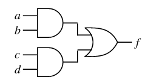

This can be simplified using "bubble logic" to give this:


## Logic Minimisation

Boolean expressions can be simplified using one of three methods:
- Algebraic manipulation
- Karnaugh maps (K-maps)
- Tabular approaches, e.g. Quine-McCluskey (Q-M)

K mapping is the preferred approach for up to 4-5 variables.

### Minterms

A minterm contains all variables (complemented or not), in *conjunction*. For example:

| x | y | z | f | minterm    |
| - | - | - | - | ---------- |
| 0 | 0 | 0 | 1 | `!x.!y.!z` |
| 0 | 0 | 1 | 1 | `!x.!y.z`  |
| 0 | 1 | 0 | 1 | `!x.y.!z`  |
| 0 | 1 | 1 | 1 | `!x.y.z`   |
| 1 | 0 | 0 | 0 |            |
| 1 | 0 | 1 | 0 |            |
| 1 | 1 | 0 | 0 |            |
| 1 | 1 | 1 | 1 | `x.y.z`    |

There is one minterm for each term of *f* that is `TRUE`

A Boolean function expressed as the disjunction (`OR`) of its minterms is called its disjunctive normal form (DNF). For example:
```
f = x.y.z + x.y.!z + x.!y.z + x.!y.!z + !x.!y.!z
```
A Boolean function expressed as the disjunction of `AND`ed variables is called Sum of Products form (SOP). For example:
```
f = !x + y.z
```

### Maxterms

A maxterm contains all variables (complemented or not) in *disjunction*. This can be derived like this from the truth table above:
```
!f = x.!y.!z + x.!y.z + x.y.!z

f = (!x + y + z).(!x + y + !z).(!x + !y + z)
```
A Boolean function expressed as the conjunction (`OR`) of its maxterms is called its conjunctive normal form (CNF), as shown above.

A Boolean function expressed as the conjunction of `OR`ed variables is called Product of Sums form (POS). For example:
```
f = (!x + y).(!x + z)
```

### SOP vs POS form
- SOP form is suitable for implementation using `AND` then `OR` gates, or only `NAND` gates.
- POS form is suitable for implementation using `OR` then `AND` gates, or only `NOR` gates.

## Karnaugh Mapping (K-maps)

Use Karnaugh (K) Mapping to simplify boolean expressions. A K-map is a rectangular array of cells. Each possible input state of the variables corresponds to one cell. For example, the truth table of *f* can be converted to the following K-map:

| x \ yz | 00 | 01 | 11 | 10 |
| ------ | -- | -- | -- | -- |
| **0**  | 1  | 1  | 1  | 1  |
| **1**  | 0  | 0  | 1  | 0  |

The exact positions of the cells on the map are not important, but note that the axis labels follow a Gray code (only one variable changes at a time).

Having plotted the minterms on the map, we then group together the `TRUE` values with as large groups as possible, like this:

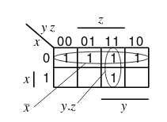

So, the simplified function is `f = !x + y.z`, as before.

### Examples

1. Plot `f = !b`.

    | ab \ cd | 00 | 01 | 11 | 10 |
    | ------- | -- | -- | -- | -- |
    | **00**  | 1  | 1  | 1  | 1  |
    | **01**  |    |    |    |    |
    | **11**  |    |    |    |    |
    | **10**  | 1  | 1  | 1  | 1  |

2. Plot `f = !b.!d`.

    | ab \ cd | 00 | 01 | 11 | 10 |
    | ------- | -- | -- | -- | -- |
    | **00**  | 1  |    |    | 1  |
    | **01**  |    |    |    |    |
    | **11**  |    |    |    |    |
    | **10**  | 1  |    |    | 1  |

3. Simplify `f = !a.b.!d + b.c.d + !a.b.!c.d + c.d`.

    | ab \ cd | 00 | 01 | 11 | 10 |
    | ------- | -- | -- | -- | -- |
    | **00**  |    |    | 1  |    |
    | **01**  | 1  | 1  | 1  | 1  |
    | **11**  |    |    | 1  |    |
    | **10**  |    |    | 1  |    |

    So
    ```
    f = !a.b + c.d
    ```
### POS Simplification
If we want the result is POS form, then we simply use maxterms instead of minterms, using a similar method as we did with maxterms above (we find the complement of the function first and then use DeMorgan).

### Examples

1. Simplify `f = !a.b + b.!c.!d`.

    | ab \ cd | 00 | 01 | 11 | 10 |
    | ------- | -- | -- | -- | -- |
    | **00**  | 0  | 0  | 0  | 0  |
    | **01**  |    |    |    |    |
    | **11**  |    | 0  | 0  | 0  |
    | **10**  | 0  | 0  | 0  | 0  |

    This can be grouped like so:
    ```
    !f = !b + a.c + a.d
    ```
    And applying DeMorgan's:
    ```
    f = b.(!a + !c).(!a + !d)
    ```

### "Don't care" conditions

In some cases, we don't care about certain outputs of a logical function, in which case they can be whatever we want. In these cases, they are represented by an `x` in the K-map, and we should group them or not depending on which is more a more efficient grouping of the important outcomes. For example, this mapping:

| ab \ cd | 00 | 01 | 11 | 10 |
| ------- | -- | -- | -- | -- |
| **00**  | x  | 1  | 1  | x  |
| **01**  |    | x  | 1  |    |
| **11**  |    |    | 1  |    |
| **10**  |    |    | 1  |    |

can be grouped as
```
f = !a.!b + c.d
OR
f = !a.d + c.d
```

## Quine-McCluskey (Q-M) Method

The Q-M method has 2 parts:

1. Use a *QM implication table* to find all the prime implicants.

2. Use a *Prime implicant chart* to find the minimum cover set.

In the following example, we are using 4 variables:
```
Minterms:
4, 5, 6, 8, 9, 10, 13

Don't care:
0, 7, 15
```

### Implication table

To begin, list groups of minterms and don't cares, grouped by number of 1s, like so:
```
[0]
0000

[1]
0100
1000

[2]
0101
0110
1001
1010

[3]
0111
1101

[4]
1111
```

Next, apply the *uniting theorem*.

### Uniting theorem

1. Compare elements in group `[0]` with all elements in group `[1]`. If they differ by a single bit, it means the terms are adjacent.

2. Adjacent terms are placed in a second column, with the bit that differs replaced by a `-`. Terms in the first column that are adjacent are marked with a `/`, because they are *not* prime implicants. Any remaining terms are marked with a `*`, because they *are* prime implicants.

    ```
    [0]     [0]
    0000/   0-00
            -000
    [1]
    0100/
    1000/   

    [2]
    0101
    0110
    1001
    1010

    [3]
    0111
    1101

    [4]
    1111
    ```

3. Repeat steps 1 and 2 for each pair of successive groups in the first column.

    ```
    [0]     [0]
    0000/   0-00
            -000
    [1]     
    0100/   [1]
    1000/   010-
            01-0
    [2]     100-
    0101/   10-0
    0110/    
    1001/   [2]
    1010/   01-1
            -101
    [3]     011-
    0111/   1-01
    1101/   
            [3]
    [4]     -111
    1111/   11-1
    ```

4. Repeat steps 1, 2, 3 for each new column generated.

    ```
    [0]     [0]     [1]
    0000/   0-00*   01--*
            -000*   
    [1]             [2]
    0100/   [1]     -1-1*
    1000/   010-/
            01-0/
    [2]     100-*
    0101/   10-0*
    0110/    
    1001/   [2]
    1010/   01-1/
            -101/
    [3]     011-/
    0111/   1-01*
    1101/   
            [3]
    [4]     -111/
    1111/   11-1/
    ```

After this process, we can see that the prime implicants are:

```
0-00
-000
100-
10-0
1-01
01--
-1-1
```
### Prime implicant chart

We now need to find the smallest number of prime implicants that will cover the function. We will use the *prime implicant chart*, which is organised like this:

|          | 4 | 5 | 6 | 8 | 9 | 10 | 13 |
| -------- | - | - | - | - | - | -- | -- |
| **0-00** | x |   |   |   |   |    |    |
| **-000** |   |   |   | x |   |    |    |
| **100-** |   |   |   | x | x |    |    |
| **10-0** |   |   |   | x |   | x  |    |
| **1-01** |   |   |   |   | x |    | x  |
| **01--** | x | x | x |   |   |    |    |
| **-1-1** |   | x |   |   |   |    | x  |

now we look for *essential* prime implicants, which are indicated by only one `x` in any column (this means there is a minterm covered by only one prime implicant). In this case, this is column `6` and column `10`, which means `01--` and `10-0` are essential.

These essential prime implicants already cover some other minterms, in this case `10-0` covers `8`, and `01--` covers `4`,`5`. This leaves only `9` and `13`, which can be covered simply by `1-01`.

So, our final minimum cover is:
```
01--    ->  !a.b
10-0    ->  a.!b.!d
1-01    ->  a.!c.d

f = !a.b + a.!b.!d + a.!c.d
```

## Binary Adders

### Half adder

Adds together two single bit binary numbers `a` and `b` (**without** carry input). The truth table for a half adder is this:

| a | b | sum | cOut |
| - | - | --- | ---- |
| 0 | 0 | 0   | 0    |
| 0 | 1 | 1   | 0    |
| 1 | 0 | 1   | 0    |
| 1 | 1 | 0   | 1    |

By inspection, we can deduce
```
sum = !a.b + a.!b = a XOR b

cOut = a.b
```

### Full adder

Adds together two single bit binary numbers `a` and `b` (**with** carry input). The truth table for a full adder is this:

| a | b | cIn | sum | cOut |
| - | - | --- | --- | ---- |
| 0 | 0 | 0   | 0   | 0    |
| 0 | 1 | 0   | 1   | 0    |
| 1 | 0 | 0   | 1   | 0    |
| 1 | 1 | 0   | 0   | 1    |
| 0 | 0 | 1   | 1   | 0    |
| 0 | 1 | 1   | 0   | 1    |
| 1 | 0 | 1   | 0   | 1    |
| 1 | 1 | 1   | 1   | 1    |

```
sum = cIn XOR a XOR b

cOut = a.b + cIn.(a + b)
    = a.b + cIn.(a XOR b)
```

### Ripple carry Adder

A ripple carry adder is just *n* full adders cascaded together. For example, a 4-bit adder looks like this:

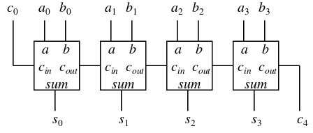

This can also be used to do subtraction, if we complement `b` and set `c0 =  1`.

The ripple carry adder introduces delays, since the carry signal must pass down the chain of adders before the full result can be calculated. This can be avoided by generating the carry signals before the addition, in a separate unit, like this:


In order to derive the logic for the *fast carry* system, we can take a closer look at how the carry signal is handled in a full adder. The rows in the truth table can be separated into 3 groups, depending on how the `cIn` signal relates to the `cOut` signal:

1. kill - `cOut` is always `0`, regardless of `cIn`

2. propagate - `cOut` is the same as `cIn`

3. generate - `cOut` is always `1`, regardless of `cIn`.

Here they are listed:

| a | b | cIn | cOut | category  |
| - | - | --- | ---- | --------- |
| 0 | 0 | 0   | 0    | kill      |
| 0 | 0 | 1   | 0    | kill      |
| 0 | 1 | 0   | 0    | propagate |
| 0 | 1 | 1   | 1    | propagate |
| 1 | 0 | 0   | 0    | propagate |
| 1 | 0 | 1   | 1    | propagate |
| 1 | 1 | 0   | 1    | generate  |
| 1 | 1 | 1   | 1    | generate  |

By observing the values of `a` and `b` for each category, we can derive variables that tell us if the operation is in each category, and start to derive the logic for the fast carry system:
```
k = !a.!b       (kill)
p = a XOR b     (propagate)
g = a.b         (generate)

Also from before, we have
cOut = a.b + cIn.(a XOR b)
OR
c[i+1] = a[i].b[i] + c[i].(a[i] XOR b[i])


So,
c[i+1] = g[i] + c[i].p[i]

c[i+2] = g[i+1] + c[i+1].p[i+1]
    = g[i+1] + p[i+1].(g[i] + c[i].p[i])
    = g[i+1] + p[i+1].g[i] + p[i+1].p[i].c[i]

c[i+3] = g[i+2] + c[i+2].p[i+2]
    = g[i+2] + p[i+2].(g[i+1] + p[i+1].g[i] + p[i+1].p[i].c[i])
    = g[i+2] + p[i+2].(g[i+1] + p[i+1].g[i]) + p[i+2].p[i+1].p[i].c[i]

c[i+4] = g[i+3] + c[i+3].p[i+3]
    = g[i+3] + p[i+3].(g[i+2] + p[i+2].(g[i+1] + p[i+1].g[i]) + p[i+2].p[i+1].p[i].c[i])
    = g[i+3] + p[i+3].(g[i+2] + p[i+2].(g[i+1] + p[i+1].g[i])) + p[i+3].p[i+2].p[i+1].p[i].c[i]
```

So, to generate `c[4]`:
```
c[4] = g[3] + p[3].(g[2] + p[2].(g[1] + p[1].g[0])) + p[3].p[2].p[1].p[0].c[0]
    = G + P.c[0]
where
G = g[3] + p[3].(g[2] + p[2].(g[1] + p[1].g[0]))
P = p[3].p[2].p[1].p[0]
```
which can be evaluated quickly.

We could generate all carries withing an adder block using the above method, however to reduce complexity we can implement 4-bit adder blocks using fast carry generation, and string them together as before. Withing each 4-bit adder, conventional ripple carry addition is used.

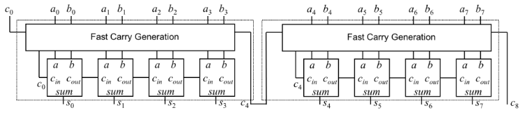

## Multilevel logic

Multilevel logic refers to logic expressions with more than 2 levels of operations, unlike SOP or POS expressions, for example, the full adder is a multilevel logic unit.

In general, all boolean expressions can be simplified to 2-level logic expressions, either in SOP or POS form. However, this is not always a good idea in practice, because of a few reasons:

- Commercially available logic gates are usually only available with 2 or 3 inputs.

- Sytem composition from sub-systems reduces design complexity, e.g. a ripple adder made from full adders. (Imagine an entire computer if it was built from 2-level logic...!)

- Multilevel logic allows boolean optimisation of multiple outputs, e.g. eliminating common sub-expressions.

###  Common expression elimination

Consider the following minimised SOP expression:

```
z = a.d.f + a.e.f + b.d.f + b.e.f + c.d.f + c.e.f + g
```

This expression contains 19 literals, and would require six 3-input `AND` gates, and one 7-input `OR` gate - a total of 7 gates when implemented with 2-level logic.

We can recursively factor out common literals:
```
z = a.d.f + a.e.f + b.d.f + b.e.f + c.d.f + c.e.f + g
    = (a.d + a.e + b.d + b.e + c.d + c.e).f + g
    = ((a + b + c).d + (a + b + c).e).f + g
    = (a + b + c).(d + e).f + g

z = x.y.z + g

where x = a + b + c, and y = d + e
```
This new 3-level form contains only 9 literals, and can be implemented with only 4 gates.

## Gate propagation delay

Because logic gates are implemented with physical electronic components, they have a finite delay before the output of a gate responds to a change in its inputs, known as *propagation delay*.

The cumulative delay of a number of gates in cascade can increase the time before the output of a combinatorial logic circuit becomes valid, for example, in the ripple carry adder, the sum will not be valid until the carry signal has rippled through all of the full adders in the chain.

As well as slowing down the operation of combinatorial logic circuits, gate delay can result in what are called *hazards* at the output.

### Hazards

Hazards are classified into two types:

1. Static hazards - The output undergoes a momnetary transition when one input changes when it is supposed to remain unchanged.

2. Dynamic hazards - The output changes more than once when it is supposed to change just once.

To visually represent hazards, we can use a *timing diagram*, which shows the logic level of the output over time. Within static hazards, there are 2 types:


Note that the timing diagrams make a few simplifications, namely:

- The signal is de-noised to produce 2 clean levels

- Transitions between logic levels are not actually instantaneous, though they are represented as if they are.

The timing diagram for a dynamic hazard looks something like this:

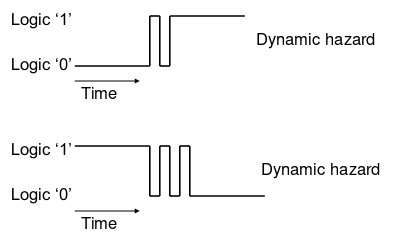

A simple example of a circuit that would produce a static hazard is a 2-to-1 multiplexer:

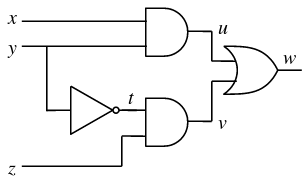

This causes a static 1 hazard if `x = z = 1`, and `y` is switched from `1` to `0`, because of the delay in the `NOT` gate.

### Hazard removal

To remove a static 1 hazard, we can use a K-map to find another term which overlaps the essential terms. for example, in the above case, the boolean expression is `w = x.y + z.!y`:

| x \ yz | 00 | 01 | 11 | 10 |
| ------ | -- | -- | -- | -- |
| **0**  |    | 1  |    |    |
| **1**  |    | 1  | 1  | 1  |

We can add the algebraically unnecessary term `x.z`, in order to create a bridge between the essential terms in the K-map. The logic circuit then becomes:

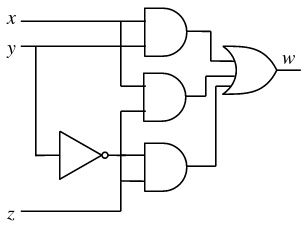

To remove a static 0 hazard, just create a bridging term for the `0`s in the K-map, rather than the `1`s. Removing dynamic hazards is not covered in the course.

## Multiplexers (mux)

A mux selects one output from several possible inputs, chosen by control inputs. If the input to a circuit can come from several places a Mux is one way to funnel the multiple sources selectively to the single ouput. A 2-to-1 mux is shown above in the hazards section, but any number of inputs is possible. A mux is typically drawn like this:

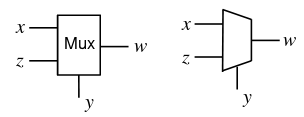

A mux can be used to implement combinatorial logic functions, for example, the expression `f = !x.!y.!z + !x.y.!z + x.y.!z + x.y.z` (written in DNF form) can be implemented using the following mux:

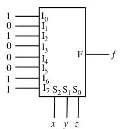

This can be simplified to a 4-to-1 mux by observing the truth table, and noting that the output `f` will always correspond to one of `z`, `!z`, `0`, or `1`:

| x | y | z | f | corresponds to |
| - | - | - | - | -------------- |
| 0 | 0 | 0 | 1 | `!z`           |
| 0 | 0 | 1 | 0 | `!z`           |
| 0 | 1 | 0 | 1 | `!z`           |
| 0 | 1 | 1 | 0 | `!z`           |
| 1 | 0 | 0 | 0 | `0`            |
| 1 | 0 | 1 | 0 | `0`            |
| 1 | 1 | 0 | 1 | `1`            |
| 1 | 1 | 1 | 1 | `1`            |

This leads to the 4-input mux:

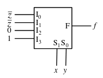

### Demultiplexers (demux)

A demux is the opposite of a mux - a single input is directed to one of several outputs, chosen by control inputs.

A similar function is a *decoder*, which is like a demux, but the input is always 1. This could be used, for example, to activate 1 of *n* logic subsystems.

We can see that each output of a 1-of-*n* decoder will correspond to a given minterm of the inputs. As a result, any logical expression in DNF form can be created by `OR`ing together the outputs which correspond to the required minterms:

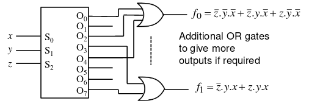

## Read Only Memory (ROM)

A ROM is a data storage device, usually only written into once, typically at manufacture. The data can be read at will, and the ROM is essentially a lookup table, where a group of *n* input lines is used to specify the address of *m*-bit data words. If `n = 4`, the ROM has `2^4 = 16` possible inputs; if `m = 4` then each location can store a 4-bit word. The total number of bits stored in the ROM is `m * 2^n`, so in this (small) example the total number of bits is 64.

Logical functions can be implemented in ROM simply by writing the minterms which correspond to the correct address inputs. If multiple boolean functions are to be implemented, the different outputs can just be written into different bytes in the word at each address.

This is reasonably efficient if lots of outputs need to be 1, but can be quite inefficient with only a few non-zero entries if the number of minterms in the function to be implemented is small. Devices which can overcome these problems are known as *programmable logic arrays*.

## Programmable logic array (PLA)

In PLAs, only the required minterms are generated using a separate AND plane. The outputs from this plane are `OR`ed together in a separate `OR` plane to produce the final outputs. The basic structure is this:

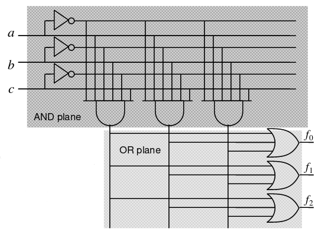

This framework can then be programmed by selectively removing connections in the `AND` and `OR` planes to leave the required logic, either using fuses or memory bits.

In a PLA, outputs from the `AND` plane are available to all `OR` gates to give the final output. Another structure known as *Programmable array logic* (PAL) (terrible naming system) does not have a programmable `OR` array, so outputs from the AND array cannot be shared among the OR gates. This is a simpler structure, but less efficient:

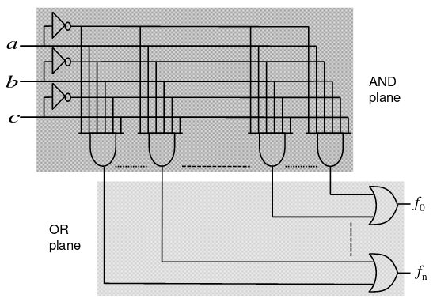

## Other Memory devices

Non-volatile storage is offered by ROMs and other technologies like FLASH. Volatile storage is offered by *Static Random Access Memory* (SRAM) = once power is removed, the data is lost.

The CPU often makes use of busses (a bunch of wires in parallel) to access external memory devices. The *address bus* is used to specify the memory location that is being read or written, and the *data bus* conveys the data to and from that location.

### Bus contention

More than one memory device will often be connected to the same data bus. In this case, if the outputs from each memory device were connected to the bus at the same time, the data read would be invalid. To solve this issue, we can use *tristate buffers*.

### Tristate Buffer

A tristate buffer is used on the data output of the memory devices. In contrast to regular buffers which have only `0` or `1` as outputs, a tristate buffer also has a *high impedance* state, which will have no effect on any other data currently on the bus. Here is a diagram:

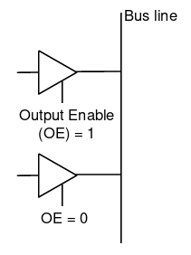

Like `Output Enable` in the tristate buffer, there are other control signals provided:

- Write enable (WE) - Determines whether data is written or read (not needed on a ROM)

- Chip select (CS) - determines if the chip is activated or not.

These signals may be active low or high, depending on the device.
