# Sequential Logic

## Definitions

- Finite State Machine (FSM) - a deterministic machine (circuit) that produces outputs which depend on its internal state and external inputs.

## Introduction

The logic circuits discussed previously are known as combinational, in that the output depends only on the *combination* of the inputs at any point in time.

Sequential logic is a type of logic where the output depends not only on the latest inputs, but also on the *sequence* of earlier inputs. These circuits implicitly contain memory elements.

## Memory elements

A memory element stores data - usually one bit per element. A snapshot of the memory is called the *state*. A one bit memory is often called a bistable, i.e. it has 2 stable internal states. *Flip-flops* and *latches* are particular implementations of bistables

### RS latch

An RS latch is a memory element with 2 inputs: `R` (reset) and `S` (set) and 2 outputs: `Q` (memory) and `!Q` (complement memory).

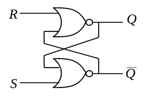

We can describe the operation of a RS Latch by using a *state transition table*, where `Q'` represents the next value of `Q`:

| `S` | `R` | `Q` | `Q'` |
| --- | --- | --- | ---- |
| 0   | 0   | 0   | 0    |
| 0   | 0   | 1   | 1    |
| 0   | 1   | 0   | 0    |
| 0   | 1   | 1   | 0    |
| 1   | 0   | 0   | 1    |
| 1   | 0   | 1   | 1    |
| 1   | 1   | 0   | `x`  |
| 1   | 1   | 1   | `x`  |

The value of `Q'` when both `R` and `S` are `1` is undefined, shown here by an `x`. We can also represent the relationship between `S`, `R` and `Q` using a *state diagram*:

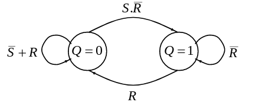

### Synchronous/Asynchronous operation

We can see that for the RS Latch, the output state changes immediately in response to the inputs. This is known as *asynchronous* operation. However, most sequential circuits use *synchronous* operation, where the output of a sequential circuit can only change when a global *enabling signal* is given. This signal is generally the system clock.

### Transparent D Latch

We can modify the RS latch so that its output can only change when it is given an enable signal. This is achieved by introducing some `AND` gates on the `R` and `S` inputs, so that they are only active when the `EN` input is `1`:

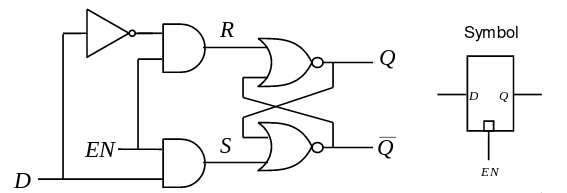

The state transition table for the transparent D latch is as follows:

| `EN` | `D` | `Q'` |
| ---- | --- | ---- |
| 0    | 0   | `Q`  |
| 0    | 1   | `Q`  |
| 1    | 0   | 0    |
| 1    | 1   | 1    |

The transparent D latch is a *level-triggered* device, meaning it exhibits transparent behaviour when `EN = 1`, but it is often simpler to design sequential circuits if they are *edge-triggered*. We can achieve this kind of operation by combining 2 transparent D latches in a *master-slave* configuration:

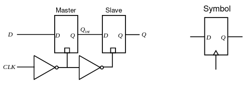

The Master-Slave configuration has now been superseded by new F-F circuits which are easier to implement and have better performance; when designing synchronous circuits it is best to use truly edge-triggered flip flop devices

### JK Flip Flop

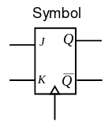

The JK flip flop is similar in function to a clocked RS flip flop, but with the undefined state - when both inputs are `1` - being replaced by a 'toggle' function. The state transition table for the JK flip flop:

| `J` | `K` | `Q'` |
| --- | --- | ---- |
| 0   | 0   | `Q`  |
| 0   | 1   | 0    |
| 1   | 0   | 1    |
| 1   | 1   | `!Q` |

### T Flip Flop

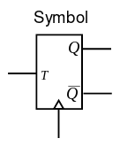

The T flip flop is essentially a JK flip flop with its inputs combined, so if the input `T` is `0`, it holds its state, and if the input is `1` it toggles (hence **T** flip flop).

| `T` | `Q'` |
| --- | ---- |
| 0   | `Q`  |
| 1   | `!Q` |

### Asynchronous inputs

It is common for flip flops to also have additional so called *asynchronous* inputs, such as clear, or set, which function independently of clock pulses. These are often used to force a synchronous circuit into a known state, say at startup.

### Timing requirements

Various timings must be satisfied if a flip flop is to operate properly:

- Setup time - the minimum duration that the data must be stable at the input before the clock edge

- Hold time: Is the minimum duration that the data must remain stable on the FF input after the clock edge

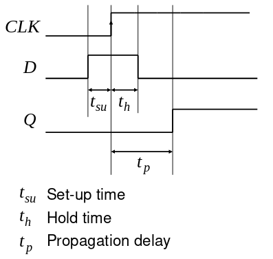

## Counters

### Ripple Counters

A ripple counter can be made be cascading together negative edge triggered T-type FFs operating in ‘toggle’ mode:

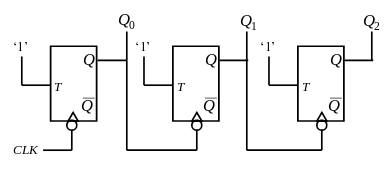

This is not a synchronous design, since the flip flops are not all connected to the same clock signal, rather each gets the signal from the previous one. This results in a timing diagram like this:

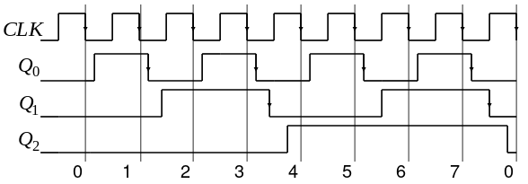

As you can see, this design is not ideal, since the outputs do not change at the same time due to propagation delay - it takes a while for the outputs to become coherent. This propagation delay stacks between each stage, limiting the maximum clock speed that will prevent miscounting.

Ignoring propagation delay, you can see that the frequency of each successive counter signal is 1/2 of the previous one, but we may want to use a counter which is not based on a power of 2, e.g. a binary coded decimal (BCD) counter. In order to achieve this, we can use flip flops that have a set/clear asynchronous input, and use an `AND` gate to detect the upper limit, and trigger the lower limit to be written into the flip flops.

### Synchronous counters

Ripple counters should not usually be used to implement counter functions; It is recommended that synchronous counter designs be used instead. In a synchronous design, all the flip flop clock inputs are directly connected to the same clock signal, so all flip flop outputs change at the same time. More complex combinational logic is also needed to generate the appropriate flip flop input signals.

#### Excitation table

An excitation table for a flip flop describes which input values are required to achieve a particular next from a given current state. The excitation table can be derived by rearranging the columns of the state transition table. For example, for a D flip flop, the excitation table is:

| `Q` | `Q'` | `D` |
| --- | ---- | --- |
| 0   | 0    | 0   |
| 0   | 1    | 1   |
| 1   | 0    | 0   |
| 1   | 1    | 1   |

Clearly for a D flip flop, `D = Q'`, but this is not generally true for other flip flop types, when the excitation table will be more useful. The excitation table for a JK flip flop:

| `Q` | `Q'` | `J` | `K` |
| --- | ---- | --- | --- |
| 0   | 0    | 0   | x   |
| 0   | 1    | 1   | x   |
| 1   | 0    | x   | 1   |
| 1   | 1    | x   | 0   |

We can use these excitation tables to derive the logic needed for a synchronous counter. For a 0 to 7 counter, 3 D flip flops are required. Since we know that `D = Q'` for D flip flops, we can use a state transition table to work out what the D inputs should be based on the current `Q` values.

| `Q2` | `Q1` | `Q0` | `D2` | `D1` | `D0` |
| ---- | ---- | ---- | ---- | ---- | ---- |
| 0    | 0    | 0    | 0    | 0    | 1    |
| 0    | 0    | 1    | 0    | 1    | 0    |
| 0    | 1    | 0    | 0    | 1    | 1    |
| 0    | 1    | 1    | 1    | 0    | 0    |
| 1    | 0    | 0    | 1    | 0    | 1    |
| 1    | 0    | 1    | 1    | 1    | 0    |
| 1    | 1    | 0    | 1    | 1    | 1    |
| 1    | 1    | 1    | 0    | 0    | 0    |

From inspection, we can see that `D0 = !Q0`, and `D1 = Q0 XOR Q1`. We can use a K-map to derive `D2 = !Q0.Q2 + !Q1.Q2 + Q0.Q1.!Q2`. This results in the following circuitry for a 3-bit synchronous counter:

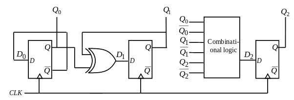

A similar method can be used to design counters for an arbitrary count sequence:

1. Write down the state transition table.

2. Determine the flip flop excitation (easy for D-types)

3. Determine the combinational logic necessary to generate the required flip flop excitation from the current states (any unused counts can be used as don’t care states).

### Shift register

A shift register can be implemented using a chain of D-type FFs:

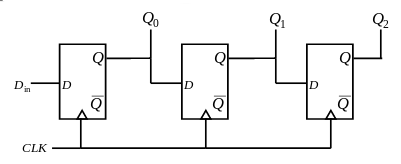

Data moves one flip flop to the right on application of each clock edge.

Asynchronous preset/clear inputs on the flip flops can be used to set the desired state to begin with, and data can then be shifted out through `Q2` in a serial fashion, creating a parallel in, serial out arrangement. Along with the previous serial in, parallel out arrangement, this can be used as the basis for a serial data link:

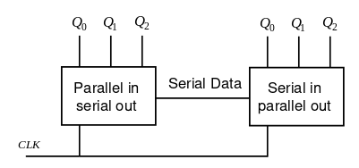

This setup uses many fewer wires than a parallel data link.

## Finite State Machines (FSM)

An FSM is a deterministic machine (circuit) that produces outputs which depend on its internal state and external inputs. Two types of state machines are in general use: *Moore* machines and *Mealy* machines.

### Moore Machines

A Moore machine is an FSM whose outputs only depend on its current state. They can be represented using a *state diagram*:

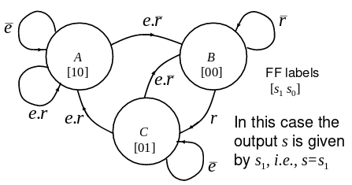

The example above has 3 states (A, B, C), 2 inputs (e, r) and 1 output (s). The Moore machine rests on nodes, and moves between them at each clock pulse, based on the values of the inputs. Each state can be associated with one output configuration, which must be specified along with the diagram. The general schematic for a Moore machine:

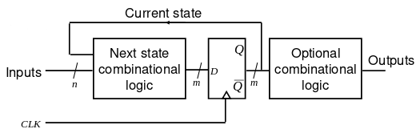

### Mealy Machines

A Mealy machine is similar to a Moore machine, but the output depends on both the current state and the value of the inputs. The state diagram for a Mealy machine is similar to that of a Moore machine, but the outputs associated with each edge are labelled along with the inputs:

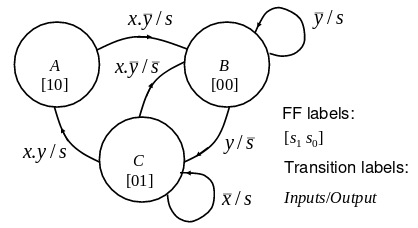

The Mealy machine rests on edges, depending on both the current state and the inputs. When the inputs change, the Mealy machine moves between edges originating from the same node. On the application of a clock pulse, the Mealy machine moves along the edge that it is resting on, and then stops on the edge at the next state that corresponds to its inputs. The general schematic for a Mealy machine:

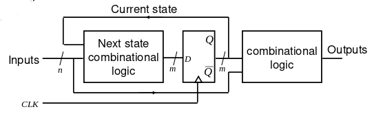

Any Moore machine can be converted to a Mealy machine, and vice versa, although their behaviour upon changing inputs will be different.

### Traffic lights

A simple traffic light system is an example of a finite state machine. It is not really a Moore or a Mealy machine though, since it has no inputs, just a clock. The traffic light system we will implement will have the following state transition diagram:

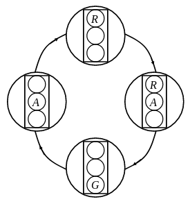

Since there are only four states, in theory this could be represented by only two flip flops. However, the logic for this machine is much simpler when 3 flip flops are used, since we can then assign one flip flop to each light, and no combinational logic needs to be used on the outputs.

We can produce a state transition table based on this diagram:

| `R` | `A` | `G` | `R'` | `A'` | `G'` |
| --- | --- | --- | ---- | ---- | ---- |
| 1   | 0   | 0   | 1    | 1    | 0    |
| 1   | 1   | 0   | 0    | 0    | 1    |
| 0   | 0   | 1   | 0    | 1    | 0    |
| 0   | 1   | 0   | 1    | 0    | 0    |

In this configuration, we have unused states `000`, `011`, `101`, and `111`, these can be used as don't care states when deriving the next-state logic.

Using K-maps or by observation, we find that the next state inputs for the machine are `D[R] = R XOR A`, `D[A] = !A`, and `D[G] = R.A`. This gives the final circuit design:

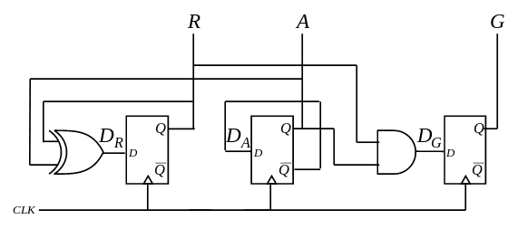

### Power-up

On power-up, it could be the case that the machine state is one of the unused states, which may cause the machine to behave incorrectly to begin with, or it may even never return to a used state. This problem can be fixed by adding additional next-state logic to make sure that all unused states return to a used state, or alternatively, using an asynchronous preset/clear to set the machien to a known state on power-up. In the case of the traffic lights above, all unused states return immediately to a used state, so the machine is *self-starting*.

## State assignment

State assignment in an FSM is not always straightforward, and will depend on what properties we are trying to optimise.

If we want to minimise complexity (which also depends on the technology we are using to implement our machine), we may want to use fewer flip flops, and instead use more complex combinational logic to derive the next state and outputs. However, wiring complexity can be as big an issue as gate complexity, so this is not always beneficial. For `m` states, we need at least `log[2](m)` flip flops to encode all of the states.

If we want to optimise speed, then we may want to use a higher number of flip-flops, so that the combinational logic is simpler, and thus the propagation delay is reduced. This may also result in a more intuitive design.

There are many different methods of state assignment. We will use an example problem of a divide-by-5 counter which gives an output of `1` for 2 clock edges, and then an output of `0` for 3 clock edges:

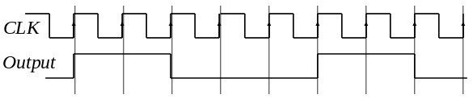

### Sequential State Assignment

Sequential state assignment simply assigns states in an increasing natural binary count. This will require 3 flip flops to cover the 5 required states. The state transition table for 3 flip flops:

| `Q2` | `Q1` | `Q0` | `Q'2` | `Q'1` | `Q'0` |
| ---- | ---- | ---- | ----- | ----- | ----- |
| 0    | 0    | 0    | 0     | 0     | 1     |
| 0    | 0    | 1    | 0     | 1     | 0     |
| 0    | 1    | 0    | 0     | 1     | 1     |
| 0    | 1    | 1    | 1     | 0     | 0     |
| 1    | 0    | 0    | 0     | 0     | 0     |

This style of assignment requires the minimum of `log[2](m)` flip flops for `m` states, but the next-state logic and output logic will both be complex.

### Shift Register State Assignment

Using shift register state assignment, flip flops are connected to form a shift register, where the final flip flop feeds back into the first, forming a loop. This style of assignment is effective when a cyclic pattern for one output is required, e.g. in the example given above, but is not applicable to other cases.

This setup is useful, because the output can be taken directly from any of the flip flops, but it takes `m` flip flops for `m` states, compared to `log[2](m)` for sequential assignment.

### One Hot State Assignment

One Hot assignment is similar to shift register assignment, but only one flip flop holds a `1` at any time, leading to one flip flop corresponding to each state. This obviously requires `m` flip flops for `m` states, but it results in simple, fast, state machines. Any number of outputs can be generated by simply `OR`ing together each state in which that output is `1`. The One Hot implementation of the traffic system is shown below:

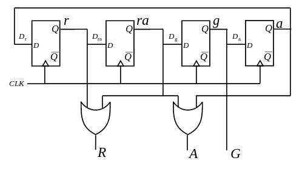

### Sliding State Assignment

Sliding state assignment is again similar to shift register assignment, but it exploits certain output patterns in order to reduce the amount of flip flops required, while only making the next-state logic slightly more complex. In the example given above, the number of flip flops can be reduced from 5 to 3, by using the following state transition table:

| `Q2` | `Q1` | `Q0` | `Q'2` | `Q'1` | `Q'0` |
| ---- | ---- | ---- | ----- | ----- | ----- |
| 0    | 0    | 0    | 0     | 0     | 1     |
| 0    | 0    | 1    | 0     | 1     | 1     |
| 0    | 1    | 1    | 1     | 1     | 0     |
| 1    | 1    | 0    | 1     | 0     | 0     |
| 1    | 0    | 0    | 0     | 0     | 0     |

This table was derived simply by removing flip flops from the right hand side of the shift register arrangment, as long as all states remained unique. The next-state logic after this reduction is the same for all but one of the flip flops: `Q'2 = Q1`, `Q'1 = Q0`, but now for the rightmost flip flop: `Q'0 = !Q2.!Q1`.

### Row matching

We can use a method called *row matching* to remove redundant states from an FSM. The process is as follows:

1. Write out the state a table with a row for each state, indicating the next states and the outputs for each input value.

2. For each row, find any other rows which have the same next states and outputs.

3. Replace all of the references to any of the matching rows with the original row, and remove the matching rows from the table.

4. Repeat from step 2 until no more rows are removed.

This process is not sufficient to find all the equivalent states in an FSM, except for in special cases.

## Generic Logic Arrays (GLA)

A GLA is similar to a PLA, but they also have the option to make use of D-type flip flops in the `OR` plane; the outputs of which are also fed back into the `AND` plane. Consequently, it is possible to build programmable sequential logic circuits such as FSMs. The general schematic for a GLA:

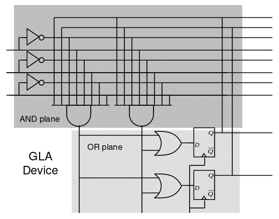

### Generic Array Logic (GAL)

A GAL is to a GLA as a PAL is to a PLA; the difference being that the outputs from the `AND` plane are not shared between the gates in the `OR` plane:

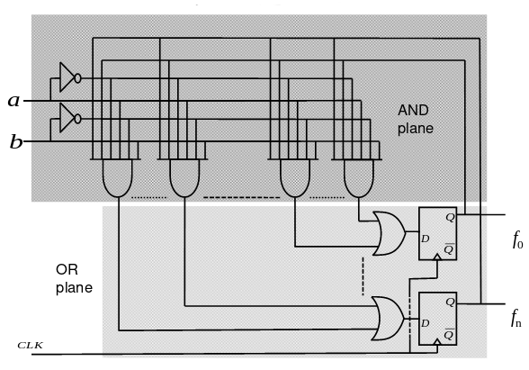

## Field Programmable Gate Arrays (FPGA)

FPGAs are the latest type of programmable logic, consisting of an array of Configurable Logic Blocks (CLBs) surrounded by Input Output Blocks (IOBs). CLBs contain lookup tables (LUTs), multiplexers (MUXs), and D flip flops. Programmable routing channels allow CLBs to be connected to each other and to IOBs.

# !!!!!!!!!!!!!!!!!!!!!!!!!!!!!!!!!!!!!!!!!
