# Devices and Circuits

## Introduction

This section will look at how logic gates can be built using electronic circuits.

Basic concepts of electrical circuits and components enable the analysis of *linear circuits*, i.e. circuits where *superposition* applies:

- If an input `x1(t)` gives an output `y1(t)`, and input `x2(t)` gives an output `y2(t)`, then input `x1(t) + x2(t)` gives an output `y1(t) + y2(t)`.

However, logic circuits are *non-linear*; we will use a graphical technique for analysing these circuits.

## Basic Electricity

```
Q = It

E = QV = ItV

P = IV = E/t

V = IR
```

### Kirchhoff's Laws

#### Kirchhoff's Current Law

The sum of currents entering any point is zero. For example:

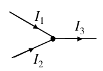

In the above case, `I1 + I2 - I3 = 0`, or `I1 + I2 = I3`.

#### Kirchhoff's Voltage Law

In any closed loop of a circuit, the sum of the voltages in that loop is zero. For example:

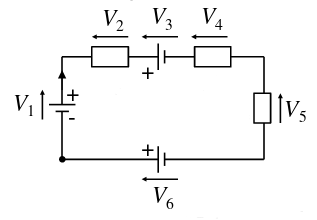

In the above case, `V1 - V2 - V3 - V4 - V5 + V6 = 0`

### Potential Divider

A potential divider is part of a circuit which allows specific potential differences to be produced using the correct resistor values:

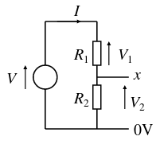

In the above circuit, the circle represents an ideal voltage source. We can calculate the p.d. between 0V and `x` - `V2` - algebraically:

```
V = V1 + V2
    = I*R1 + I*R2
    = I(R1 + R2)

So,
I = V/(R1 + R2)

V2 = I*R2
    = V*R2/(R1 + R2)
```

This can also be done graphically. Suppose we have a function `I(V)`, called the *device characteristic*, which gives the current through a component for some p.d. across it (for an Ohmic component e.g. resistor, `I(V) = kV`). We know that the current through both resistors is equal: `I[R1](V1) = I[R2](V2)`. We also know that `V = V1 + V2`. We can therefore substitute for `V1` in the first equation, to give `I[R1](V - V2) = I[R2](V2)`. This gives us a graphical interpretation:

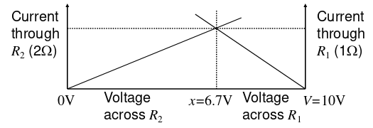

This method also works for non-linear functions `I(V)`, so can be used with components such as transistors.

## Capacitors

A capacitor is effectively 2 conductors separated by a non-conductor, or dielectric. Parallel conductors can often occur incidentally in circuits, creating *parasitic* capacitors.

### Capacitor Laws

The charge `Q` stored in a capacitor with capacitance `C` with voltage `V` across it is `Q = VC`.

As we know, current is the rate of flow of charge: `dQ/dt = I`, so `Q = ∫(I)dt`, so we can write `V = ∫(I)dt / C`.

### Resistor-Capacitor circuits (RC circuits)

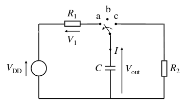

The above circuit is a simple RC circuit. Initially, `Vout = 0`, and the switch moves from position `b` to position `a`. `C` charges through `R1` and current `I` flows in `R1` and `C`.

#### Charging
When the switch is at `a`, we can see that

```
V[DD] = V1 + Vout
    = I*R1 + ∫(I)dt / C

Differentiate dt:

    0 = R1 * dI/dt + I/C

    -dt/(C*R1) = dI/I

    -∫(1/(C*R1))dt = ∫(1/I)dI

    -t/(C*R1) + c = ln(I)

Substitute values for t = 0:

    0 + c = ln(I0)
        = ln(V[DD]/R1)

So

    -t/(C*R1) + ln(I0) = ln(I)

    -t/(R1*C) = ln(I/I0)

    e^(-t/(R1*C)) = I/I0

    I = I0*e^(-t/(R1*C))

```

We can use this result to derive `Vout = V[DD]*(1-e^(-t/(R1*C)))`. If `t = R1*C`, then we get `Vout = V[DD]*(1-1/e)`, which is constant (roughly `0.632*V[DD]`). The value `R1*C` is known as the *time constant*, and has units of seconds.

#### Discharging

## Semiconductors

In a metal, since there are many free electrons, it is difficult to precisely control its electrical properties. Instead, we can use a material with low electron density - a *semiconductor* - like silicon, to carefully control the electron density, and create a range of electronic devices.

We can create n-type silicon by doping with arsenic (group 5), which donates an electron to the silicon, creating a small excess of free electrons in the material. The free electrons are then free to move around the silicon lattice. Called n-type because the charge carriers are negative.

Similarly we can create p-type silicon by doping with boron (group 3), which accepts an electron from the silicon, creating a deficit of free electrons in the material. This leaves a *hole*, which is free to move around the lattice. Called p-type because the charge carrier (the hole) is positive.

### Metal Oxide Semiconductor Field Effect Transistors (MOSFET)

#### n-Channel MOSFET

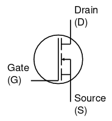

In an n-channel MOSFET, the current flow from `D` to `S` is controlled by the voltage aplied between `G` and `S`, `V[GS]`. `G` must be positive compared to `S` in order for current `I[DS]` to flow.

#### p-Channel MOSFET

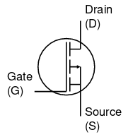

In a p-channel MOSFET, the current flow from `S` to `D` is controlled by `V[GS]`. `G` must be negative compared to `S` in order for current `I[DS]` to flow.

### Device Characteristic

The device characteristic represents how current flows through a device with varying potential difference across it. The characteristics of an n-MOSFET for various gate voltages:

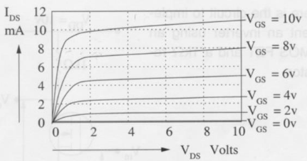

At a constant value `V[DS]` across the transistor, we can also plot how the current through the transistor varies with gate voltage:

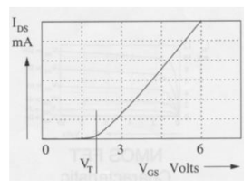

The current begins to flow when `V[GS]` reaches the threshold voltage `V[T]`.

### n-MOS Inverter

We can create a simple inverter using an n-MOS, by incorporating it into a potential divider circuit:

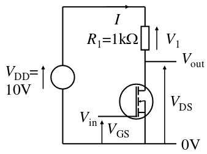

Since this is a potential divider, we can use the graphical method from earlier to determine `V[DS]` for any given `V[GS]`:

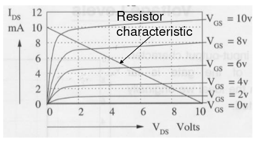

This results in the following profile for the relationship between `V[GS]` and `V[DS]`:

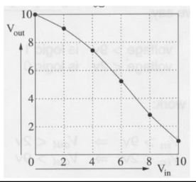

where `Vin = V[GS]`, and `Vout = V[DS]`. This is different from the ideal inverter profile:

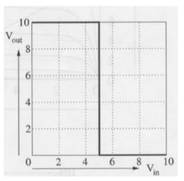

but we can achieve a roughly binary action by specifying suitable threshold voltages. For example, if we say `logical 1 > 9V`, and `logical 0 < 2V`, the inverter will work as desired, giving `Vin = 0 => Vout = 1` and `Vin = 1 => Vout = 0`.
