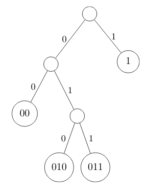

# Complexity and Design Strategies

## Reading

[CLRS3] Introduction to Algorithms, Third edition - Cormen, Leiserson, Rivest, Stein. MIT press, 2009

## Overview

An algorithm is a systematic recipe for solving a problem. The problem should be precisely defined.

### Proving correctness

A useful technique to reason about the correctness of an algorithm is to place *assertions* at key points in the code. These provide stepping stones for a proof, as well as helping with inductive arguments about loops and recursion.

### Models of hardware

It is normal in the analysis of algorithms to ignore issues relating to the cost of memory access and addressing, and assume that any element `a[i]` of an array can be accessed in unit time.

In similar spirit, we ignore the time taken to perform arithmetic operations on integers, floats, doubles etc. and assume again that they all take unit time.

## Computational Complexity

We tend to make a few simplifying assumptions when estimating the cost of an algorithm:

- We only worry about the worst amount of time that an activity could take

- We look at *rates of growth*, rather than absolute computing times.

- We ignore minor deviations to the estimate, as long as the estimate is valid for all large values of $n$.

- We don't only look at reasonable values of $n$; we are more interested in tendencies for large $n$.

Since $\log_2(n)$ comes up fairly often when discussing time complexities, we will denote $\lg(n) = \log_2(n)$, following Knuth.

### Big-O

Informally, big-O notation describes an upper bound for a function $f(n)$, such that $f(n)$ is strictly smaller than that bound if $n$ is large enough.

$f(n) \in O(g(n)) \iff \exists k > 0 \, \exists N \, \forall n \gt N \, |f(n)| \le kg(n)$

### Big-Omega

Big-Omega notation is almost identical to big-O, except that it provides a lower bound rather than an upper bound.

$f(n) \in \Omega(g(n)) \iff \exists k > 0 \, \exists N \, \forall n > N \, f(n) \ge kg(n)$

### Big-Theta

Big-Theta notation describes a function that grows at exactly the same rate as another.

$f(n) \in \Theta(g(n)) \iff \exists k_1 > 0 \, \exists k_2 > 0 \, \exists N \, \forall n > N \, k_1g(n) \le f(n) \le k_2g(n)$

### Small-O

Small-O notation serves nearly the same function as big-O notation, except that where with big-O, the upper bound may be identical in growth rate to the function in question, with small-o, the bound grows strictly faster than the function.

$f(n) \in o(g(n)) \iff \forall k > 0 \, \exists N \, \forall n > N \, |f(n)| < kg(n)$

### Small-Omega

Small-omega serves the same purpose as small-o, but now the function grows strictly faster than the bound.

$f(n) \in \omega(g(n)) \iff \forall k > 0 \, \exists N \, \forall n > N \, |f(n)| > k |g(n)|$

### Informal representation

| notation          | comparison |
| ----------------- | ---------- |
| $f \in o(g)$      | $f \lt g$  |
| $f \in O(g)$      | $f \le g$  |
| $f \in \Theta(g)$ | $f =   g$  |
| $f \in \Omega(g)$ | $f \ge g$  |
| $f \in \omega(g)$ | $f \gt g$  |

### Amortized costs

The *amortized cost* of an operation on a data structure is the cost of that operation if we diffuse part of its true cost over the surrounding, cheaper operations. The formal definition is this:

Let there be a sequence of $k$ operations, whose true costs are $c_1, c_2, \ldots, c_k$. Suppose we define ${c'}_1, {c'}_2, \ldots, {c'}_k$ such that

$$
\sum_{i=1}^n c_i \le \sum_{i=1}^n {c'}_i
$$

for all $n \le k$, then we call the costs $c'$ *amortized costs*.

When considering amortized costs on data structures, we should assume that they are initially empty at the start of the sequence of operations, otherwise the statements that we can make are not very revealing.

#### Potential functions

Suppose there is a function $\Phi$, called a *potential function*, which maps possible states of the data structure to real numbers $\ge 0$, where $\Phi$ for the initial state is $\Phi(S_0) = 0$. For an operation with true cost $c$, where the state before the operation was $S_{\text{before}}$ and the state after the operation is $S_{\text{after}}$, the amortized cost of that operation is

$$
c' = c + \Phi(S_{\text{after}}) - \Phi(S_{\text{before}})
$$

## Design strategies

Some simple strategies for designing an algorithm for a given problem:

- Recognize a variant of a different problem

- Reduce to a simpler problem

- Backtracking

- Look for wasted work in intuitive methods

- Try to find a lower bound on complexity

Below we go into more detail of some specific design strategies for addressing problems.

### Dynamic Programming

Dynamic programming solves complex problems by first building up a table of solutions to smaller problems, and combining the answers to solve more complicated instances. The method has applications in various tasks related to combinatorial search, as we will see. In general, dynamic programming is suited to problems with the following features:

1. There exist many choices, each with its own “score” which must be minimized or maximized (optimization problem).

2. The number of choices is exponential in the size of the problem, so brute force is generally not applicable.

3. The structure of the optimal solution is such that it is composed of optimal solutions to smaller problems.

4. There is overlap: in general, the optimal solution to a sub-problem is required to solve several higher-level problems, not just one.

To solve a problem with dynamic programming, you must define a suitable sub-problem structure so that you can write the optimal solution to a sub-problem in terms of optimal solutions to smaller sub-problems.

#### Fibonacci

One example of the triumph of dynamic programming over the divide and conquer approach is seen in the generation of fibonacci numbers, where a recursive implementation takes exponential time to compute, and ends up recomputing answers many times, but if we construct a list of previous values, it takes only linear time:

```python
def F(n):
    if n <= 1:
        return 1
    else:
        return F(n-2) + F(n-1)

def F1(n):
    F_n = [1, 1]
    for i in range(2, n+1):
        F_n.append(F_n[i-2] + F_n[i-1])
    return F_n[n]
```

#### Matrix multiplication

A more useful example is the problem of finding the best order in which to multiply a chain of matrices. If $A$ is a $p \times q$ matrix, and $B$ is a $q \times r$ matrix, the product $C = AB$ is a $p \times r$ matrix, whose elements are defined by

$$
C_{ij} = \sum_{k=0}^{q-1} A_{ik} \cdot B_{kj}
$$

The total number of scalar multiplications required to compute the product of the two matrices is therefore $q$ multiplications for each of the $p \cdot r$ elements, or $p \cdot q \cdot r$.

If we want to find the product of $n$ matrices $A_0 A_1 \ldots A_{n-1}$, there are many choices for the order in which we multiply them, which will involve different amounts of scalar multiplications. Since the second dimension of one matrix must be equal to the first dimension of the next, we can specify the problem as a vector of dimensions $(d_0, d_1, \ldots, d_n)$, where the dimensions of matrix $A_i$ are $d_i \times d_{i+1}$.

If we define $A_{i \ldots j}$ as the product $A_i A_{i+1} \ldots A_{j-1}$, and $m(i, j)$ as the minimum number of scalar multiplications to compute $A_{i \ldots j}$, then we can define $m(i, j)$ recursively:

$$
m(i, j) = \begin{cases}
0 & j-i = 1 \\
\text{min}_{k \in [i, j)} [ m(i, k) + m(k, j) + d_i d_k d_j ] & j-i > 1  \\
\end{cases}
$$

We can keep track of previously computed values of $m(i, j)$ to speed up the process. This practice is called *memoization* (as in making a memo).

#### Longest Common Subsequence

A subsequence of a given sequence is that sequence with some (possibly none) of its elements left out. For two sequences $x_1, \ldots x_m$ and $y_1, \ldots y_n$, we define the length of the longest common subsequence of $x_1, \ldots x_i$ and $y_1, \ldots y_j$ to be $len(i, j)$, defined like so:

$$
len(i, j) = \begin{cases}
0 & \text{$i=0$ or $j=0$} \\
len(i-1, j-1) + 1 & x_i = y_j \\
max[len(i-1, j), len(i, j-1)] & x_i \ne y_j \\
\end{cases}
$$

The length of the longest common subsequence of the complete sequences is then $len(m, n)$. If we want to find what the subsequence actually was, we can trace back through our memoization table, inferring the previous letter based on the values we stored.

### Greedy algorithms

Greedy algorithms always perform whatever operation contributes the most towards the final goal, even if that operation is not optimal in the long run. Sometimes they can be successful, but other times they may get stuck in a local maximum. It is therefore important to develop a proof of correctness before using a greedy algorithm. In the case that they work, greedy algorithms can be a cheap way to find the optimal solution. The general pattern to use a greedy algorithm is this:

1. Develop a method where we make a (greedy) choice, and are left with just one smaller problem to solve.

2. Prove that the greedy choice is always part of an optimal solution.

3. Prove that there is optimal substructure, i.e. that the greedy choice with an optimal solution to the subproblem yields an optimal solution for the overall problem.

#### Activity scheduling

We consider a room which can be booked at certain times for different activities. A list $a=[a_0, a_1, \ldots, a_{n-1}]$ of $n$ possible activities and their time slots $a_i=(s_i, f_i)$ is provided, sorted so that $f_0 \le f_1 \le \ldots \le f_{n-1}$. The task is to find a subset of $a$ such that the maximum number of activities are included in the schedule.

The number of subsets of $a$ is $2^n$, so examining each possible subset in turn is infeasible for large $n$. To use a dynamic programming approach, we could note that each timeslot $a_i$ produces 2 more subproblems: $a_{<i}$, the set of timeslots which finish before $a_i$ starts, and $a_{>i}$, the set of timeslots which start after $a_i$ finishes. We can now define a recursive function $m(S)$, which gives the optimal solution for the set $S$ of timeslots:

$$
m(S) = \begin{cases}
0 & S = \{\} \\
max_{S_i \in S}[m(S_{<i}) + m(S_{>i}) + 1] & \text{otherwise}
\end{cases}
$$

This approach is polynomial in $n$, which is an improvement on the exponential time of brute force, but we can do even better with a greedy strategy: we pick the activity which finishes first, $a_0$, claiming that this choice will leave the maximum amount of space for the other activities.

We can prove the correctness of this greedy approach by contradiction: Assume there is an optimal solution $O \subset a$ that does not include $a_0$. Let $a_k$ be the activity in $O$ with the earliest finishing time. There are two cases: either $f_0 \le s_k$ or $s_k < f_0$. If $f_0 \le s_k$, then $O$ can be extended to include $a_0$, which is a contradiction. If $s_k < f_0$, then we can use the knowledge that $f_0 < f_k \le s_{k+1}$, so we can replace $a_k$ with $a_0$ in $O$ for another optimal solution, which is another contradiction. So the optimal solution must always contain $a_0$.

#### Huffman codes

Consider the problem of losslessly compressing a string of characters from some alphabet $A$ into the shortest possible binary string. We will consider only methods that map each character individually to a single compressed representation. The minimum number of bits required to represent all characters uniquely is $\lceil \lg{|A|} \rceil$, but with more knowledge about the input string, we can map more frequent characters to shorter codes, and less frequent characters to longer codes.

Since the binary string has no delimiters for characters, we also want to encode our characters to codes that give no ambiguity when strung together. This is equivalent to saying that for each code, no shorter version of it should also be a code. This can be achieved simply by constructing a binary tree of codes, where no code is a parent of any other; i.e. each code is a leaf, not a branch:



Now the greedy algorithm: Assign a node to each character in $A$, where its weight is the frequency of that character. Take the two lowest-weighted nodes and make them children of a new parent node, whose weight is the sum of the weights of its children. Repeat this process until there is only one agglomerated tree, which is the tree of codes.

#### Knapsack problem

We have a knapsack with carrying capacity $W$, and a set of  items $S$ with values $v_i$ and weights $w_i$. We want take a subset of $S$ such that the total value is maximized while the total weight stays below $W$. This problem does in fact have optimal substructure, since if we pick an item $i$ which belongs to an optimal subset, then the optimal solution to the overall problem is found by adding $i$ to the optimal solution for the remaining items and capacity $W - w_i$. However if we employ a greedy strategy, maybe to take the item with the highest value first, we will not be guaranteed an optimal solution.
