# Data structures

Frequently, the construction of an algorithm involves the design of data structures that provide natural and efficient support for the most important steps used in the algorithm.

## Primitives and arrays

It is obvious that *integers*, *boolean values*, *real numbers*, and *characters* should exist in any useful computer environment.

An *array* is an ordered collection of fixed length, containing elements of a common type. An integer index can be used to select a particular element in an array, with the access taking unit time.

A *record* (or `struct` in C) is a collection of a fixed number of fields, each with a name and a value of any type. The values are usually accessed by their field name, rather than an index.

A *pointer* refers to an object in dynamically allocated memory. At a machine level, it is simply the memory address where the object is located, but in a typed system it contains implicit information about how much memory the object takes up.

Here we use a convention of drawing dynamically allocated objects and pointers:

- Objects are represented by a square
- Fields of an object are drawn as a rectangle within a square
- Pointers are drawn as a circle with an arrow to where the pointer references
- A null pointer has an earth symbol on the end of the arrow.

Example:

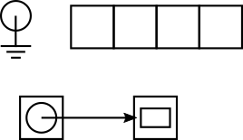

## Lists

A simple and natural implementation of the items in a list is as a record structure with a value, and a pointer to the next list item. An empty list can be represented with a null pointer.

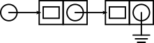

Lists are a useful alternative to arrays when an ordered collection of adaptable size is required, and the links in the list make it easy to remove or add items in the middle of the list. However, list accesses take $O(n)$ time, since the $n$th item must be found by tracing through the previous $n-1$ items.

## Doubly linked lists (DLL)

Another issue with lists is that once you have traced a list to the $n$th item, it is impossible to return to the $n-k$th item without starting again from the beginning. This is solved with the introduction of the doubly linked list, which keep track of both the next and previous items.

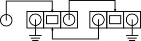

## Graphs

A graph with $n$ nodes can be represented by an $n \times n$ adjacency matrix, which is a boolean matrix with $a_{ij} = 1$ iff there is an edge between vertices $i$ and $j$. This works too for directed graphs, and graphs with edge labels.

When the graph is sparse, it can be more efficient to store an adjacency list for each vertex, for each of the vertices it is connected to. But this representation takes longer to check for an edge between two arbitrary nodes. More on graphs later.

## Abstract Data Types (ADT)

Abstract data types specify the behaviour of a kind of data type, without specifying the exact way in which that behaviour is achieved. They support the design of algorithms without having to worry about the specifics of a concrete data type. Here we will specify each ADT fairly loosely.

Technically, even primitives like integers and floats are ADTs: they don't have specifications across languages, but they are expected to perform certain operations like addition, multiplication, etc.

### Stacks

A stack is an ordered collection of variable size where the only accessible item is the last one added to the stack. It has four basic functions:

- `isEmpty()` - returns true iff the stack is empty.
- `push(x)` - adds element `x` to the top of the stack.
- `pop()` - removes the element on top of the stack, and returns it.
- `top()` - returns the element on top of the stack.

### Lists

The list ADT is an ordered collection with one leading 'head' element and a 'tail' which is another list. This is different from the low level implementations of a list which we discussed previously. The list has five functions:

- `isEmpty()` - returns true iff the list is empty.
- `head()` - returns the first item in the list.
- `prepend(x)` - adds item `x` to the beginning of the list.
- `tail()` - returns the list of all elements except the first
- `setTail(list)` - replaces the tail of the list with `list`.

### Queues and Deques

A queue is an ordered collection similar to a stack, but the only accessible item is the earliest one added to the queue. It has four basic functions:

- `isEmpty()` - returns true iff the queue is empty.
- `put(x)` - inserts item `x` at the end of the queue.
- `get()` - removes the first item in the queue and returns it.
- `first()` - returns the first item in the queue.

A variant of the queue and the stack is the deque ("deck") which is accessible from both ends, and has `putFront()`, `putEnd()`, `getFront()`, `getEnd()` methods.

### Dictionaries

A dictionary is a collection of key-value pairs, where each key maps to only one value. It has three basic functions:

- `set(k, v)` - sets the value for `k` to be `v` in the dictionary.
- `get(k)` - returns the value paired with key `k`.
- `delete(k)` - removes the key-value pair for `k`.

### Sets

Sets are exactly what the name implies: collections of unique values. Usually a set is not accessed for values, rather values are tested for membership of a set. Typical functions include those in set theory: `union(s)`, `intersection(s)`, etc. as well as `contains(x)`, `add(x)`, `remove(x)`, `isEmpty()`.

## Priority Queues

A priority queue doesn't share many properties with a regular queue. It is an ordered collection where items are placed in the queue in order of their priority, and the only accessible item is that with the highest priority. It supports the following functions:

- `first()` - return the highest priority item in the queue.
- `insert(x, p)` - insert item `x` into the queue with priority `p`.
- `extractMin()` - remove the highest priority item from the queue, and return it.
- `decreaseKey(x, p)` - change the key of item `x` to the value `p`.
- `delete(x)` - remove item `x` from the queue.

## Trees

### Binary search trees (BST)

A binary search tree implements the Set ADT, but assumes a total order on the members of the set so that `min()`, `max()`, `predecessor(x)`, and `successor(x)` are defined. Each node of the tree contains a key-value pair and pointers to two sub-trees: the left for items with smaller keys than the current node and the right for larger keys.

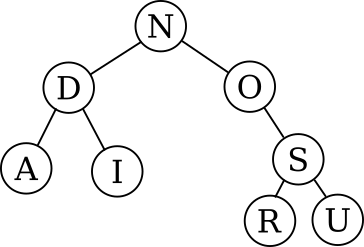

To search for a key in the tree, simply start at the root, comparing keys with the current node and taking the appropriate branch at each level.

To find the successor of a node $x$ with key $k_x$, look in $x$'s right subtree: if it exists, then the successor is in it, otherwise go up the tree until you take a right turn, and the node you find will be the successor.

To insert into a BST, simply find the place where the item should be and insert it there.

To delete a node, if it is a leaf node, it can simply be removed. If it has one child, it can be replaced by its child. If it has two children, then it can be replaced by either its successor or its predecessor, either of which will have on or fewer child nodes, so can be moved as in the second case.

If the tree is fairly well balanced, these functions should be at $O(\lg n)$, but they can be as bad as $O(n)$ for unbalanced trees. One way to avoid this is to balance the tree using *rotations*.

#### Rotations

A rotation of a BST is a transformation of a BST that changes its shape but preserves the BST properties. The operation has constant cost and does not depend on the size of the BST. The example below is a rotation of the $BD$ edge.

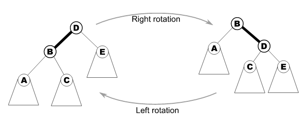

During the rotation, not only do $B$ and $D$ switch roles, but also $C$ moves from being the right child of $B$ to the left child of $D$. After the rotation, the result is still a BST with the order of the nodes preserved.

A rotation can be performed on any edge in a BST; the nodes involed will simply positions as usual if they have a parent node.

### 2-3-4 trees

2-3-4 trees follow the same rules as BSTs, but now rather than each node having 1 key and 2 sub-trees with $L < k < R$, nodes may have several keys with several sub-trees, with $T_0 < k_0 < T_1 < k_1 < T_2 < k_2 < T_3$ etc. where the keys are the delimiters between the sub-trees. Nodes with $n$ sub-trees are called $n$-nodes, where $n = 2, 3, 4$ (hence the name).

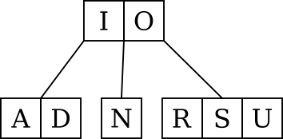

#### Insertion

Insertion into a 2-3-4 tree goes by the following process, starting at the root of the tree:

1. Search down the tree as you would expect, looking for the position to insert the new item.
2. If the current node is ever a 4-node: Remove the center value and turn it into a 2-node parent of two 2-nodes. If the current node has a parent, insert the newly formed center node into the parent node. Otherwise, the new center node becomes the root of the tree, and the height increases. Go back to the parent node.
3. Once we reach the bottom of the tree, insert the value into that node.

The reason that this process keeps a balanced tree, is that the length of any path doesn't increase unless the root node is split, in which case all paths are increased by 1, so at all times the paths are the same length. Each node has a brancing factor of at least 2, so the maximum amount of time to insert any item is $O(\lg n)$.

### B-trees

B-trees are exactly the same in structure as 2-3-4 trees, but with generally much higher branching factor. If the size of one node in bits is about the same as the size of a unit of disk data, then B-trees can be used naturally with disk storage for *really* large trees, at low cost to disk access. The rules for a B-tree of order $m$ are as follows:

1. There are internal nodes with keys, payloads and children, and leaf nodes with none.
2. For each key in a node, there is an associated payload stored.
3. All leaf nodes are at the same distance from the root.
4. All internal nodes have at most $m$ children; all nodes except the root have at least $\lceil m/2 \rceil$ children.
5. A node has $c$ children iff it has $c-1$ keys.

The algorithms for adding data to a B-tree ensure that the tree remains balanced, and they are similar to those for 2-3-4 trees, although with some implementation differences, since the most costly factor is now disk accesses.

#### Insertion

To insert a new key into a B-tree, look for the key in the same way as 2-3-4 trees: if you come across a full node on the way down, split it into two about the median key and move the median key to the parent node. If you find the key, update it in place, otherwise add the new key to whichever node you end up at.

#### Deletion

You can't delete a key from anywhere apart from a node at the bottom of the tree, since there are sub-trees dependent on any key in the middle of the tree. The algorithm therefore consists of creating the right conditions for a deletion to happen.

To move a key to the bottom for deletion, swap it with its successor, which will be at the bottom of the tree. Then, to refill a node $N$ which has too few keys, use an appropriate combination of the following constant-time operations:

- Merge - this is the inverse of the split: a key is removed from a parent node and combined with its two children.
- Redistribute - a key from one sub-tree is switched with the separating key, and the separating key is sent to the other sub-tree.

If the left or right sibling of $N$ has more than the minimum number of keys, then redistribute keys with that sibling. Otherwise, merge $N$ with either of its siblings. After this process, the key can be safely deleted from the bottom node.

### Red-black trees

Red-black trees are binary search trees that are guaranteed to always be reasonably balanced - no path from the root to a leaf is more than twice as long as another. They follow 5 simple rules:

1. Every node is either red or black.
2. The root is black.
3. All leaves are black and never contain key-value pairs.
4. If a node is red, both its children are black.
5. For each node, all paths from that node to descendent leaves contain the same number of black nodes.

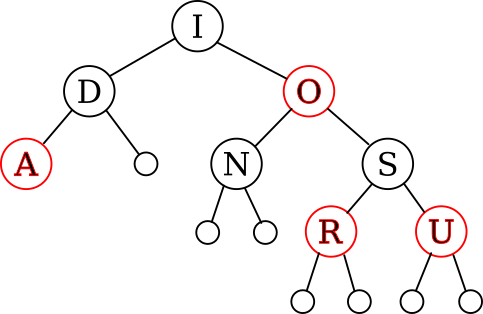

The structure of a red-black tree is isomorphic to that of a 2-3-4 tree via the following equivalence:

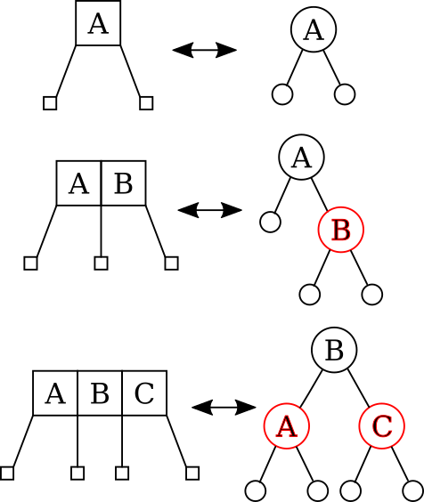

#### Insertion

Functions on the tree that don't alter it have the same time complexity as a regular BST of $O(\lg n)$, but insertions and deletions are a little more difficult to work out.

We start by finding where the new node $N$ should go by ordinary BST methods. If the tree is empty, then we can just insert $N$ as the root node, colour it black and we are done. If the parent node $P$ where we want to insert it is black, then we can just colour $N$ red without violating any of the invariants for red-black trees, and again we are done.

However, if $P$ is red, we have to reshuffle the tree. We insert the new node and colour it red. We then know that if $P$ is red, the grandparent node $G$ must be black, and we also consider the "uncle" node $U$, which could be red or black. Apply the following cases:

1. If $U$ is red, we can simply invert the colours of $P$, $G$, and $U$. If $G$ is the root node, we can then colour it black again to satisfy rule 2. If the parent of $G$ is red, we then reset $N$, $P$, $G$ and $U$ so that $G$ is the next $N$, and reapply the cases.

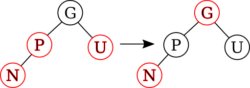

2. If $U$ is black, and $N$ is on the outer side of $P$, we can rotate the $PG$ edge, and switch their colours. There are no rule violations any more, so the loop ends.

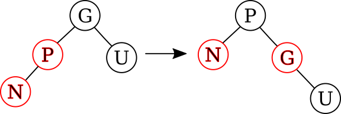

3. If $U$ is black, and $N$ is on the inner side of $P$, we can rotate the $NP$ edge, transforming it into case 2. We can then switch our labels for $N$ and $P$, and continue with case 2.

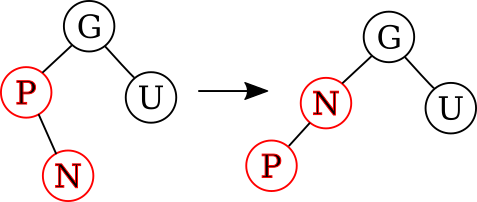

## Hash tables

A hash table implements the general case of the Dictionary ADT, when keys may not have a total order defined on them.

A hash function $h(k)$ maps a key of arbitrary length onto an integer in the range $[0, m)$ for some size $m$, so we can store key-value pairs in an array of size $m$ at that index. A good hash function will map keys to indexes with no discernable pattern.

If two different keys map to the same index, this is called a collision. There are two main strategies for handling it: chaining, and open addressing.

### Chaining

In chaining, each location in the array holds a linked list of all the keys that hash to that location.

### Open addressing

If $h(k)$ is occupied, a succesion of other probes are made according to some rule, until an empty slot is located, and the item is inserted. An example of such a rule is just to check the next index in the array, and wrapping around at the end.

The convenience of open addressing relies on the fact that an insertion is unlikely to be redirected very many times, so if the array becomes too full, the performance drops significantly. In this case, its size is typically doubled, and all the items are rehashed for the new array.

The worst case cost of a hash table can be pretty bad, but in the average case, insertions and accesses should have constant cost.

#### Probing sequences

There are many ways to determine the sequence of slots to visit until a free one is found. We can think of the probe sequence $p_j$ as a function of the key $k$ and the attempt number $0 < j < m$. So that slots aren't wasted, the sequence should visit a permutation of $[0,\ldots,m-1]$, so that it doesn't miss any slots.

- Linear probing - $p_j = h(k) + cj \mod m$. This system is simple, but it leads to *primary clustering*: if the sequence for different keys ever hit the same slot, they continue to hit the same slots afterwards.

- Quadratic probing - $p_j = h(k) + cj + dj^2 \mod m$. This works better than linear probing and avoids primary clustering, however it still leads to *secondary clustering*: Keys that hash to the same value will yield the same probing sequence.

- Double hashing - $p_j = h_1(k) + j \cdot h_2(k) \mod m$. This method uses a secondary hash function to define the probing sequence, so that even if the keys hash to the same slot under $h_1$, they will be given different probing sequences. This avoids both primary and secondary clustering.

## Binary Heaps

A binary heap is a binary tree where each node has a value $\ge$ those of its children. When stored as an array, this property means that `a[k]` $\ge$ `a[2k+1]` and `a[2k+2]`. Strictly, this is a max-heap, and the converse exists, called a min-heap. A heap is a natural implementation of a priority queue, and can perform all functions in $O(\lg n)$ time.

### Sift-down

The sift-down function takes a would-be heap where the root item is misplaced, and moves it down the heap until it reaches the right place. If the children of the initial root node form max-heaps, then the result of sift-down will be another max-heap. The time complexity is $O(\lg n)$ in the worst case, since only one comparison is made at each level.

```python
def siftDown(a, iStart, iEnd):
    iParent = iStart

    while 2*iParent + 1 <= iEnd:
        iSwap = iParent

        if a[2*iParent+1] > a[iSwap]:
            iSwap = 2*iParent+1
        if 2*iParent+2 <= iEnd:
            if a[2*iParent+2] > a[iSwap]:
                iSwap = 2*iParent+2

        if iSwap == iParent:
            return
        else:
            swap(a[iParent], a[iSwap])
            iParent = iSwap
```

To delete an arbitrary item from a heap, it can simply be swapped with the last element in the heap, then deleted, and the swapped item sifted down.

### Heapify

The heapify function takes an array and reorders it into a heap. This is done by starting at the leaves of the tree and sifting down each item As we go towards the root. Since each child node is already a max-heap, we end up with a max-heap as the final result. Naïvely, we can say that this runs in $O(n \lg n)$ time, since we call sift-down $n$ times, but this bound is not tight.

We know that the height $H$ of a binary tree is $H = \lfloor \lg n \rfloor$. This is the same for binary heaps. The number of nodes $n_h$ at level $h$ of the heap (starting at the leaves) is $n_h \le n/2^h$, so the cost of running sift-down over all subtrees is:

$$
\begin{aligned}
T(n) &= \sum_{h=0}^{H} \frac{n}{2^h} O(\lg n) \\
&= \sum_{h=0}^{H} \frac{n}{2^h} O(h) \\
&= O \left( \sum_{h=0}^{H} \frac{n}{2^h} h \right) \\
&= O \left( n \sum_{h=0}^{H} \frac{h}{2^h} \right) \\
&= O \left( n \sum_{h=0}^{\infty} \frac{h}{2^h} \right) \\
&= O (n \cdot k) \\
&= O (n) \\
\end{aligned}
$$

Using the fact that $\sum_{h=0}^{\infty} \frac{h}{2^h}$ converges.

```python
def heapify(a, iRoot, iEnd):
    jNode = iEnd
    while jNode >= iRoot:
        siftDown(a, jNode, iEnd)
        jNode -= 1
```

## Binomial Heaps

A binomial heap is another possible implementation of a priority queue, but which allows merging of two queues.

A binomial *tree* of order $0$ is a single node containing one item. It has height $0$.

A binomial tree of order $k$ is a tree obtained by combining two binomial trees of order $k-1$, by appending one of the trees to the root of the other as the new leftmost child. By induction, it contains $2^k$ nodes, and the number of children of the root node is k, and the height of the tree is $k$.

A binomial heap is a forest of binomial trees, with at most one for each order, sorted by increasing size, each obeying the min-heap property. If the heap contains $n$ nodes, it contains $O(\lg n)$ binomial trees, and the largest of those trees has degree $O(\lg n)$.

The sequence of trees in a binomial heap with $n$ nodes exactly matches the binary representation of $n$.

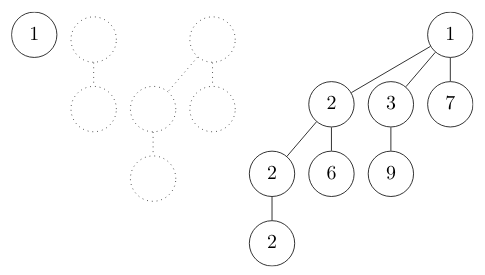

### Merging

To merge two binomial heaps, examine their trees by increasing order and combine them in a procedure similar to binary addition.

Take the collection of trees from both heaps. For each order $k$, if there is more than one tree of order $k$, combine two of them to form a tree of order $k+1$, and add it back into the collection. Repeat with increasing order until there are no trees of order $>k$. This operation takes $O(\lg n)$ time.

### Other functions

- `insert(x)` - to add a new item `x` to a binomial heap, it is treated as a tree of order $0$, and it merged with the existing heap, taking $O(\lg n)$ time.
- `first()` - to find the minimium element in the heap, scan the roots of each of the trees. This takes $O(\lg n)$ time.
- `extractMin()` - first find the minimum, then remove it, and merge its children (which will form a binomial heap) with the rest of the tree, taking $O(\lg n)$ time.
- `delete(x)` - to delete an item, just proceed to delete it from the tree in which it belongs. This should take $O(\lg n)$ time.
