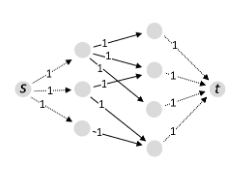

# Flow

Consider a directed graph. Let there be a source vertex $s$ and a sink vertex $t$. Let each edge have a label $c(u \rightarrow v) > 0$ called the capacity. A flow is a set of edge labels $f(u \rightarrow v) \ge 0$ such that the flow fits within the capacity:

$$
f(u \rightarrow v) \le c(u \rightarrow v)
$$

and the amount of flow into a vertex is the same as the flow out (except for $s$ and $t$):

$$
\sum_{u: \, u \rightarrow v} f(u \rightarrow v) = \sum_{w: \, v \rightarrow w} f(v \rightarrow w) \, , \, v \notin \{s, t\}
$$

The value of a flow is the net flow out of $s$:

$$
\text{value}(f) = \sum_{w: \, s \rightarrow w} f(s \rightarrow w) - \sum_{u: \, u \rightarrow s} f(u \rightarrow s)
$$

A cut is a partition of the vertices into two sets $S$ and $\bar{S}$, with $s \in S$ and $t \in \bar{S}$.

The capacity of a cut is the sum of capacities from $S$ to $\bar{S}$:

$$
\text{capacity}(S, \bar{S}) = \sum_{u \in S, \, v \in \bar{S}: \, u \rightarrow v} c(u \rightarrow v)
$$

## Max-flow min-cut theorem

[Theorem] For any flow $f$ and any cut $(S, \bar{S})$:

$$
\text{value}(f) \le \text{capacity}(S, \bar{S})
$$

### Proof

To simplify notation in this proof, we'll say that if there is no edge $u \rightarrow v$, then $f(u \rightarrow v) = c(u \rightarrow v) = 0$.

The proof is as follows:

$$
\begin{aligned}
    \text{value}(f)

    &= \sum_u f(s \rightarrow u) - \sum_u f(u \rightarrow s)\\
    & \text{by definition} \\

    &= \sum_{v \in S} \left(\sum_u f(v \rightarrow u) - \sum_u f(u \rightarrow v) \right) \\
    & \text{the part in the brackets is zero for $v \ne s$} \\

    &= \sum_{v \in S}\sum_{u \in S} f(v \rightarrow u) + \sum_{v \in S}\sum_{u \in \bar{S}} f(v \rightarrow u) - \sum_{v \in S}\sum_{u \in S} f(u \rightarrow v) - \sum_{v \in S}\sum_{u \in \bar{S}} f(u \rightarrow v) \\
    & \text{splitting the sum over $u$ into two sums, $u \in S$ and $u \in \bar{S}$} \\

    &= \sum_{v \in S}\sum_{u \in \bar{S}} f(v \rightarrow u) - \sum_{v \in S}\sum_{u \in \bar{S}} f(u \rightarrow v)\\
    & \text{the first and third sums are equivalent} \\

    &\le \sum_{v \in S}\sum_{u \in \bar{S}} f(v \rightarrow u) \\
    & \text{since $f \ge 0$} \\


    &\le \sum_{v \in S}\sum_{u \in \bar{S}} c(v \rightarrow u) \\
    & \text{since $f \le c$} \\

    &= \text{capacity}(S, \bar{S}) \\
    & \text{by definition of flow capacity.}
\end{aligned}
$$

### Uses

The above theorem is important because it suggests that we can find a flow $f'$ and a corresponding cut $(S', \bar{S'})$ so that $\text{value}(f') = \text{capacity}(S', \bar{S'})$, then $f'$ must be the maximum flow.

## Ford-Fulkerson Algorithm (FFA)

The Ford-Fulkerson algorithm finds a maximum flow given a weighted directed graph with source and sink vertices.

In essence, the Ford-Fulkerson algorithm works by continually finding paths from source to sink over which it can add more flow, until it can't add any more. The catch is that some of the edges in this path may be backward edges from which we subtract flow, but this doesn't really change the calculations.

### Method

We define the *residual network* $G_f(V, E_f)$ to be the network with capacity  $c_f(u \rightarrow v) = c(u \rightarrow v) - f(u \rightarrow v)$, and no flow. This shows the places where there is room for more flow to be added in the original network.

1. $f(u \rightarrow v) = 0$ for all edges $u \rightarrow v$.
2. While there is a path $p$ from $s$ to $t$ in $G_f$, such that $c_f(u \rightarrow v) > 0$ for all edges $u \rightarrow v \in p$:
    1. Find $c_f(p) = \min \{ c_f(u \rightarrow v): u \rightarrow v \in p \}$
    2. For each edge $u \rightarrow v \in p$:
        1. $f(u \rightarrow v) = f(u \rightarrow v) + c_f(p)$
        2. $f(v \rightarrow u) = f(v \rightarrow u) - c_f(p)$

Note that the method above doesn't describe how to choose the path in step 2. One implementation that does describe this is the Edmonds-Karp algorithm, choosing the path with the fewest edges, by using BFS.

### Complexity

When some capacities are irrational, it cannot be guaranteed that the algorithm will terminate.

In the case when all capacities are integers, the algorithm is guaranteed to terminate, since $c_f \ge 1$, meaning that the flow in the graph will increase monotonically until it reaches the maximum value in finite time (a maximum of $f'$ iterations).

Each augmenting path can be found in $O(E)$ time, and with the maximum of $f'$ iterations this gives a final complexity of $O(Ef')$.

The Edmonds-Karp implementation can be shown to run in $O(VE^2)$ time.

### Correctness

[Theorem] Suppose the algorithm terminates. Let $f'$ be the final flow it produces, and $(S', \bar{S'})$ be the associated cut. Then,

1. The value of $f'$ is equal to the capacity of the cut $(S', \bar{S'})$
2. $f'$ is a maximum flow.

#### Proof

When the algorithm terminates, since there are no paths fitting the criteria in step 2, this means that there is some edge in each path from $s$ to $t$ where $c_f = 0$. We will set $(S', \bar{S'})$ such that these edges form the division between $S'$ and $\bar{S'}$. By this new definition, the flow from $S'$ to $\bar{S'}$ is equal to the capacity of the cut, or in other words, the value of $f'$ is equal to the capacity of the cut $(S', \bar{S'})$.

Then, by the max-flow min-cut theorem, the flow $f'$ must be a maximum flow.

### Multiple sources and sinks

If the graph has multiple sources and sinks, let $S$ be the set of all sources, and $T$ be the set of all sinks. Add a new source $s^\ast$, and an edge $s^\ast \rightarrow s$ for every node $s \in S$ with the same capacity as $s$. Add a new sink $t^\ast$, and an edge $t \rightarrow t^\ast$ for every node $t \in T$ with capacity the same as the requirement of $t$. Then run Ford-Fulkerson as usual with the new source and sink nodes.

## Matchings

A matching in a bipartite graph is a selection of the graph's edges such that no vertex is connected to more than one edge in the selection. The size of a matching is the number of edges it contains. A maximum matching is one with the largest possible size.

### Method

To find a maximum matching in a bipartite graph, we can just treat one side as sources, and the other as sinks, with a capacity of $1$ on all edges, and then run the Ford-Fulkerson algorithm as described above for multiple sources and sinks. The flow produced by the algorithm is then interpreted as a matching on the original graph.



In order to show that this method actually produces a maximum matching, we must first ensure that the maximum flow genuinely corresponds to a matching, and secondly ensure that that matching is maximal.

### Correctness

[Theorem]

1. The Ford-Fulkerson method terminates, and the flow $f'$ that it produces can be translated into a matching $m'$ with $\text{size}(m') = \text{value}(f')$.
2. Any matching $m$ translates in to a flow $f$ with $\text{size}(m) = \text{value}(f)$. In particular, if there were any matching larger than $m'$ then the corresponding flow would have to be larger than that of $f'$.

#### Proof

Since the capacities on the modified graph are all integers, we know that it will terminate. We also know that the flow will always be an integer on all edges, and since the capacities are all $1$, we know that the flow must be $0$ or $1$ on all edges. We can translate a $f'$ into a matching $m'$ by selecting all the edges with $f' = 1$. Due to the capacity constraints on the edges coming from $s$, each vertex on the left may only have flow of $0$ or $1$ coming in, so may only be connected to $0$ or $1$ vertices on the right. A similar argument holds for the right hand vertices. This shows that $m'$ is at least a valid matching.

To translate a matching $m$ into a flow $f$, we give the edges coming from $s$ a flow of $1$ if their corresponding vertex is matched. Similarly for the edges at $t$. With this layout, the number of edges in the matching corresponds directly to the flow coming from $s$, so it is obvious that $\text{size}(m) = \text{value}(f)$.

Now, if there were a matching with greater size than $m'$, it would mean that there is a flow with greater value than $f'$. This is impossible, so $m'$ is a maximum matching.

## Subgraph Algorithms

Given a connected undirected graph with edge weights, a **minimum spanning tree** (MST) is a spanning tree which has minimum weight among all spanning trees.

### Prim's Algorithm

Given a connected undirected graph with edge weights, Prim's algorithm finds an MST. In essence, it works by building the tree up, starting with just one vertex. It's a greedy algorithm: at each iteration, it checks all the edges between the tree and the free vertices, and adds the edge with the lowest weight.

We can use a priority queue like in Dijkstra's algorithm to store a frontier of neighbour vertices, rather than computing them at each stage. For this reason, the pseudocode looks very similar to that for Dijkstra.

```python
def prim(g, s):
    for v in g.vertices:
        v.distance = float('inf')
        v.in_tree = False
    s.come_from = None
    s.distance = 0
    toexplore = PriorityQueue([s], sortkey=lambda v: v.distance)

    while not toexplore.is_empty():
        v = toexplore.popmin()
        v.in_tree = True
        for (w, edgeweight) in v.neighbours:
            if (not w.in_tree) and edgeweight < w.distance:
                w.distance = edgeweight
                w.come_from = v
                if w in toexplore:
                    toexplore.decreasekey(w)
                else:
                    toexplore.push(w)
```

#### Complexity

Due to the similarity with Dijkstra's algorithm, the analysis of Prim's algorithm is nearly identical, assuming a Fibonacci Heap is used to implement the priority queue, so the complexity is therefore $O(E + V \lg V)$.

#### Correctness

The proof of correctness is not examinable, but it makes use of the following theorem:

[Theorem] Suppose we have a forest $F$ and a cut $C$ such that

1. No edges of $F$ cross $C$
2. There exists an MST containing $F$.

Then if we take an edge crossing $C$ of minimum weight and add it to $F$, the result is still an MST.

### Kruskal's algorithm

Kruskal's algorithm is another algorithm for finding an MST, and its running time is actually worse that Prim's algorithm, but some of the intermediate states of the algorithm are useful for other things.

In essence, it works by agglomerating smaller subtrees, by iteratively picking the lowest-weight edge which will join two subtrees. The pseudocode below uses a disjoint set to keep track of the separate subtrees.

```python
def kruskal(g):
    tree_edges = []
    partition = DisjointSet()
    for v in g.vertices:
        partition.add_singleton(v)
    edges = sorted(g.edges, key = lambda e: e[2])

    for (u,v,edgeweight) in edges:
        p = partition.get_set_with(u)
        q = partition.get_set_with(v)
        if p != q:
            tree_edges.append((u,v))
            partition.merge(p, q)
    return tree_edges
```

#### Complexity

All disjoint set operations can be done in near constant time so we will say that they are completed in $O(1)$ for simplicity.

The sort on line 6 takes $O(E \lg E)$ time. The iteration over the edges on line 8 takes $O(E)$ time. Lines 12-13 are run a total of $O(V)$ times, but since there must be at least $V$ edges, this is also $O(E)$. This gives us a total complexity of $O(E \lg E)$.

The the minimum number of edges in a connected graph is $V-1$, and the maximum number of edges in an undirected graph is $\frac{V^2-V}{2}$, so $\lg E = \Theta(\lg V)$, which means we can write the complexity as $O(E \lg V)$.

#### Correctness

The correctness proof for Kruskal's algorithm uses the same theorem as in Prim's algorithm.

#### Applications

Kruskal's algorithm can be used for image segmentation. If vertices are made to represent pixels, with edges connecting adjacent pixels, each weighted by the difference in colour between the pixels, then Kruskal's algorithm can be run until limit of clusters remain, which then represent different segments of the original image.


### Topological sort

We can use a directed graph to represent orderings, where each edge represents a pairwise comparison between two items. If the graph contains cycles, then a total ordering might not exist, but in a directed acyclic graph (DAG), we can always guarantee the existence of a total ordering.

Given a DAG, the toposort algorithm returns a total ordering of all its vertices, such that if $v_1 \rightarrow v_2$, then $v_1$ appears before $v_2$ in the total order.

The general idea of topological sort is to explore the graph with DFS, and add a vertex to the ordering list only when it has finished being visited, i.e. when all of its children are already on the list.

```python
def toposort(g):
    for v in g.vertices:
        v.visited = False
    totalorder = []
    for v in g.vertices:
        if not v.visited:
            visit(v, totalorder)
    return totalorder

def visit(v, totalorder):
    v.visited = True
    for w in v.neighbours:
        if not w.visited:
            visit(w, totalorder)
    totalorder.insert(0, v)
```

#### Complexity

The complexity is exactly the same as that for DFS: $O(V + E)$.

#### Correctness

[Theorem] The `toposort` algorithm terminates, and return a total order where if $v_1 \rightarrow v_2$, then $v_1$ appears before $v_2$ in the total order.

##### Proof

Pick any edge $v_1 \rightarrow v_2$. We want to show that $v_1$ appears before $v_2$ in the total order. It's easy to see that every vertex is visited exactly once. We will say that on that visit

1. it’s coloured grey
2. some stuff happens
3. it’s coloured black.

Let’s consider the instant when $v_1$ is coloured grey. At this instant, there are three possibilities for $v_2$:

- $v_2$ is black. If this is so, then $v_2$ has already been added to the list, so $v_1$ will be added after $v_2$, which means $v_1$ appears before $v_2$.
- $v_2$ is white. If this is so, then $v_2$ hasn’t yet been visited, therefore we’ll call `visit(v_2)` at some point during the execution of `visit(v_1)`. This call to `visit(v_2)` must finish before returning to the execution of `visit(v_1)`, so $v_2$ gets added earlier and $v_1$ gets added later, which means $v_1$ appears before $v_2$.
- $v_2$ is grey. If this is so, then there was an earlier call to `visit(v2)` which we’re currently inside. The call stack corresponds to a path in the graph from $v_2$ to $v_1$. But we’ve picked an edge $v_1 \rightarrow v_2$, so there is a cycle, which is impossible in a DAG. This is a contradiction, so it’s impossible that $v_2$ is grey.
