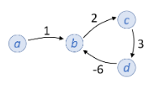
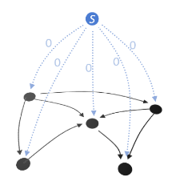

# Graphs

## Definitions

A **graph** is a collection of **vertices**, with **edges** between them. We write a graph as $G=(V,E)$, where $V$ is the set of vertices, and $E$ is the set of edges.

A graph may be **directed** or **undirected**.
- in a directed graph, $v_1 \rightarrow v_2$ is the edge from $v_1$ to $v_2$.
- in an undirected graph, $v_1 \leftrightarrow v_2$ is the edge between $v_1$ and $v_2$.

The **neighbours** of a vertex $v$ are the vertices you reach by following an edge from $v$.
- in a directed graph, $\text{neighbours}(v) = \{ w \in V : (v \rightarrow w) \in E \}$
- in an undirected graph, $\text{neighbours}(v) = \{ w \in V : (v \leftrightarrow w) \in E \}$

A **path** is a sequence of vertices connected by edges.
- in a directed graph, $v_0 \rightarrow v_1 \rightarrow \cdots \rightarrow v_k$, or $v_0 \rightsquigarrow v_k$
- in an undirected graph, $v_0 \leftrightarrow v_1 \leftrightarrow \cdots \leftrightarrow v_k$, or $v_0 \leftrightsquigarrow v_k$

An undirected graph is **connected** if for every pair of vertices there is a path between them.

A **cycle** is a path from a vertex to itself, i.e. where $v_0 = v_k$. An **acyclic** graph is a graph without any cycles.

A **forest** is an undirected acyclic graph; A **tree** is a connected forest. A **spanning tree** is a tree that connects all vertices.

A **bipartite** graph is one in which the vertices are split into two sets, and all the edges have one end in one set and the other end in the other set.

The **density** of a graph is defined as $\frac{|E|}{|V|^2}$, commonly written as just $\frac{E}{V^2}$.

## Algorithms

Two standard ways to store graphs in computer code are as an array of *adjacency lists*, or as an *adjacency matrix*. The first is a list of all the vertices connected to a given vertex, and takes up $O(V+E)$ space. The second is a boolean matrix with a $1$ if vertices $i$ and $j$ are connected, and takes up $O(V^2)$ space.

### Depth-first search (DFS)

With DFS, we visit each vertex in a graph, prioritizing neighbours of the vertex we are currently at, rather than neighbours of previous vertices.

We can do this either using recursion, or by storing the vertices we want to visit on a stack. In either case, we must keep track of vertices that we have visited already, so that we do not become stuck in a loop.

The complexity of this alorithm is $O(V+E)$, since each vertex is visited once, and each edge must be checked the same amount of times to see if the vertex there has been visited yet.

```python
def dfs_recurse(g, s):
    for v in g.vertices:
        v.visited = False
    visit(s)

def visit(v):
    # Do some work here
    v.visited = True
    for w in v.neighbours:
        if not w.visited:
            visit(w)
```

```python
def dfs(g, s):
    for v in g.vertices:
        v.seen = False
    toexplore = Stack([s])
    s.seen = True

    while not toexplore.is_empty():
        v = toexplore.popright()
        for w in v.neighbours:
            if not w.seen:
                toexplore.pushright(w)
                w.seen = True
```

### Breadth-first search (BFS)

Breadth first search is another form of graph traversal, but now we prioritise vertices which were closer to the starting vertex.

We can accomplish this by using a queue to store unvisited vertices, rather than a stack.

BFS has time complexity $O(V+E)$, for the same reasons as DFS.

```python
def bfs(g, s):
    for v in g.vertices:
        v.seen = False
    toexplore = Queue([s])
    s.seen = True

    while not toexplore.is_empty():
        v = toexplore.popright()
        for w in v.neighbours:
            if not w.seen:
                toexplore.pushleft(w)
                w.seen = True
```

An advantage of BFS is that we can naturally use it to find the shortest path between two nodes, as long as each edge has the same weight, simply by keeping track of which node we came from when we get to each vertex. This works because the queue means that we alway visit closer vertices first.

```python
def bfs_path(g, s, t):
    for v in g.vertices:
        v.seen = False
        v.come_from = None
    s.seen = True
    toexplore = Queue([s])

    while not toexplore.is_empty():
        v = toexplore.popright()
        for w in v.neighbours:
            if not w.seen:
                toexplore.pushleft(w)
                w.seen = True
                w.come_from = v

    if t.come_from is None:
        return None
    else:
        path = [t]
        while path[0].come_from != s:
            path.insert(0, path[0].come_from)  # i.e. prepend
        path.insert(0,s)
        return path
```

### Dijkstra's algorithm

Dijkstra's algorithm solves the problem of the shortest path when the graph has edge weights - with no edge weights this can simply be done by BFS. Here, we prioritise vertices with the shortest total distance from the start node, this time taking into account the edge weights. The edge weights must all be $\ge 0$, or the algorithm will fail.

This is most naturally done using a priority queue. If the priority queue is implemented as a fibonacci heap, then we can achieve $O(E + V \lg V)$ complexity, by noting that `popmin()` is called at most once per vertex, and the inner `for` loop is run at most once per edge.

```python
function dijkstra(graph, source):
    # Initialization
    dist[source] = 0
    toExplore = PriorityQueue()

    for v in graph.vertices:
        if v != source:
            dist[v] = INFINITY
            pred[v] = UNDEFINED
        toExplore.add_with_priority(v, dist[v])

    # Main loop
    while not toExplore.isEmpty():
        u = toExplore.extract_min()
        for each neighbor v of u:
            altDist = dist[u] + length(u, v)
            if altDist < dist[v]:
                dist[v] = altDist
                prev[v] = u
                toExplore.decrease_priority(v, altDist)

    return dist, prev
```

#### Proof

Proof of Dijkstra's algorithm is constructed by induction on the number of visited nodes.

A good proof of Dijkstra's algorithm has two key ingredients:

- It needs to establish that when a vertex is popped from the priority queue, its computed distance is equal to the true distance.
- It needs to make use of the fact that all edge weights are $\ge 0$, otherwise the algorithm will fail.

**Invariant hypothesis:** For each visited node $v$, $\text{dist}[v]$ is considered the shortest distance from $s$ to $v$; and for each unvisited node $u$, $\text{dist}[u]$ is assumed the shortest distance when traveling via visited nodes only, from $s$ to u. This assumption is only considered if a path exists, otherwise the distance is set to infinity. (Note : we do not assume $\text{dist}[u]$ is the actual shortest distance for unvisited nodes)

The base case is when there is just one visited node, namely the initial node $s$, in which case the hypothesis is trivial.

Otherwise, assume the hypothesis for $n-1$ visited nodes. In which case, we choose an edge $v \rightarrow u$ where $u$ has the least $\text{dist}[u]$ of any unvisited nodes and the edge $v \rightarrow u$ is such that $\text{dist}[u] = \text{dist}[v] + \text{length}[v,u]$.

$\text{dist}[u]$ is considered to be the shortest distance from $s$ to $u$ because if there were a shorter path, and if $w$ was the first unvisited node on that path then $\text{dist}[w] < \text{dist}[u]$, since all edge weights are $\ge 0$, which creates a contradiction since we chose $u$ for the smallest $\text{dist}[u]$ of unvisited nodes.

Similarly if there were a shorter path to $u$ without using unvisited nodes, and if the second last node on that path were $w$, then we would have had $\text{dist}[u] = \text{dist}[w] + \text{length}[w,u] \implies \text{dist}[w] < \text{dist}[u]$ since all edge weights are $\ge 0$, also a contradiction.

After processing $u$ it will still be true that for each unvisited node $w$, $\text{dist}[w]$ will be the shortest distance from source to $w$ using visited nodes only, because if there were a shorter path that doesn't go by $u$ we would have found it previously, and if there were a shorter path using $u$ we would have updated it when processing $u$.

The algorithm is bound to terminate, since the vertices are only added to the queue once: at the start.

### Bellman-Ford algorithm

The Bellman-Ford algorithm is again a shortest-path algorithm, but this time the graph may have negative edge-weights as well. This introduction complicates things significantly, since now a graph like the following has a cycle ($b \rightarrow c \rightarrow d \rightarrow b$) which can be traversed infinitely many times to reduce the path weight:



This is called a *negative weight cycle*, and if there is a path between two nodes that includes such a cycle, then the minimum path weight between those nodes is $-\infty$.

The Bellman-Ford algorithm gives the following behaviour:

Given a directed graph where each edge is labelled with a weight, and a start vertex $s$,

- if the graph contains no negative-weight cycles reachable from $s$ then for every vertex $v$ compute the minimum weight from $s$ to $v$;
- otherwise report that there is a negative weight cycle reachable from $s$.

```python
def bf(g, s):
    # initialization
    for v in g.vertices:
        minweight[v] = float('inf')
    minweight[s] = 0

    # relax all the edges
    for i in range(len(g.vertices) - 1):
        for each edge (u, v) with weight w in g.edges:
            minweight[v] = min(minweight[u] + c, minweight[v])

    # check for negative weight cycles
    for each edge (u, v) with weight w in g.edges:
        if minweight[u] + c < minweight[v]:
            raise ValueError("Negative-weight cycle detected")
```

The running time is $O(V \cdot E)$, since we iterate over each edge $V$ times.

#### Proof

We want to prove that the algorithm gives the behaviour described above. In this proof we perform induction on the successive nodes in a shortest path.

Pick any vertex $v$, and consider a minimal-weight path from $s$ to $v$:

$$
s = u_0 \rightarrow u_1 \rightarrow \cdots \rightarrow u_k = v
$$

Initially $\text{minweight}[u_0] = w(s) = 0$, which is correct. After iteration $i$, $\text{minweight}[u_i]$ must be correct, since it is calculated based on $u_{i-1}$, which is correct by inductive assumption.

If there are no negative weight cycles, the most nodes that a minimal-weight path can contain is $|V|$, so after $|V|-1$ iterations, $\text{minweight}[v]$ is guaranteed to be correct for any choice of $v$.

To prove that the exception will be thrown if there is a negative weight cycle present, assume that there is such a cycle, but that the exception was not thrown. We label the nodes in the cycle

$$
v_0 \rightarrow v_1 \rightarrow \cdots \rightarrow v_k \rightarrow v_0
$$

Since the algorithm terminated without throwing an exception, then all these edges pass the test:

$$
\text{minweight}[v_0] + \text{weight}(v_0 \rightarrow v_1) \ge \text{minweight}[v_1] \\
\text{minweight}[v_1] + \text{weight}(v_1 \rightarrow v_2) \ge \text{minweight}[v_2] \\
\vdots \\
\text{minweight}[v_k] + \text{weight}(v_k \rightarrow v_0) \ge \text{minweight}[v_0] \\
$$

Putting these equations together,

$$
\text{minweight}[v_0] + \sum_{i=0}^k\text{weight}(v_i \rightarrow v_{i+1}) \ge \text{minweight}[v_0]
$$

so the cycle has total weight $\ge 0$, which contradicts the assumption that this was a negative weight cycle, so the exception must be thrown if a negative weight cycle is present.

### Johnson's algorithm

Johnson's algorithm is another shortest path algorithm, but this time it finds a minimal-weight path between *all* possible pairs of vertices. It works by combining existing algorithms with some tricks to give a more reasonable complexity.

There are 3 steps to Johnson's algorithm:

1. The helper graph

In the first step, we construct a helper graph, which is exactly the same as the original graph, but with an added vertex which has zero-weight edges to all other vertices.



We run Bellman-Ford on this helper graph, as let the minimum path weight from $s$ to $v$ be $d_v$ - The direct path $s \rightarrow v$ obviously has weight $0$, but some of the edge weights may be negative, so some vertices will have $d_v < 0$. This section will also detect negative weight cycles, in which case we should stop.

2. The tweaked graph

We now define a tweaked graph which has the same structure as the original graph, but different edge weights, given by

$$
w'(u \rightarrow v) = d_u + w(u \rightarrow v) - d_v
$$

We claim that the minimum weight paths in the tweaked graph are the same as in the original graph, the proof is as follows:

Pick any two vertices $p$ and $q$, and any path between them $p = v_0 \rightarrow v_1 \rightarrow \cdots \rightarrow v_k = q$. The weight of this path in the tweaked graph is

$$
\begin{aligned}
w'(p \rightsquigarrow q)
&= w'(v_0 \rightarrow v_1) + w'(v_1 \rightarrow v_2) + \cdots + w'(v_{k-1} \rightarrow v_k) \\
&= d_p + w(v_0 \rightarrow v_1) -d_{v_1} + d_{v_1} + w(v_1 \rightarrow v_2) -d_{v_2} + \cdots + d_{v_{k-1}} + w(v_{k-1} \rightarrow v_k) -d_q \\
&= d_p + w(v_0 \rightarrow v_1) + w(v_1 \rightarrow v_2) + \cdots + w(v_{k-1} \rightarrow v_k) -d_q \\
&= w(p \rightsquigarrow q) + d_p - d_q \\
\end{aligned}
$$

So the new weights for each path between $p$ and $q$ will all change by the same amount, which means that the shortest path will be the same one.

3. Shortest paths

We now run Dijkstra's algorithm once for each of the vertices in the tweaked graph, giving the shortest path from any vertex to any other.

#### Complexity

The complexity of the first step is just the same as Bellman-Ford, so $O(VE)$.

The complexity of the final step is the same as running Dijkstra $V$ times, so $V \cdot O(E + V \lg V) = O(VE + V^2 \lg V)$

The final complexity of Johnson's algorithm is therefore

$$
O(VE) + O(VE + V^2 \lg V) = O(VE + V^2\lg V )
$$

which is the same as if we had only run the Dijkstra section. This is good because we get the complexity of Dijkstra without having to worry about negative edge weights.

## Bellman Equation

The Bellman equation formulates the task of finding the minimum weight path to reach a given end-state $e$ within a specified number of steps $T$.

The algorithm we can derive from the Bellman equation is again a minimal-weight path finding algorithm. It can take negative edge-weights, but it assumes that there are no negative weight cyles present.

We define the *value function* $F_T(v, t)$ to be the minimal weight for reaching the target end-state at timestep $T$, starting from state $v$ at timestep $t$. This is given recursively:

$$
\begin{align}
F_T(v, T) &= \cases {
    0       &   $v$ = $e$ \\
    \infty  &   otherwise \\
} \\

F_T(v, t) &= \min_{w: \, v \rightarrow w} \{ \text{weight}(v \rightarrow w) + F_T(w, t+1) \}
\end{align}
$$

We also give the option to stay on the current vertex at zero cost.

### Implementation

To turn the problem into matrix equations, let $n = |V|$ be the number of vertices, and define an $n \times n$ matrix $W$, where $W_{ij}$ is the weight of going from vertex $i$ to $j$:

$$
W_{ij} = \cases {
    0 & i = j \\
    \text{weight}(i \rightarrow j) & if there is an edge $i \rightarrow j$ \\
    \infty & otherwise \\
}
$$

We also define $M^{(\ell)}_{ij}$ to be the minimum weight of going from $i$ to $j$ in exactly, $l$ steps, similar to the original Bellman equation:

$$
\begin{align}
M^{(1)}_{ij} &= W_{ij} \\

M^{(\ell)}_{ij} &= \min_{k \in V} \{ W_{ik} + M^{(\ell-1)}_{kj} \}
\end{align}
$$

If we define $a \land b$ to be $\min(a, b)$, this can be rewritten as

$$
M^{(\ell)}_{ij} = (W_{i1} + M^{(\ell-1)}_{1j}) \land (W_{i2} + M^{(\ell-1)}_{2j}) \land \cdots \land (W_{in} + M^{(\ell-1)}_{nj})
$$

This operation has similar structure to regular matrix multiplication: ${[AB]}_{ij} = A_{i1}B_{1j} + A_{i2}B_{2j} + \cdots + A_{in}B_{nj}$, but using $+$ instead of multiplication, and $\land$ instead of addition. We therefore write it shorthand as

$$
M^{(\ell)} = W \otimes M^{(\ell-1)}
$$

We can now write out the algorithm very concisely:

1. Let $M^{(1)} = W$.
2. Compute $M^{(n-1)}$ using $M^{(\ell)} = W \otimes M^{(\ell-1)}$.
3. Return $M^{(n-1)}$.

### Correctness

We know that $M^{(\ell)}_{ij}$ is the minimum weight from $i$ to $j$ among all paths with $\le \ell$ edges, since we constructed it as such. The only other thing to prove is that computing up to $\ell = n-1$ is sufficient to find all minimal weight paths. This follows similar reasoning to the Bellman-Ford algorithm above:

Suppose there is a path from $i$ to $j$ with $n$ or more edges. Since the graph has only $n$ vertices, this path must have a cycle. By assumption, this cycle must have weight $\ge 0$, so the path's weight will remain the same or decrease if we cut out the cycle. Therefore, for every $i$ and $j$, there is a minimum weight path between them of $\le n-1$ edges.

### Running time

As with regular matrix multiplication, it takes $V^3$ operations to compute $\otimes$, so the total running time is $O(V^4)$ with this initial method, but we can use a trick to reduce the running time - taking $V=10$ as an example:

Rather than applying $\otimes$ repeatedly to find $M^{(9)}$, we can repeatedly square:

$$
\begin{align}
M^{(1)} &= W \\
M^{(2)} &= M^{(1)} \otimes M^{(1)} \\
M^{(4)} &= M^{(2)} \otimes M^{(2)} \\
M^{(8)} &= M^{(4)} \otimes M^{(4)} \\
M^{(16)} &= M^{(8)} \otimes M^{(8)} \\
\end{align}
$$

And $M^{(16)} = M^{(9)}$ since there are no negative edge weight cycles. This gives an overall running time of $O(V^3 \lg V)$. Despite this improvement, it is still usually impractical to compute exact solutions to the Bellman equation, since the number of states in a typical planning problem is extremely large.
