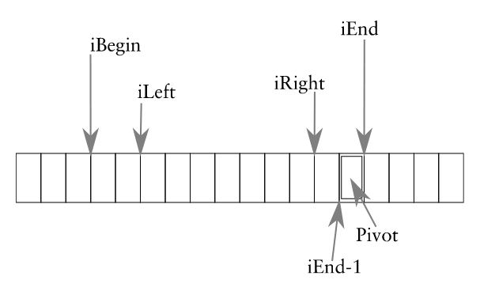

# Sorting

## Minimum theoretical cost

All sorting algorithms must fundamentally contain a series of comparisons, and a series of exchanges. To deduce a theoretical minimum time complexity for a sorting algorithm, we will find the respective minimum amounts of each of these operations.

### Lower bound on exchanges

If there are $n$ items in an array, then $\Theta(n)$ exchanges are needed to put them in order in the worst case.

In the worst case, in order to correctly place the smallest item in the array, one exchange is needed. For the second smallest, another exchange, and so on, so the total number of exchanges is $n-1$ (since the last item must be in the right place anyway).

### Lower bound on comparisons

Sorting by pairwise comparison necessarily costs at least $\Omega(n \lg n)$ comparisons

There are $n!$ permutations of $n$ items, and in sorting, we effectively identify one of these permutations. Each pairwise comparison divides the number of possible permutations in half, so we need at least $\lceil \lg(n!) \rceil$ comparisons to discriminate between $n!$ cases. Using Stirling's approximation, we find that this is roughly $\lg(n^n) = n \lg n$

The analysis above shows that the minimum time complexity for a sorting algorithm is $\Omega(n \lg n)$.

## Stability

In the event that the items being sorted are distinguishable by some attribute other than their value, a stable sorting algorithm is one that preserves the relative ordering of items with equal value.

 Some algorithms are stable anyway, but in general, any sorting algorithm can be made stable: extend the record for each item to include their original position, and then use this extra field to break ties in comparison.

## Insertion sort

Insertion sort is an elementary sorting algorithm, in which a sorted array is constructed by inserting each new item into the array in the correct position relative to the other items. In practice, this insertion is performed by shuffling the item to the left until it reaches the right place.

### Pseudocode

```python
def insertionSort(a):
    for i in range(1, len(a)):
        # shuffle the item to the left
        j = i-1
        while j >= 0 and a[j] > a[j+1]:
            swap(a[j], a[j+1])
            j -= 1
```

### Time complexity

For an array `a[]` of size $n$, we can see from the pseudocode that the outer loop of the function is executed exactly $n-1$ times, regardless of the values in `a[]`. The inner loop is more complicated, but in the worst case (when `a[]` is reversed): for the $i$th iteration of the outer loop, the inner loop will run $i$ times. Since the inner loop will always run in constant time, we get a triangle number:

$$
T(n) = \sum_{i=0}^{n-1}i = \frac{n(n-1)}{2} \in O(n^2)
$$

## Selection Sort

Selection sort constructs a sorted list of items by successively finding the smallest of a set of items, and appending that to the sorted list.

### Pseudocode

```python
def selectionSort(a):
    for i in range(len(a)):
        # find the smallest in the rest of the array
        jMin = i
        for j in range(jMin + 1, len(a)):
            if a[j] < a[jMin]:
                jMin = j
        # place the next smallest
        swap(a[i], a[jMin])
```

### Time complexity

The outer loop runs a total of $n$ times, the inner loop searches a sub-array of size $n, n-1, \ldots 2, 1$, so the complexity is again a triangle number with a precise cost of $\Theta(n^2)$.

Where insertion sort used $O(n^2)$ for both comparisons and for exchanges, selectionSort only uses $\Theta(n)$ exchanges, so there is at least some improvement there.

## Binary insertion sort

Binary insertion sort works the same way as insertion sort, but now the desired position of an item in the sorted sub-array is found using binary search.

### Pseudocode

```python
def binaryInsertionSort(a):
    for k in range(1, len(a)):
        # find the right location for a[k] in the sorted sub-array
        i = binarySearchLocation(a[k])
        # shuffle items so it's in the right place.
        if i != k:
            tmp = a[k]
            for j from k-1 down to i-1:
                a[j+1] = a[j]
            a[i] = tmp
```

### Time complexity

The number of exchanges in binary insertion sort is the same as in insertion sort - $O(n^2)$ - but now the number of comparisons is $O(n \lg n)$. The asymptotic time complexity is still $O(n^2)$, however if comparisons are more expensive than exchanges, we get significant performance improvements for small $n$.

## Bubble sort

In bubble sort, adjacent items in an array are compared, and swapped if they are in the wrong order. The algorithm ends when no more swaps can be performed.

### Pseudocode

```python
def bubbleSort(a):
    swappedThisPass = True
    while swappedThisPass:
        swappedThisPass = False
        for k in range(len(a)-1):
            if a[k] > a[k+1]:
                swap(a[k], a[k+1])
                swappedThisPass = True
```

### Time complexity

Bubble sort has $O(n^2)$ costs in the worst case (reversed list), but terminates in linear time on input that was already sorted.

## Mergesort

The idea behind mergesort is that two arrays that have already been sorted can be merged into another sorted array in around $n$ steps, just by comparing the first item in each array.

### Pseudocode

```python
def mergeSort(a):
    if len(a) < 2:
        return a

    h = int(len(a)/2)
    a1 = mergeSort(a[:h])
    a2 = mergeSort(a[h:])

    a3 = new array of size len(a)
    i1 = 0 # index into a1
    i2 = 0 # index into a2
    i3 = 0 # index into a3

    while i1 < len(a1) or i2 < len(a2):
        a3[i3] = smallest(a1, i1, a2, i2) # updates i1 or i2 too
        i3 += 1

    return a3
```

### Time complexity

Since mergesort is recursive, we can derive a recurrence relation for $T(n)$, namely

$$
T(n) = 2T(n/2) + kn
$$

Where $2T(n/2)$ is the cost of the two recursive calls, and $kn$ is the cost of merging. We can solve this recurrence relation using the substitution $n = 2^m, \, m = \lg n$:

$$
\begin{aligned}
T(n)
&= 2T(n/2) + kn \\
&= 2T(2^m/2) + k2^m \\
&= 2T(2^{m-1}) + k2^m \\
&= 2(2T(2^{m-2}) + k2^{m-1}) + k2^m \\
&= 2^2T(2^{m-2}) + 2 \cdot k2^m \\
&= 2^3T(2^{m-3}) + 3 \cdot k2^m \\
\vdots \\
&= 2^mT(2^{m-m}) + m \cdot k2^m \\
&= 2^mT(1) + k \cdot m2^m \\
&= T(1) \cdot n + k \cdot n \lg n \\
&= O(n \lg n)
\end{aligned}
$$

Thus, mergesort is the first of the algorithms we look at to have the optimal $O(n \lg n)$ time complexity. Its main disadvantage is that is requires extra space to hold he partially merged results.

### Space complexity

In the pseudocode above, the algorithm requires $2n$ space to perform any merge, since it stores each sub-array before merging them into a sorted array.

Merging can be performed in $n/2$ space using a clever trick. The space-heavy part of mergesort is the storage of each sub-array, so we want to find a way to do this in $n/2$ space. The method is this:

1. Assume we have an array consisting of two sorted sub-arrays.

2. Copy the first sub-array into temporary space

3. Merge the sub-arrays back into the original array, filling up the space where the first sub-array used to be.

This method works because the amount of spare space in the original array is always the same as the amount of elements left in the copied sub-array.

## Quicksort

Quicksort works by selecting a 'pivot' element `p`, separating the array into two sub-arrays: one where `a[i] <= p`, and one where `a[i] > p`, and then recursively quicksorting each of those sub-arrays.

The most important part of the quicksort algorithm is the parititioning step; where the sub-array is divided into a lower and higher half. Here we use the following method:

1. We choose the pivot $p$ to be the rightmost item in the sub-array. Set two indexes `iLeft` and `iRight`, initially at either end of the sub-array, which we will use as delimiters. We say that:
- all the items to the left of `iLeft` are $\le p$
- all the items to the right of `iRight` are $> p$ (ignoring $p$ itself).

2. We now increment `iLeft`, and decrement `iRight` as long as the above statements still hold. Once neither can move any further, we swap `a[iLeft]`and `a[iRight-1]`.

3. Repeat the above process until `iLeft = iRight`, then swap `a[iLeft]` with the pivot element.



### Pseudocode

```python
def quickSort(a, iBegin, iEnd):
    if iBegin < iEnd:
        pivot = a[iEnd-1]
        iLeft = iBegin
        iRight = iEnd - 1

        while iLeft < iRight:
            while a[iLeft] <= pivot and iLeft < iRight:
                iLeft += 1
            while a[iRight-1] > pivot and iLeft < iRight:
                iRight -= 1
            if iLeft != iRight:
                swap(a[iLeft], a[iRight-1])

        swap(a[iLeft], a[iEnd-1])

        quickSort(a, iBegin, iLeft)
        quickSort(a, iLeft+1, iEnd)
```

### Time complexity

In the average case, quicksort has $\Theta(n \lg n)$ time complexity. However, in the worst case, (a sorted list) the complexity rises to $O(n^2)$. The partitioning step can always be completed in $O(n)$ time, but the question of how many times the partitioning step must be run varies from $O(\lg n)$ in the average case to $O(n)$ in the worst case

## Heapsort

The heapsort algorithm uses the data structure of the *heap* as its foundation. It consists of two phases:

1. Reordering the array into a heap. This can be done in linear time, as shown earlier.

2. Successively taking the maximum item from the heap, to form the sorted list.

### Pseudocode

```python
def heapSort(a):
    heapify(a, 0, len(a)-1)
    for k in range(len(a)-1, 0, -1):
        swap(a[0], a[k])
        siftDown(a, 0, k-1)
```

### Time complexity

As mentioned, the complexity of `heapify()` is $O(n)$. However, the complexity of reorganising the heap after each removal is what limits us here. The complexity of `siftDown()` is $O(\lg n)$, and must be run $O(n)$ times, so the overall complexity is $O(n \lg n)$, as we might have expected.

## Counting sort

Counting sort uses the knowledge that an array contains non-negative integers in a fixed range, in order to speed up sorting significantly. It works simply by counting the number of occurrences of each integer, and then doing some arithmetic to place them correctly. No comparisons are needed at all.

### Pseudocode

```python
def countingSort(a):
    k = max(a)

    # array of counts recorded for each integer
    counts = [0 for i in range(k+1)]

    for x in a:
        counts[x] += 1

    # the positions for each integer
    positions = [0 for i in range(k+1)]
    total = 0

    for i in range(k+1):
        positions[i] = total
        total += counts[i]

    output = [0 for i in a]
    for x in a:
        output[positions[x]] = x
        positions[x] += 1

    return output
```

### Time complexity

Counting sort only ever uses one-dimensional for loops, so it can be analaysed fairly easily to see that it has $O(n)$ complexity, or more specifically $O(n+k)$, where $k$ is the largest integer in the list.

## Bucket sort

Bucket sort is specifically tailored to sorting real numbers in a known range. It works by roughly grouping the items into ranked 'buckets' of similar value, and then sorting those buckets individually.

### Pseudocode

```python
def bucketSort(a):
    k = max(a)
    n = len(a)
    buckets = [[] for i in a]

    # separate into buckets
    for i in range(n):
        buckets[floor(a[i] / k * (n-1))].append(a[i])

    # sort each bucket and concatenate results
    output = []
    for list in buckets:
        insertionSort(list)
        output += list

    return output
```

### Time complexity

In the case where the numbers are uniformly distributed, each `insertionSort()` will take only linear time, so the expected complexity is $O(n)$. In fact, this is true for the average case. However, if the array contains several clusters of values, the algorithm can take as long as $O(n^2)$, due to the poor performance of insertion sort on longer arrays.

## Radix sort

Radix sort sorts items by their digits in some base $b$. Starting with the least-significant digit, items are sorted using some stable sorting algorithm, before moving to the next digit. By properties of the stable sort, the order with respect to the previously sorted digits is preserved.

Since radix treats integers as a string of digits rather than a number, it can be applied equally well to sorting strings.

### Pseudocode

```python
def radix_sort(a):
    # b is the base of the number system
    k = max(a)

    # compute the number of digits needed to represent k
    nDigits = len(str(k))
    for d in range(nDigits):
        # counting_sort on the dth digit.
        a = counting_sort(a, d)

    return output
```

### Time complexity

By using counting sort as our stable sort, we can achieve linear complexity in each sort-by-digit, giving a total complexity of $O(d \cdot n)$ where $d$ is the number of digits.

## Median and order statistics

We consider the general problem of finding the $k$th smallest value in a collection of $n$ values, for which the median is an example: the $k/2$ smallest. This $k$th smallest value is called the $k$th *order statistic*.

The naïve way to approach this is to sort the values completely, and then select the $k$th smallest from the sorted list, which takes $O(n \lg n)$ for the sorting. It turns out that this problem can be solved much faster, in $O(n)$ time.

One method is based on the partitioning method of quicksort: but now instead of sorting both arrays produced by each partition, we compare the index $p$ of the pivot to $k$. If $k<p$, we continue looking for the rank $k$ item in the lower partition; if $k>p$, we look for the rank $k-p$ item in the higher partition. The cost of this method in the best case is roughly $T(n) = T(n/2) + kn$, which we can show can linear growth using the substitution $n = 2^m$ like earlier:

$$
\begin{aligned}
T(n)
&= T(n/2) + kn \\
&= T(2^m/2) + k2^m \\
&= T(2^{m-1}) + k2^m \\
&= T(2^{m-2}) + k2^{m-1} + k2^m \\
&= T(2^{m-3}) + k(2^{m-2} + 2^{m-1} + 2^m) \\
\vdots \\
&= T(2^{m-m}) + k(2^{m-(m-1)} + \ldots + 2^{m-1} + 2^m) \\
&= T(1) + 2k(2^m-1) \\
&= T(1) + 2kn - 2k \\
&= O(n)
\end{aligned}
$$

Although in the worst case the complexity is still $O(n^2)$, just as with quicksort.
