# Devices and Circuits

## Introduction

This section will look at how logic gates can be built using electronic circuits.

Basic concepts of electrical circuits and components enable the analysis of *linear circuits*, i.e. circuits where *superposition* applies:

- If an input $x_1(t)$ gives an output $y_1(t)$, and input $x_2(t)$ gives an output $y_2(t)$, then input $x_1(t) + x_2(t)$ gives an output $y_1(t) + y_2(t)$.

However, logic circuits are *non-linear*; we will use a graphical technique for analysing these circuits.

## Basic Electricity

$$
Q = It \\
E = QV = ItV \\
P = IV = E/t \\
V = IR \\
$$

### Kirchhoff's Laws

#### Kirchhoff's Current Law

The sum of currents entering any point is zero. For example:

In the above case, $I_1 + I_2 - I_3 = 0$, or $I_1 + I_2 = I_3$.

#### Kirchhoff's Voltage Law

In any closed loop of a circuit, the sum of the voltages in that loop is zero. For example:

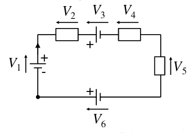

In the above case, $V_1 - V_2 - V_3 - V_4 - V_5 + V_6 = 0$

### Potential Divider

A potential divider is part of a circuit which allows specific potential differences to be produced using the correct resistor values:

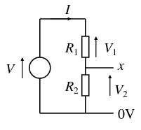

In the above circuit, the circle represents an ideal voltage source. We can calculate the p.d. between 0V and $x$, or $V_2$, algebraically:

$$
V = V_1 + V_2 \\
    = I R_1 + I R_2 \\
    = I(R_1 + R_2)
$$

So,
$$
I = \frac{V}{R_1 + R_2} \\

\therefore
V_2 = I R_2 \\
    = \frac{V R_2}{R_1 + R_2}
$$

This can also be done graphically. Suppose we have a function $I(V)$, called the *device characteristic*, which gives the current through a component for some p.d. across it (for an Ohmic component e.g. resistor, $I(V) = kV$). We know that the current through both resistors is equal: $I_{R_1}(V_1) = I_{R_2}(V_2)$. We also know that $V = V_1 + V_2$. We can therefore substitute for $V_1$ in the first equation, to give $I_{R_1}(V - V_2) = I_{R_2}(V_2)$. This gives us a graphical interpretation:

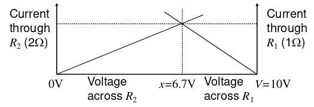

This graphical method also works for non-linear functions $I(V)$, so can be used with components such as transistors.

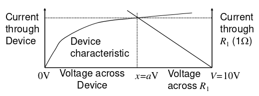

## Capacitors

A capacitor is effectively 2 conductors separated by a non-conductor, called a dielectric. Parallel conductors can often occur incidentally in circuits, creating *parasitic* capacitors.

### Capacitor Laws

The charge $Q$ stored in a capacitor with capacitance $C$ with voltage $V$ across it is $Q = VC$.

As we know, current is the rate of flow of charge: $dQ/dt = I$, so $Q = ∫(I)dt$, so we can write

$$
V = \frac{\displaystyle \int \! I \, \mathrm{d}t}{C}
$$

### Resistor-Capacitor circuits (RC circuits)

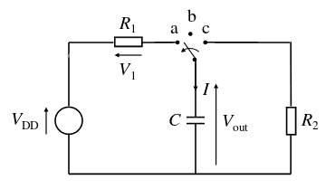

The above circuit is a simple RC circuit. Initially, $V_{out} = 0$, and the switch moves from position $b$ to position $a$. $C$ charges through $R_1$ and current $I$ flows in $R_1$ and $C$.

#### Charging
When the switch is at $a$, we can see that

$$
V_{DD} = V_1 + V_{out} \\
    = I R_1 + \frac{\displaystyle ∫ \! I \, \mathrm{d}t}{C}
$$

Differentiate $dt$:

$$
0 = R_1 \frac{\mathrm{d}I}{\mathrm{d}t} + \frac I C \\

-\frac{\mathrm{d}t}{C R_1} = \frac{\mathrm{d}I} I \\

-∫ \frac 1 {C R_1} \mathrm{d}t = ∫ \frac 1 I \mathrm{d}I \\

-\frac t {C R_1} + c = \ln(I)
$$

Substitute values for $t = 0$:

$$
0 + c = \ln(I_0) \\
    = \ln(\frac {V_{DD}} {R_1})
$$

So
$$
-\frac t {C R_1} + \ln(I_0) = \ln(I) \\

-\frac t {R_1 C} = ln(\frac I {I_0}) \\

e^{-\frac t {R_1 C}} = \frac I {I_0} \\

I = I_0 e^{-\frac t {R_1 C}}
$$

We can use this result to derive $V_{out} = V_{DD} (1-e^{-\frac t {R_1 C}})$. If $t = R_1 C$, then we get $V_{out} = V_{DD} (1-\frac 1 e)$, which is constant over time (roughly $0.632 V_{DD}$). The value $R_1 C$ is known as the *time constant*, and has units of seconds.

#### Discharging

## Semiconductors

In a metal, since there are many free electrons, it is difficult to precisely control its electrical properties. Instead, we can use a material with low electron density - a *semiconductor* - like silicon, to carefully control the electron density, and create a range of electronic devices.

We can create n-type silicon by doping with arsenic (group 5), which donates an electron to the silicon, creating a small excess of free electrons in the material. The free electrons are then free to move around the silicon lattice. Called n-type because the charge carriers are negative.

Similarly we can create p-type silicon by doping with boron (group 3), which accepts an electron from the silicon, creating a deficit of free electrons in the material. This leaves a *hole*, which is free to move around the lattice. Called p-type because the charge carrier (the hole) is positive.

### Metal Oxide Semiconductor Field Effect Transistors (MOSFET)

#### n-Channel MOSFET (n-MOS)

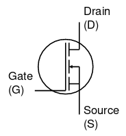

In an n-channel MOSFET, the current flow from $D$ to $S$ is controlled by the voltage aplied between $G$ and $S$, $V_{GS}$. $G$ must be positive compared to $S$ in order for current $I_{DS}$ to flow.

#### p-Channel MOSFET (p-MOS)

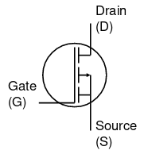

In a p-channel MOSFET, the current flow from $S$ to $D$ is controlled by $V_{GS}$. $G$ must be negative compared to $S$ in order for current $I_{DS}$ to flow.

### Device Characteristic

The device characteristic represents how current flows through a device with varying potential difference across it. The characteristics of an n-MOSFET for various gate voltages:

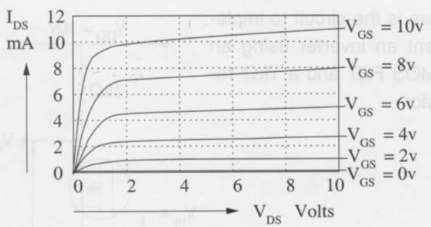

At a constant value $V_{DS}$ across the transistor, we can also plot how the current through the transistor varies with gate voltage:

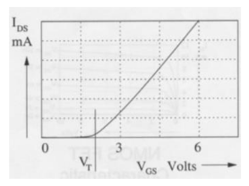

The current begins to flow when $V_{GS}$ reaches the threshold voltage $V_{T}$.

### n-MOS Inverter

We can create a simple inverter using an n-MOS, by incorporating it into a potential divider circuit:

Since this is a potential divider, we can use the graphical method from earlier to determine $V_{DS}$ for any given $V_{GS}$:

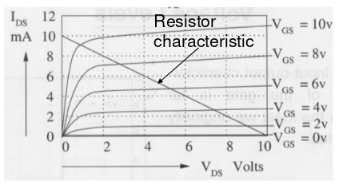

This results in the following profile for the relationship between $V_{GS}$ and $V_{DS}$:

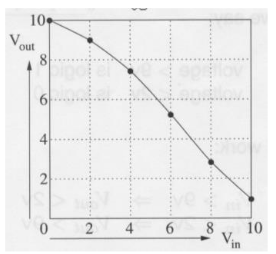

where $V_{in} = V_{GS}$, and $V_{out} = V_{DS}$. This is different from the ideal inverter profile:

but we can achieve a roughly binary action by specifying suitable threshold voltages. For example, if we say $[1] > 9V$, and $[0] < 2V$, the inverter will work as desired, giving $V_{in} = [0] \mapsto V_{out} = [1]$ and $V_{in} = [1] \mapsto V_{out} = [0]$.

### n-MOS Logic

Using n-MOS transistors in for logic circuits has a few drawbacks:

- Low switching speed

- High power consumption

#### Speed limitations

One of the main speed limitations is due to stray capacitance owing to the metal track used to connect gate inputs and outputs. We can modify the circuit from before to include this stray capacitance $C$:

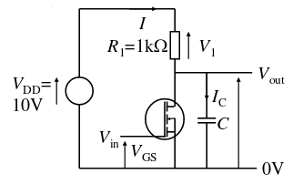

When the transistor is off, we can effectively eliminate it from the diagram. This leaves us with a typical capacitor charging setup, in this case with a time constant of $1000 \cdot C$. This means that the when the transistor switches off, $V_{out}$ takes some time to change, due to the capacitor charging.

A similar effect is observed when the transistor is switched on: in this case the discharging resistance is just the resistance of the transistor, which is typically fairly low (say $<100\Omega$). The time constant then is lower, so the voltage changes faster, but still in finite time.

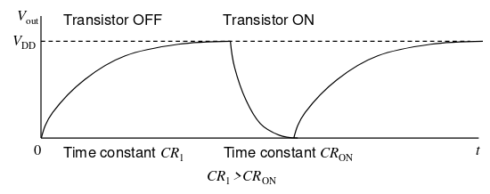

#### Power consumption

When the transistor is off, power consumption is not a problem, since no current flows through $R_1$.

When the transistor is on, current flows through $R_1$, since the voltage across it is not longer $0V$. This consumes power, since $P = IV$.

### CMOS Logic

To overcome the problems with n-MOS logic, complementary MOS (CMOS) logic was developed, which uses both n-MOS and p-MOS transistors.

#### CMOS Inverter

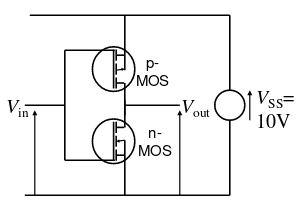

The diagram above shows the circuitry for a CMOS inverter. The Source of the p-MOS is tied high, which means that when the $V_{in}$ is at a lower voltage, $V_{out}$ will be high. The Source of the n-MOS is tied low, which means that when the $V_{in}$ is at a higher voltage, $V_{out}$ will be high. This results in an inverting action. The switching characteristics are much better than for the n-MOS inverter:

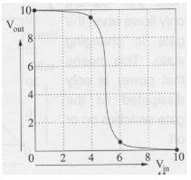

It can be shown that the transistors in a CMOS inverter only dissipate power when they are switching. When either of the transistors is off, the power consumption is zero:

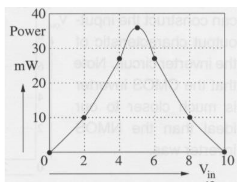

#### CMOS Gates

CMOS can also be used to build `NAND` and `NOR` gates.

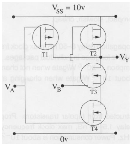

The circuit above shows a CMOS `NAND` gate. The top two transistors are p-MOS, and the bottom two are n-MOS. The circuitry effectively consists of two inverter circuits, but with the n-MOS transistors in series, so that both inputs must be high to allow the output to be low.

A CMOS `NOR` gate can be made similarly by arranging the p-MOS transistors in series rather than the n-MOS.

### Logic Families

- NMOS - compact, slow, cheap, obsolete

- CMOS - Older families slow (4000 series about 60ns), but new ones (74AC) much faster (3ns). 74HC series popular

- TTL - Uses bipolar transistors. Known as 74 series. Note that most 74 series devices are now available in CMOS. Older versions slow (LS about 16ns), newer ones faster (AS about 2ns)

- ECL - High speed, but high power consumption

Which logic family to use for a particular purpose should be chosen by considering the performance/[power consumption] trade off for the situation. It is possible to use different logic families in conjunction, but you must account for the different acceptable logic values and gate current ranges.

## Noise Margin

We can quantify the tolerance of a particular logic to noise, by using the idea of *noise margins*:

The noise margin is the amount by which the acceptable input range for the voltage differs from the possible output range.

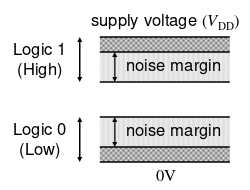

The high noise margin is therefore the difference between the minimum high output voltage ($V_{OHmin}$) and the minimum high input voltage ($V_{IHmin}$), and the low noise margin is the difference between the maximum low output voltage ($V_{OLmax}$) and the maximum low input voltage ($V_{ILmax}$).

$$
\text{Low noise margin} = V_{OHmin} - V_{IHmin} \\
\text{High noise margin} = V_{ILmax} - V_{OLmax}
$$

The noise margins for CMOS devices are generally much larger than for TTL devices, since their output ranges are much smaller, so in general they can tolerate more noise pickup.

## Analogue interfaces

To convert an analogue signal to a digital format we need an analogue to digital converter (ADC). Similarly to convert a digitally represented signal into an analogue signal we need to use a digital to analogue converter (DAC). These are implemented in different ways depending on the situation.

### Analogue to Digital Conversion (ADC)

ADC is a 2 stage process:

1. Sampling - The continuous time analogue signal is sampled at regular intervals so that it only exists at multiples of the sample time $T$. Thus $f(t)$ can be represented as $\{ f(0T), f(1T), f(2T), f(3T) \ldots \}$

2. Quantisation - The continuous range of the amplitude of the signal is constrained to take one of only $M$ values, depending on how many bits are used to represent the values. In $n$-bit ADC, $M = 2^n$.

This process introduces error in the signal, since it is only approximated by discrete values.

#### Nyquist rate

The sample rate must be at least twice the highest frequency in the analogue signal being sampled. If this is not the case, it will introduce *alias distortion* in the sampled signal, which will make some signals indistinguishable from one another, and cannot be undone. This minimum rate is called the *Nyquist rate*.

To ensure this criterion is satisfied, an analogue signal is often passed through a low-pass filter, which will remove frequencies above a specified limit.

#### Amplitude range

ADC also requires that the input signal suits its specified amplitude range. Consequently, amplification is usually required before being input to the ADC. If not, the quality of the signal will be poor.

##### Signal quality

Signal quality can be quantified by the ratio of the amplitude of the underlying signal to the amplitude of the quantisation noise.

Op-amp based "gain blocks" are often used in front of the ADC since they have predictable performance and are straightforward to use.

### Digital to Analogue Conversion (DAC)

A DAC is used to convert the digitised sample values back into an analogue signal. A low pass filter usually follows the DAC to yield a smoother signal.

Op-amp based buffer amplifiers are also often used following the DAC to prevent the load (speakers etc) affecting the operation of the DAC.

## Operational Amplifiers (Op-Amps)

Op-amps have 2 inputs, known as inverting ($-$) and non-inverting ($+$), and a single output. They can be configured to implement amplifiers, as well as many other functions:

- Filters: circuits that can manipulate the frequency content of signals

- Mathematical functions e.g. integrators and differentiators

- Comparators and triggers i.e. thresholding devices

A ‘cookbook’ of useful such applications can be found in ‘The Art of Electronics’ by Horowitz and Hill

The defining expression for an op-amp is

$$
V_{out} = A_{OL}(V^+-V^-)
$$

where $A_{OL}$ is the open-loop gain of the amplifier; the gain when no feedback loop is connected.

Here we will assume the op-amps to be 'ideal', i.e. infinite input resistance (zero input current) and infinite gain.

One important thing to note is that if we take our op-amp equation, and substitute the infinite gain of an ideal op-amp, we get $V^+ - V^- = \frac{V_{out}}{A_{OL}} = \frac{V_{out}} \infty = 0$, so we have $V^+ = V^-$. When $V^-$ is connected to ground, we have that $V^+$ is effectively ground as well, although it is not actually connected. This idea is called virtual ground.

### Inverting Amplifier

The following setup is known as an inverting amplifier. It scales the input signal proportionally to the ratio of the two resistors:

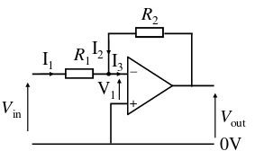

From Kirchhoff's current law, we know that $I_1 + I_2 - I_3 = 0$. Since the op-amp is ideal, $I_3 = 0$, so $I_1 = -I_2$.

From Kirchhoff's voltage law, we know that $V_{in} - I_1 R_1 - V_1 = 0$, and that $V_1 + I_2 R_2 - V_{out} = 0$.

Since the op-amp is ideal, $V^+ = V^-$, so $V_1 = 0$. Substituting this into the above equations, we get $V_{in} = I_1 R_1$, and $V_{out} = I_2 R_2$. Substituting $I_1 = -I_2$, we have $V_{out} = -I_1 R_2$.

Equating the two expressions for $I_1$, we get

$$
\frac{V_{in}}{R_1} = -\frac{V_{out}}{R_2}
$$

or equally

$$
\frac{V_{out}}{V_{in}} = -\frac{R_2}{R_1}
$$

### Non-Inverting Amplifier

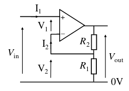

Now in this configuration, $I_1 = I_2 = 0$, since the input currents are $0$. On the right of this circuit, we have a potential divider, so $V_2 = V_{out} \frac{R_1}{R_1 + R_2}$. We also have $V_{in} = V_1 + V_2$, but since $V_1 = 0$ (similar to the inverting amplifier), we just have $V_{in} = V_2$.

So, $V_{in} = V_{out} \frac{R_1}{R_1 + R_2}$, and we have

$$
\frac{V_{out}}{V_{in}} = 1 + \frac{R_2}{R_1}
$$

### Buffer Amplifier (Unity Gain)

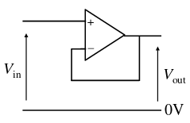

If we let $R_1 = \infty$ (open circuit) and $R_2 = 0$ (short circuit) in the non-inverting amplifier, we end up with

$$
\frac{V_{out}}{V_{in}} = 1
$$

This circuit can then be used to as a buffer, to stop and voltage changes on the right hand side affecting the input on the left, e.g. in DAC.

### Op-amp Power Supplies

Usually, op-amps use split power supplies:

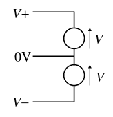

This permits input signals having both positive and negative values to be amplified. This can be inconvenient for battery powered equipment, however if the input signal is either always positive or always negative, one of the rails can removed i.e. set to 0V.
