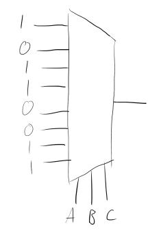
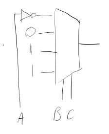
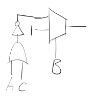

1a)

$\begin{aligned}
X &= \overline A.B.C + \overline{B.\overline C} + B.C \\
&= \overline B + C + B.C \\
&= \overline{B} + C
\end{aligned}$

$\begin{aligned}
Y &= \overline{(A+B+C)}.D + A.D + B \\
&= \overline A.\overline B.\overline C.D + A.D + B.D + B \\
&= (\overline A.\overline B.\overline C + A + B).D + B \\
&= (\overline C + A + B).D + B \\
&= A.D + B + \overline C . D \\
\end{aligned}$

b)
(i)

(ii)

(iii)

c)

(i)

| $I_7$ | $I_6$ | $I_5$ | $I_4$ | $I_3$ | $I_2$ | $I_1$ | $I_0$ | $O_2$ | $O_1$ | $O_0$ | None |
| ----- | ----- | ----- | ----- | ----- | ----- | ----- | ----- | ----- | ----- | ----- | ----- |
| 0     | 0     | 0     | 0     | 0     | 0     | 0     | 0     | 0     | 0     | 0     | 1     |
| 0     | 0     | 0     | 0     | 0     | 0     | 0     | 1     | 0     | 0     | 0     | 0     |
| 0     | 0     | 0     | 0     | 0     | 0     | 1     | x     | 0     | 0     | 1     | 0     |
| 0     | 0     | 0     | 0     | 0     | 1     | x     | x     | 0     | 1     | 0     | 0     |
| 0     | 0     | 0     | 0     | 1     | x     | x     | x     | 0     | 1     | 1     | 0     |
| 0     | 0     | 0     | 1     | x     | x     | x     | x     | 1     | 0     | 0     | 0     |
| 0     | 0     | 1     | x     | x     | x     | x     | x     | 1     | 0     | 1     | 0     |
| 0     | 1     | x     | x     | x     | x     | x     | x     | 1     | 1     | 0     | 0     |
| 1     | x     | x     | x     | x     | x     | x     | x     | 1     | 1     | 1     | 0     |

(ii)

$O_2 = I_4+I_5+I_6+I_7$

$O_1 = I_2 + I_3 + I_6 + I_7$

$O_0 = I_1 + I_3 + I_5 + I_7$

$\text{None} = \overline {I_0 + I_1 + I_2 + I_3 + I_4 + I_5 + I_6 + I_7}$
