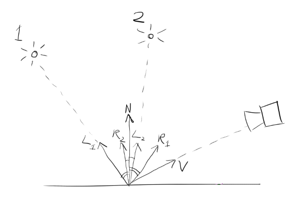

4a) (i)

(ii) The diffuse term models reflections caused by light scattering after hitting a rough surface. This term depends on:

- intensity/color of light sources $I_i$

- diffuse constant of the material $k_d$

- the angle between the incident ray and the surface normal (effectively $\mathbf{L_i \cdot N}$).

(iii) The specular term models direct reflections in a mirror-like surface. This term depends on:

- intensity/color of light sources $I_i$

- specular constant of the material $k_s$

- the angle between the ideal reflected ray and the viewer (effectively $\mathbf{R_i \cdot V}$)

- the "shininess" of the material $n$

(iv) The ambient term models the typically small amount of light that comes from the environment, and is scattered throughout an entire scene. This term depends on:

- intensity/color of ambient lighting from the environment $I_a$

- ambient constant of the material $k_a$.

(v) $\mathbf{L_i \cdot N}$ is the cosine of the angle between an incoming light ray and the surface normal (since both are unit vectors). This mimics the way that diffuse reflections are diminished if the incoming light is at a low angle to the surface.

(vi) On diffuse materials, the microfacets at any point on the surface are distributed with a high variance, so that incoming light may be reflected at very high angles from compared to an ideal reflection.

For imperfect specular materials, the variance is low, but non-zero, so a general blurry reflection will be seen in the surface. Most microfacets will align well with the surface normal, but some will deviate.

For perfect specular materials, the variance is zero, so the reflections will be clear, and the light rays will follow the path of the ideal reflection. The microfacets will all align with the surface normal.

b)

Reflected ray: $\vec R=\vec{AB} - 2 \vec {N_1}(\vec{AB} \cdot \vec{N_1})$

Plane 2: $(\vec p- \vec D) \cdot N_2 = 0$

Line BC: $\vec p = \vec B+\lambda \vec R$

Intersection of line BC and plane 2:
$$
\lambda = \frac{(\vec D-\vec B)\cdot \vec{N_2}}{\vec R \cdot \vec{N_2}} \\

\therefore \vec C = \vec B + \vec R \left( \frac{(\vec D-\vec B)\cdot \vec{N_2}}{\vec R \cdot \vec{N_2}} \right)
$$
