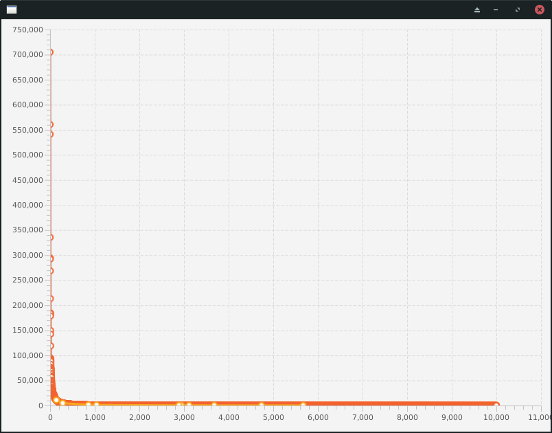
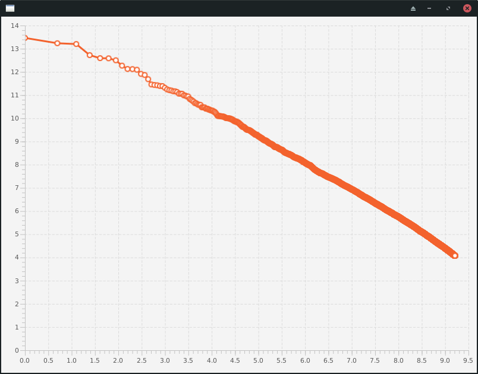
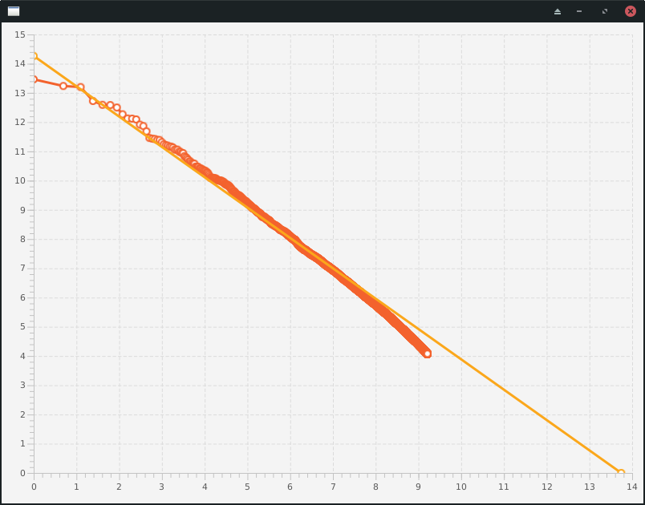
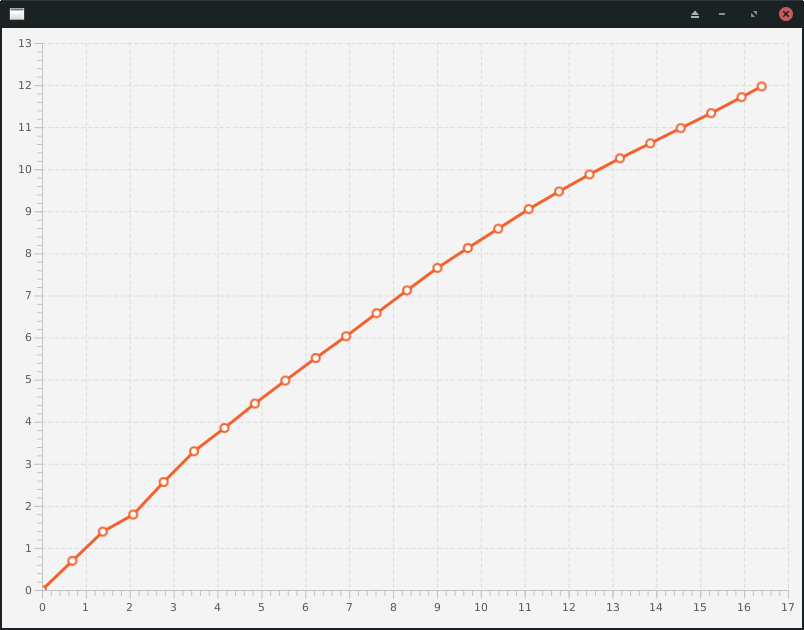
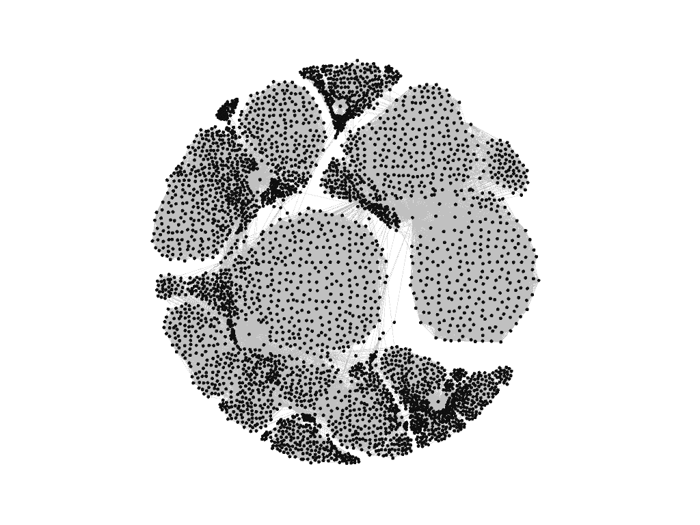
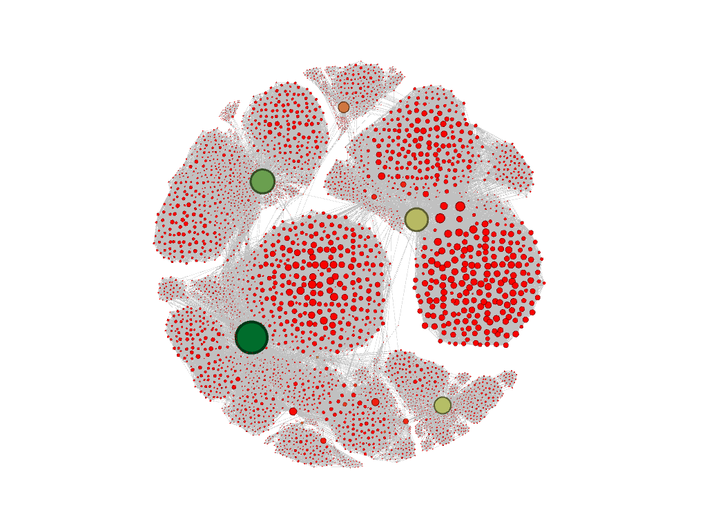

# Machine Learning and Real World Data (Lab Notebook)

## Topic 1: Sentiment Detection

### Task 1: Simple Classifier

#### Part 1: Manual Classification

| Review | Sentiment |
| ------ | --------- |
| 1      | Positive  |
| 2      | Negative  |
| 3      | Negative  |
| 4      | Positive  |

#### Part 2: Sentiment Lexicon Database

The entries for *excellent* and *boring* in the given lexicon show that the exntries are structured with a polarity of either positive or negative, and with an intensity value as well.

Words I think will indicate sentiment:

| Word          | Sentiment |
| ------------- | --------- |
| excellent     | positive  |
| dry           | negative  |
| annoying      | negative  |
| spoiled       | negative  |
| unique        | positive  |
| uncomfortable | negative  |
| mistaken      | negative  |
| profanity     | negative  |
| popcorn       | positive  |
| better        | positive  |

A lot of the words I've chosen are listed with the same sentiment in the given lexicon, but some are not listed. I mostly agree with the sentiments given in the lexicon.

#### Part 3: Simple Classifier Virtual programming lab

##### Setup
I've named the package `uk.ac.cam.cl.erm67.exercises` for this task. In order to compile my code, I run the following command from my parent `tasks` folder:

```sh
javac -d out/ -cp src/stanford-postagger.jar src/uk/ac/cam/cl/erm67/exercises/*.java src/uk/ac/cam/cl/mlrd/exercises/sentiment_detection/*.java src/uk/ac/cam/cl/mlrd/testing/Exercise1Tester.java
```

Then I can run the tests with

```sh
java -cp src/stanford-postagger.jar:out uk.ac.cam.cl.mlrd.testing.Exercise1Tester
```

##### Classification

I used a `HashMap` to map each token onto their respective increments (positive or negative) when rating each review. The sum of the increments is calculated for each review; if it is positive, then the review is positive, and vice versa. I initially tried creating a list of objects that stored `word, intensity, polarity` for each word, but this was slow given the length of the lexicon.

##### Evaluation

The evaluation of this initial approach gives accuracy $A = 0.6349999904632568$, which is not amazing, but not bad either.

##### Improvements

I initially added some code that would allow me to use weights based on the `intensity` value in the lexicon, so stronger tokens would produce larger changes to the rating. Specifically, `weak` tokens remained at a change of 1, and `strong` tokens gave a change of $k$, which I found gave the best accuracy at about $k = 10$. This improved the accuracy to $A = 0.6672222018241882$.

I then tried changing the boundary between positive and negative reviews, so where a rating $\ge b \implies positive$. Previously, $b$ had just been zero. I found that the best value for for this boundary was at about $b = 3$, giving an accuracy of $A = 0.6711111068725586$.

Even with these improvements, the accuracy is not very impressive.

### Task 2: Naive Bayes Classifier

#### Step 0: Data preparation

Compile the code with

```sh
javac -d out/ -cp src/stanford-postagger.jar src/uk/ac/cam/cl/erm67/exercises/*.java src/uk/ac/cam/cl/mlrd/exercises/sentiment_detection/*.java src/uk/ac/cam/cl/mlrd/testing/*.java src/uk/ac/cam/cl/mlrd/utils/*.java
```

Then run the tests with

```sh
java -cp src/stanford-postagger.jar:out uk.ac.cam.cl.mlrd.testing.Exercise2Tester
```

#### Step 1: Parameter estimation

Effectively just translated the pseudocode from Jurafasky and Martin.

#### Step 2: Classification

The simple classifier from task 1 gives an accuracy of $A = 0.5899999737739563$ for the data used in the tester.

The unsmoothed classification gave an accuracy of $A = 0.5149999856948853$. This is only just better than random, so something is definitely wrong. It is also much worse than the accuracy of the simple classifier used in task 1.

#### Step 3: Smoothing

The issue with the unsmoothed classifier, is that some of the log probabilities calculated for words are $0$, so when these words show up in a text, they overshadow whatever other words are in the text, and the final probability for that class will just be zero.

After applying smoothing, the accuracy is now $A = 0.7749999761581421$. This is much better than the unsmoothed value, but also much better than the simple classifier used for task 1.

### Task 3: Statistical laws of language

Switched to using IntelliJ instead of running commands from the terminal.

#### Step 1: Zipf's law

Frequency vs. rank for the 10,000 highest-ranked words:


The words I chose in task 1 had the following rankings:

| word          | rank | frequency |
| ------------- | ---- | --------- |
| better        | 140  | 10925     |
| excellent     | 283  | 4723      |
| unique        | 857  | 1353      |
| annoying      | 1040 | 1089      |
| popcorn       | 2886 | 326       |
| dry           | 2941 | 320       |
| uncomfortable | 3114 | 298       |
| spoiled       | 3678 | 241       |
| profanity     | 4737 | 170       |
| mistaken      | 5672 | 134       |

The frequencies of these words on the ranking graph:



They mostly appear in the lower frequency section, but without being ranked *too* low. About average really.

The frequencies plotted on a log-log scale:



Now with a line of best fit, weighted by frequency:



The parameters for this line of best fit $y = mx + c$ are $m = -1.04, c = 14.3$. So,

$$
\ln{y} = m \ln{x} + c \\
y = e^{m\ln{x} + c} \\
y = e^c x^m \\
y = e^{14.3} x^{-1.04} \\
y = \frac{1.56 \times 10^6}{x^{1.04}} \\
\therefore f(r) = \frac{1.56 \times 10^6}{r^{1.04}}
$$

Using this formula with the words from task 1:

| word          | rank | predicted frequency | actual frequency |
| ------------- | ---- | ------------------- | ---------------- |
| better        | 140  | 9290                | 10925            |
| excellent     | 283  | 4474                | 4723             |
| unique        | 857  | 1417                | 1353             |
| annoying      | 1040 | 1158                | 1089             |
| popcorn       | 2886 | 402                 | 326              |
| dry           | 2941 | 394                 | 320              |
| uncomfortable | 3114 | 371                 | 298              |
| spoiled       | 3678 | 312                 | 241              |
| profanity     | 4737 | 240                 | 170              |
| mistaken      | 5672 | 199                 | 134              |

This is pretty good actually.

#### Step 2: Heaps' law

Plotting the number of unique words in a given number of tokens on a log-log scale gives this graph:



The line is ascending with a slight downward curve, implying a fairly high value for $\beta$, maybe $0.9$ or something.

### Task 4: Statistical Testing

#### Step 1: Magnitude classifier

Reused the weighting function I made for task 1, only fixing the weighting at 2.

#### Step 2: Sign test

Rounding up the number of `Null`s added to our `Plus` and `Minus` counts gives us a stricter test, since there are more data points than if we rounded down.

Using the `BigInteger` and `BigDecimal` classes made the code fairly unreadable, so I made several helper functions to encapsulate some tasks.

#### Step 3: Test your classifiers

The significance of the difference between the results for the Magnitude and the Simple classifiers is $p =0.6722499772048186$, which is not statistically significant at the $5\%$ level, however between the Magnitude and Naive Bayes classifiers, the significance was $p=0.04003719161339948$, which is statistically significant at this level.

#### Additional questions

Reducing the number of samples increases the p-value, since a broader range of scores is more likely on a smaller test set.

### Task 5: Cross-validation and test sets

#### Step 1: Data split

I made sure that each of the folds was the same size by checking if it was the correct size, and if it was then I tried assigning it to the next fold instead.

For stratified random, I used the same process, but keeping track of the amount of positive and negative reviews individually.

#### Step 2: Cross-validation

The cross-validation scores for the two methods of splitting the data were almost identical, at $0.82$ with some rounding errors.

The variance for the stratified random method was slightly lower.

#### Step 3: Evaluation on held-out data

The cross-validation accuracy of the classifier on the held-out test set was $0.83$.

#### Step 4: The Wayne Rooney effect

The system trained on the data from 2004 performs worse on the 2016 data, giving a cross-validation accuracy of $0.73$.

#### Step 5 (not part of tester)

When run on the held-out data, the simple classifier from task 1 gives an accuracy of $0.615$, which is worse than the $0.83$ from the naive bayes classifier. However, the simple classifier gives an accuracy of $0.700$ on the 2016 data, which is still worse than the naive bayes classifier, but it is an improvement on its score from the 2004 data.

The simple classifier is likely to be more consistent over time, since it uses general properties of language, rather than those specifically from one point in time.

### Task 6: Uncertainty and human agreement

#### Step 1: Nuanced classifier

I think the task is made easier by the introduction of the neutral category, since many reviews are hard to judge, as is the case with review 6220.

The accuracy of the new nuanced classifier is $0.582$, which is lower than it was for the binary classifier.

#### Step 2: Human agreement

My predictions broadly aligned with the predictions of the whole group.

#### Step 3: $\kappa$

Overall kappa value:
$0.6520918950518719$

Kappa value for reviews 1 and 2:
$0.3459080601937744$

Kappa value for reviews 3 and 4:
$0.9257192001425383$

## Topic 2: Hidden Markov Models

### Task 7: Training the HMM

Any of the probabilities for `x -> start`, or `end -> x` will be 0.

### Task 8: Viterbi algorithm

#### Step 1: Viterbi

We use logarithms again when dealing with very small probablities, so that the numbers are more reasonable and precise.

The most likely sequence of states is the same as the sequence of most likely states, since the latter is derived by constructing the former.

#### Step 2: Evaluation

With 10-fold cross-validation, the algorithm gives an average F1-measure of $0.86$.

### Task 9: Biological applications

Varying the random seed for the train-dev-split tester gives F1 scores ranging from about $0.73$ to $0.80$. This is a broad range, so cross-validation is required.

Using cross validation, we get an average F1 score of $0.76$.

## Topic 3: Social Networks

### Task 10: Properties of Networks

#### Step 1: Graph visualisation

The graph, when initially arranged, looks like this:



When the Network Diameter statistic is run, we get 8 as expected. The average degree is $43.7$. After setting the size and colour to depend on degree and betweenness centrality respectively, the graph looks like this:



Corresponding to Facebook friend data, this arrangement is fairly unsurprising, with obvious mutual friend groups forming, and certain individuals who are friends with many people from different groups.

#### Step 2: Get degree of all nodes

This is fairly simple, just iterate through each node in the adacency matrix and count the number of entries for each.

#### Step 3: Find diameter.

Used Dijkstra's algorithm on each node, to give the shortest paths to each of the other nodes, and then found the maximum of each of those. Not very fast, but it works.

### Task 11: Betweenness

The distribution of betweenness centralities produced by the algorithm has a few very high scoring nodes, with scores quickly decreasing from there. This should give good splitting points for clique finding, namely the few very high scoring nodes.

### Task 12: Clustering

Basically just used standard depth-first search, and copied the betweenness code from task 11. Finished!
