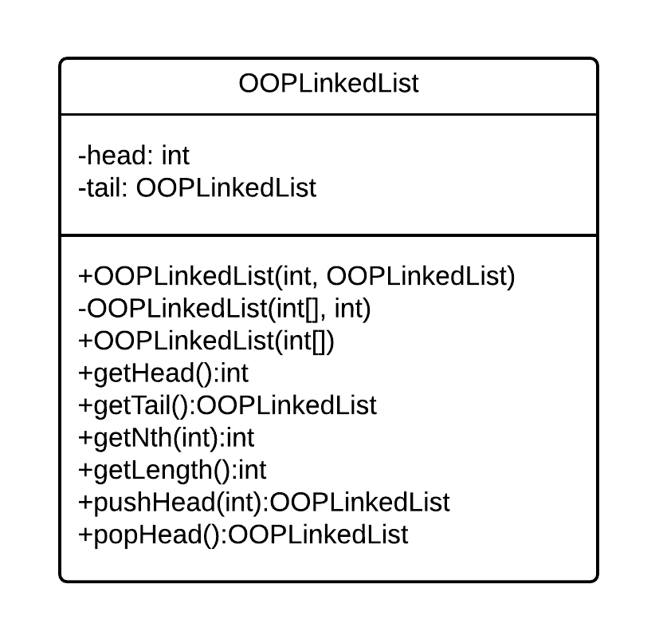

# Object-Oriented programming examples sheet 1

## Lecture 2

3. *Write Java code to test whether your Java environment performs tail-recursion optimisations or not.*

```
int add(int a, int b) {
    if (a <= 0) {
        return b;
    } else {
        return add(a-1, b+1);
    }
}
```

4. *Write a static function `lowestCommon` that takes two `long` arguments and returns the position of the first set bit in common, where position 0 is the LSB. If there is no common bit, the function should return `-1`.  For example `lowestCommon(14,25)` would be 3. Your solution should use at least one `break` statement.*

```
static int lowestCommon(long n1, long n2) {
    int jBit = 0;
    long p = (long)Math.pow(2.0f, jBit);
    while (true) {
        if (p > n1 || p > n2) {
            break;
        }
        else if (((n1 >> jBit) & 1) == 1 && ((n2 >> jBit) & 1) == 1) {
            return jBit;
        }
        else {
            jBit++;
        }
    }
    return -1;
}
```

5. *a) Why is it necessary for the assertions to have the form `assertThat(actual).isWithin(tolerance).of(expected);`?*

Due to floating point rounding errors, the actual value may not be exactly equal to the required result, so we check within a tolerance.

*b) Why have the static factory methods been put in the `Shapes` class rather than `Matrix`?*

So that the `Matrix` class is still generalised for different purposes other than making shapes.

## Lecture 3

4. *You met the idea of linked lists in FoCS.*

*a) Write a class `OOPLinkedList` that encapsulates a linked list of integers. Your class should support the addition and removal of elements from the head, querying of the head element, obtaining the nth element and computing the length of the list. You may find it useful to first define a class `OOPLinkedListElement` to represent a single list element. Do not use Generics.*

```
class OOPLinkedList {
    private int head;
    private OOPLinkedList tail;

    public OOPLinkedList(int head, OOPLinkedList tail) {
        this.head = head;
        this.tail = tail;
    }

    public OOPLinkedList(int[] l, int fromIndex) {
        if (fromIndex == l.length - 1) {
            this.head = l[fromIndex];
            this.tail = null;
        } else {
            this.head = l[fromIndex];
            this.tail = new OOPLinkedList(l, fromIndex + 1);
        }
    }

    public OOPLinkedList(int[] l) {
        OOPLinkedList newLL = new OOPLinkedList(l, 0);
        this.head = newLL.getHead();
        this.tail = newLL.getTail();
    }

    public int getHead() {
        return this.head;
    }

    public OOPLinkedList getTail() {
        return this.tail;
    }

    public int getNth(int n) {
        if (n <= 0) {
            return this.head;
        } else {
            return this.tail.getNth(n-1);
        }
    }

    public int getLength() {
        if (this.tail == null) {
            return 1;
        } else {
            return 1 + this.tail.getLength();
        }
    }

    public OOPLinkedList pushHead(int element) {
        return new OOPLinkedList(element, this);
    }

    public OOPLinkedList popHead() {
        return this.tail;
    }
}
```

*b) Give the UML class diagram for your code.*



5. *In mathematics, a set of integers refers to a collection of integers that contains no duplicates. You typically want to insert numbers into a set and query whether the set contains numbers. One approach is to store the numbers in a binary search tree.*

*a) The diagram below represents this approach. Implement it in Java, using the names of entities to decide what they should do. Make your `main` method test that the code works.*

```
class SearchSet {
    private int mElements;
    private BinaryTreeNode mHead;

    public static void main(String[] args)
    {
        SearchSet s = new SearchSet();

        System.out.println(s.contains(5));
        System.out.println(s.getNumberElements());
        s.insert(5);
        System.out.println(s.contains(5));
        System.out.println(s.getNumberElements());
    }

    public SearchSet() {
        mElements = 0;
        mHead = null;
    }

    public void insert(int element) {
        if (this.mHead == null) {
            this.mHead = new BinaryTreeNode(element);
            this.mElements++;
            return;
        }
        BinaryTreeNode checkNode = this.mHead;
        while (true) {
            if (element < checkNode.getValue()) {
                if (checkNode.getLeft() == null) {
                    checkNode.setLeft(new BinaryTreeNode(element));
                    this.mElements++;
                } else {
                    checkNode = checkNode.getLeft();
                }
            }
            else if (element > checkNode.getValue()) {
                if (checkNode.getRight() == null) {
                    checkNode.setRight(new BinaryTreeNode(element));
                    this.mElements++;
                } else {
                    checkNode = checkNode.getRight();
                }
            } else {
                return;
            }
        }
    }

    public int getNumberElements() {
        return this.mElements;
    }

    public boolean contains(int element) {
        BinaryTreeNode checkNode = this.mHead;
        while (true) {
            if (checkNode == null) {
                return false;
            }
            else if (element == checkNode.getValue()) {
                return true;
            }
            else if (element < checkNode.getValue()) {
                checkNode = checkNode.getLeft();
            }
            else if (checkNode.getValue() < element) {
                checkNode = checkNode.getRight();
            }
        }
    }
}

class BinaryTreeNode {
    private int mValue;
    private BinaryTreeNode mLeft;
    private BinaryTreeNode mRight;

    public BinaryTreeNode(int value) {
        this.mValue = value;
        this.mLeft = null;
        this.mRight = null;
    }

    public int getValue() {
        return this.mValue;
    }

    public void setValue(int value) {
        this.mValue = value;
    }

    public BinaryTreeNode getLeft() {
        return this.mLeft;
    }

    public BinaryTreeNode getRight() {
        return this.mRight;
    }

    public void setLeft(BinaryTreeNode node) {
        this.mLeft = node;
    }

    public void setRight(BinaryTreeNode node) {
        this.mRight = node;
    }
}
```

*b) The `BinaryTreeNode` class can be reused for other solutions. Create a class `FunctionalArray` that uses `BinaryTreeNode` to create a functional array of `int`s. Your class should have a constructor that creates a tree of a given size (passed as an argument); a `void set(int index, int value)` method; and a `int get(int index)` method. You should make the functional array zero-indexed to match java’s normal arrays (i.e. the first element has index 0). Requests for indices outside the limits should result in an exception.*

```
class FunctionalArray {
    private int size;
    private BinaryTreeNode head;

    public FunctionalArray(int size) {
        this.size = size;
        if (size > 0) {
            this.head = new BinaryTreeNode(0);
            BinaryTreeNode end = this.head;
            for (int jNode = 0; jNode < size; jNode++) {
                end.setRight(new BinaryTreeNode(0));
                end = end.getRight();
            }
        } else {
            this.head = null;
        }
    }

    public void set(int index, int value) {
        if (index < 0 || index >= this.size) {
            throw new ArrayIndexOutOfBoundsException();
        }
        BinaryTreeNode checkNode = this.head;
        while (true) {
            if (index == 0) {
                checkNode.setValue(value);
                return;
            } else {
                checkNode = checkNode.getRight();
                index--;
            }
        }
    }

    public int get(int index) {
        if (index < 0 || index >= this.size) {
            throw new ArrayIndexOutOfBoundsException();
        }
        BinaryTreeNode checkNode = this.head;
        while (true) {
            if (index == 0) {
                return checkNode.getValue();
            } else {
                checkNode = checkNode.getRight();
                index--;
            }
        }
    }
}
```

## Lecture 4

1. *Pointers are problematic because they might not point to anything useful. A `null` reference doesn't point to anything useful. So what is the advantage of using references over pointers?*

A pointer may point to the wrong thing, rather than simply nothing useful, whereas a reference either points to something useful, or it points to nothing (`null`).

2. *Draw some simple diagrams to illustrate what happens with each step of the following Java code in memory:*

`Person p = null;`

```
Addr    Data
1000    0000    <- p
1001    
1002    
1003    
```

`Person p2 = new Person();`

```
Addr    Data
1000    0000    <- p
1001    1002    <- p2
1002    
1003    
```

`p = p2;`

```
Addr    Data
1000    1002    <- p
1001    1002    <- p2
1002    
1003    
```

`p2 = new Person();`

```
Addr    Data
1000    1002    <- p
1001    1003    <- p2
1002    
1003    
```

`p = null;`

```
Addr    Data
1000    0000    <- p
1001    1003    <- p2
1002    
1003    
```

3. *Explain the result of the following code.*
```
public static void add(int[] xy, int dx, int dy) {
    xy[0]+=dx;
    xy[1]+=dy;
}

public static void add(int x, int y, int dx, int dy) {
    x=x+dx;
    y=y+dy;
}

public static void main(String[] args) {
    int xypair[] = {1,1};

    add(xypair[0], xypair[1], 1, 1);
    System.out.println(xypair[0]+" "+xypair[1]);

    add(xypair,1,1);
    System.out.println(xypair[0]+" "+xypair[1]);
}
```

Prints `1 1`, and then `2 2`.

In the first call to `add`, the values in `xypair` are dereferenced before being passed to the function, which means that their values within the original array cannot be changed.

In the second call to `add`, a reference to the array is passed to the function, which means that the values in the array can be changed by dereferencing them.
