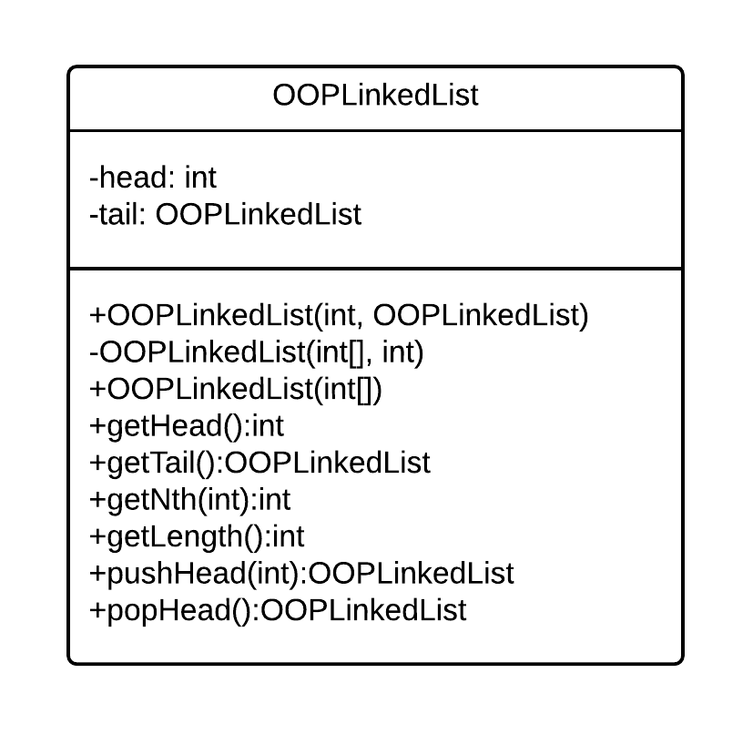

# Object-Oriented programming examples sheet 1

## Lecture 2

3. *Write Java code to test whether your Java environment performs tail-recursion optimisations or not.*

```java
int add(int a, int b) {
    if (a <= 0) {
        return b;
    } else {
        return add(a-1, b+1);
    }
}
```

4. *Write a static function `lowestCommon` that takes two `long` arguments and returns the position of the first set bit in common, where position 0 is the LSB. If there is no common bit, the function should return `-1`.  For example `lowestCommon(14,25)` would be 3. Your solution should use at least one `break` statement.*

```java
static int lowestCommon(long n1, long n2) {
    int jBit = 0;
    long p = (long)Math.pow(2.0f, jBit);
    while (true) {
        if (p > n1 || p > n2) {
            break;
        }
        else if (((n1 >> jBit) & 1) == 1 && ((n2 >> jBit) & 1) == 1) {
            return jBit;
        }
        else {
            jBit++;
        }
    }
    return -1;
}
```

5. *a) Why is it necessary for the assertions to have the form `assertThat(actual).isWithin(tolerance).of(expected);`?*

Due to floating point rounding errors, the actual value may not be exactly equal to the required result, so we check within a tolerance.

*b) Why have the static factory methods been put in the `Shapes` class rather than `Matrix`?*

So that the `Matrix` class is still generalised for different purposes other than making shapes.

## Lecture 3

4. *You met the idea of linked lists in FoCS.*

*a) Write a class `OOPLinkedList` that encapsulates a linked list of integers. Your class should support the addition and removal of elements from the head, querying of the head element, obtaining the nth element and computing the length of the list. You may find it useful to first define a class `OOPLinkedListElement` to represent a single list element. Do not use Generics.*

```java
class OOPLinkedList {
    private int head;
    private OOPLinkedList tail;

    public OOPLinkedList(int head, OOPLinkedList tail) {
        this.head = head;
        this.tail = tail;
    }

    public OOPLinkedList(int[] l, int fromIndex) {
        if (fromIndex == l.length - 1) {
            this.head = l[fromIndex];
            this.tail = null;
        } else {
            this.head = l[fromIndex];
            this.tail = new OOPLinkedList(l, fromIndex + 1);
        }
    }

    public OOPLinkedList(int[] l) {
        OOPLinkedList newLL = new OOPLinkedList(l, 0);
        this.head = newLL.getHead();
        this.tail = newLL.getTail();
    }

    public int getHead() {
        return this.head;
    }

    public OOPLinkedList getTail() {
        return this.tail;
    }

    public int getNth(int n) {
        if (n <= 0) {
            return this.head;
        } else {
            return this.tail.getNth(n-1);
        }
    }

    public int getLength() {
        if (this.tail == null) {
            return 1;
        } else {
            return 1 + this.tail.getLength();
        }
    }

    public OOPLinkedList pushHead(int element) {
        return new OOPLinkedList(element, this);
    }

    public OOPLinkedList popHead() {
        return this.tail;
    }
}
```

*b) Give the UML class diagram for your code.*



5. *In mathematics, a set of integers refers to a collection of integers that contains no duplicates. You typically want to insert numbers into a set and query whether the set contains numbers. One approach is to store the numbers in a binary search tree.*

*a) The diagram below represents this approach. Implement it in Java, using the names of entities to decide what they should do. Make your `main` method test that the code works.*

```java
class SearchSet {
    private int mElements;
    private BinaryTreeNode mHead;

    public static void main(String[] args)
    {
        SearchSet s = new SearchSet();

        System.out.println(s.contains(5));
        System.out.println(s.getNumberElements());
        s.insert(5);
        System.out.println(s.contains(5));
        System.out.println(s.getNumberElements());
    }

    public SearchSet() {
        mElements = 0;
        mHead = null;
    }

    public void insert(int element) {
        if (this.mHead == null) {
            this.mHead = new BinaryTreeNode(element);
            this.mElements++;
            return;
        }
        BinaryTreeNode checkNode = this.mHead;
        while (true) {
            if (element < checkNode.getValue()) {
                if (checkNode.getLeft() == null) {
                    checkNode.setLeft(new BinaryTreeNode(element));
                    this.mElements++;
                } else {
                    checkNode = checkNode.getLeft();
                }
            }
            else if (element > checkNode.getValue()) {
                if (checkNode.getRight() == null) {
                    checkNode.setRight(new BinaryTreeNode(element));
                    this.mElements++;
                } else {
                    checkNode = checkNode.getRight();
                }
            } else {
                return;
            }
        }
    }

    public int getNumberElements() {
        return this.mElements;
    }

    public boolean contains(int element) {
        BinaryTreeNode checkNode = this.mHead;
        while (true) {
            if (checkNode == null) {
                return false;
            }
            else if (element == checkNode.getValue()) {
                return true;
            }
            else if (element < checkNode.getValue()) {
                checkNode = checkNode.getLeft();
            }
            else if (checkNode.getValue() < element) {
                checkNode = checkNode.getRight();
            }
        }
    }
}

class BinaryTreeNode {
    private int mValue;
    private BinaryTreeNode mLeft;
    private BinaryTreeNode mRight;

    public BinaryTreeNode(int value) {
        this.mValue = value;
        this.mLeft = null;
        this.mRight = null;
    }

    public int getValue() {
        return this.mValue;
    }

    public void setValue(int value) {
        this.mValue = value;
    }

    public BinaryTreeNode getLeft() {
        return this.mLeft;
    }

    public BinaryTreeNode getRight() {
        return this.mRight;
    }

    public void setLeft(BinaryTreeNode node) {
        this.mLeft = node;
    }

    public void setRight(BinaryTreeNode node) {
        this.mRight = node;
    }
}
```

*b) The `BinaryTreeNode` class can be reused for other solutions. Create a class `FunctionalArray` that uses `BinaryTreeNode` to create a functional array of `int`s. Your class should have a constructor that creates a tree of a given size (passed as an argument); a `void set(int index, int value)` method; and a `int get(int index)` method. You should make the functional array zero-indexed to match java’s normal arrays (i.e. the first element has index 0). Requests for indices outside the limits should result in an exception.*

```java
class FunctionalArray {
    private int size;
    private BinaryTreeNode head;

    public FunctionalArray(int size) {
        this.size = size;
        if (size > 0) {
            this.head = new BinaryTreeNode(0);
            BinaryTreeNode end = this.head;
            for (int jNode = 0; jNode < size; jNode++) {
                end.setRight(new BinaryTreeNode(0));
                end = end.getRight();
            }
        } else {
            this.head = null;
        }
    }

    public void set(int index, int value) {
        if (index < 0 || index >= this.size) {
            throw new ArrayIndexOutOfBoundsException();
        }
        BinaryTreeNode checkNode = this.head;
        while (true) {
            if (index == 0) {
                checkNode.setValue(value);
                return;
            } else {
                checkNode = checkNode.getRight();
                index--;
            }
        }
    }

    public int get(int index) {
        if (index < 0 || index >= this.size) {
            throw new ArrayIndexOutOfBoundsException();
        }
        BinaryTreeNode checkNode = this.head;
        while (true) {
            if (index == 0) {
                return checkNode.getValue();
            } else {
                checkNode = checkNode.getRight();
                index--;
            }
        }
    }
}
```

## Lecture 4

1. *Pointers are problematic because they might not point to anything useful. A `null` reference doesn't point to anything useful. So what is the advantage of using references over pointers?*

A pointer may point to the wrong thing, rather than simply nothing useful, whereas a reference either points to something useful, or it points to nothing (`null`).

2. *Draw some simple diagrams to illustrate what happens with each step of the following Java code in memory:*

`Person p = null;`

```
Addr    Data
1000    0000    <- p
1001    
1002    
1003    
```

`Person p2 = new Person();`

```
Addr    Data
1000    0000    <- p
1001    1002    <- p2
1002    
1003    
```

`p = p2;`

```
Addr    Data
1000    1002    <- p
1001    1002    <- p2
1002    
1003    
```

`p2 = new Person();`

```
Addr    Data
1000    1002    <- p
1001    1003    <- p2
1002    
1003    
```

`p = null;`

```
Addr    Data
1000    0000    <- p
1001    1003    <- p2
1002    
1003    
```

3. *Explain the result of the following code.*
```java
public static void add(int[] xy, int dx, int dy) {
    xy[0]+=dx;
    xy[1]+=dy;
}

public static void add(int x, int y, int dx, int dy) {
    x=x+dx;
    y=y+dy;
}

public static void main(String[] args) {
    int xypair[] = {1,1};

    add(xypair[0], xypair[1], 1, 1);
    System.out.println(xypair[0]+" "+xypair[1]);

    add(xypair,1,1);
    System.out.println(xypair[0]+" "+xypair[1]);
}
```

Prints `1 1`, and then `2 2`

In the first call to `add`, the values in `xypair` are dereferenced before being passed to the function, which means that their values within the original array cannot be changed.

In the second call to `add`, a reference to the array is passed to the function, which means that the values in the array can be changed by dereferencing them.

## Lecture 6

3. *A programming language designer proposes adding 'selective inheritance' whereby a programmer manually specifies which methods or fields are inherited by any subclasses. Comment on this idea.*


4. *A Computer Science department keeps track of its CS students using some custom software. Each student is represented by a `Student` object that features a `pass()` method that returns true if and only if the student has all 20 ticks to pass the year. The department suddenly starts teaching NS students, who only need 10 ticks to pass. Using inheritance and polymorphism, show how the software can continue to keep all `Student` objects in one list in code without having to change any classes other than `Student`.*

5. *Complete the Chess practical exercise.*

*a) Which are the parts of the program which are poorly designed with switch statements for pieces?*

*b) In what ways is your new code easier to maintain than previously? What drawbacks have arisen from this new approach?*

6. *In the second of the shape drawing examples in lectures, we relied on the existence of an `instanceof` operator that allowed us to check which class the object really was. The built-in ability to do this is called reflection. However, not all OOP languages supprt reflection. Show how we could modify the shape classes to allow us to determine the true type without using relection.*

7. *An alternative implementation of a list to a linked list uses an array as the underlying data structure rather than a linked list.*

*a) Write down the asymptotic complexities of the array-based list methods.*

*b) Abstract your implementation of `OOPLinkedList` to extract an appropriate `OOPListinterface`.*

*c) Implement `OOPArrayList` (which should make use of your interface).*

*d) When adding items to an array-based list, rather than expanding the array by one each time, the array size is often doubled whenever expansion is required. Analyse this approach to get the asymptotic complexities associated with an insertion.*

8.

*a) Create a Java interface for a standard queue (i.e. FIFO).*

*b) Implement `OOPListQueue`, which should use two `OOPLinkedList` objects as per the queues you constructed in your FoCS course. You may need to implement a method to reverse lists.*

*c) Implement `OOPArrayQueue`. Use integer indices to keep track of the head and the tail position.*

*d) State the asymptotic complexities of the two approaches.*

9. *Imagine you have two classes: `Employee` (which embodies being an employee) and `Ninja` (which embodies being a Ninja). You need to represent an employee who is also a ninja (a common problem in the real world). By creating only one interface and only one class (`NinjaEmployee`), show how you can do this without having to copy method implementation code from either of the original classes.*

## Lecture 7

1. *Write a small Java program that demonstrates constructor chaining using a hierarchy of three classes as follows: `A` is the parent of `B` which is the parent of `C`. Modify your definition of `A` so that it has exactly one constructor that takes an argument, and show how `B` and/or `C` must be changed to work with it.*

2. *Explain why this code prints 0 rather than 7.*
```java
public class Test {

    public int x=0;

    public void Test() {
        x=7;
    }

    public static void main(String[] args) {
        Test t = new Test();
        System.out.println(t.x);
    }
}
```

3. *It is often recommended that we make classes immutable wherever possible. How would you expect this to impact garbage collection?*

4. *In Java `try...finally` blocks can be applied to any code - no `catch` is needed. The code in the `finally` block is guaranteed to run after that in the `try` block. Suggest how you could make use of this to emulate the behaviour of a destructor (which is called immediately when we indicate we are finished with the object,not at some indeterminate time later).*

5. *By experimentation or otherwise, work out what happens when the following method is executed.*
```java
public static int x() {
    try {
        return 6;
    }
    finally {
        ...
    }
}
```

## Lecture 8

1. *Using the Java API documentation or otherwise, compare the Java classes `Vector`, `LinkedList`, `ArrayList` and `TreeSet`.*

2. *Write an immutable class that represents a 3D point (x,y,z). Give it a natural order such that values are sorted in ascending order by z, then y, then x.*

3. *Complete the Sorting task*

*a) When implementing Merge Sort you will need some temporary space for the merging part of the algorithm. You will find that you are unable to create new arrays of type `T` i.e. if you try `T[] temp = new T[10]` you will get a compile error. You can use a plain `Object` array or a new `ArrayList<T>` instead. Bearing in mind the concept of type-erasure why does this fail to compile? Why does `Object[]` or `ArrayList<T>` work?*

4. *Complete the Game of Life task*

5. *Write a Java class that can store a series of student names and their corresponding marks (percentages)for the year. Your class should use at least one `Map` and should be able to output a `List` of all students (sorted alphabetically); a `List` containing the names of the top $P$% of the year as well; and the median mark.*

6. *Write a Java program that calculates the average (mean) for a list of integers. Provide three implementations:*

*1) using a regular for-loop;*

*2) using a for-each loop;*

*3) using an iterator. What are the pros and cons of each?*

## Lecture 9

1. *Explain why the following code excerpts behave differently when compiled and run (may need some research):*
```java
String s1 = new String("Hi");
String s2 = new String("Hi");
System.out.println( (s1==s2) );

String s3 = "Hi";
String s4 = "Hi";
System.out.println( (s3==s4) );
```

2. *The user of the class `Car` below wishes to maintain a collection of `Car` objects such that they can be iterated over in some specific order.*
```java
public class Car {
    private String manufacturer;
    private int age;
}
```

*a) Show how to keep the collection sorted alphabetically by the manufacturer without writing a Comparator.*

*b) Using a Comparator, show how to keep the collection sorted by {manufacturer, age}. i.e. sort first by manufacturer, and sub-sort by age.*

3. *Write a Java program that reads in a text file that contains two integers on each line, separated by a comma (i.e. two columns in a comma-separated file). Your program should print out the same set of numbers, but sorted by the first column and subsorted by the second.*

4. *The following code captures errors using return values. Rewrite it to use exceptions.*
```java
public class RetValTest {
    public static String sEmail = "";
    public static int extractCamEmail(String sentence) {
        if (sentence == null || sentence.length() == 0) {
            return -1; // Error - sentence empty
        }
        String tokens[] = sentence.split(" "); // split into tokens
        for (int i=0; i< tokens.length; i++) {
            if (tokens[i].endsWith("@cam.ac.uk")) {
                sEmail = tokens[i];
                return 0; // success
            }
        }
        return -2; // Error - no cam email found
    }

    public static void main(String[] args) {
        int ret = RetValTest.extractCamEmail("My email is rkh23@cam.ac.uk");
        if (ret == 0) {
            System.out.println("Success: "+RetValTest.sEmail);
        }
        else if (ret==-1) {
            System.out.println("Supplied string empty");
        }
        else System.out.println("No @cam address in supplied string");
    }
}
```

5. *Write a Java function that computes the square root of a `double` number using the Newton-Raphson method. Your function should make appropriate use of exceptions and assertions.*

6. *Comment on the following implementation of `pow`, which computes the power of a number:*
```java
public class Answer extends Exception {
    private int mAns;
    public Answer(int a) {
        mAns = a;
    }
    public int getAns() {
        return mAns;
    }
}

public class ExceptionTest {
    private void powaux(int x, int v, int n) throws Answer {
        if (n == 0) throw new Answer(v);
        else powaux(x,v*x,n-1);
    }
    public int pow(int x, int n) {
        try {
            powaux(x,1,n);
        }
        catch(Answer a) {
            return a.getAns();
        }
        return 0;
    }
}
```

7. *Explain in detail why Java’s Generics do not support the use of primitive types as the parameterised type? Why can you not instantiate objects of the template type in generics (i.e. why is `new T()` forbidden?)*

8. *Rewrite your `OOPListinterface` and `OOPLinkedList` class to support lists of types other than integers using Generics. e.g. `OOPLinkedList<Double>`.*

9. *Research the notion of wildcards in Java Generics. Using examples, explain the problem they solve.*

10. *Java provides the `List` interface and an abstract class that implements much of it called `AbstractList`. The intention is that you can extend `AbstractList` and just fill in a few implementation details to have a Collections-compatible structure. Write a new class `CollectionArrayList` that implements a mutable Collections-compatible Generics array-based list using this technique. Comment on any difficulties you encounter.*

## Lecture 10

1. *Give an example of how covariant arrays in Java can create runtime errors.*

2. *Compare Inner-classes, method-local classes, anonymous inner classes and lambda functions.What general advice would you give someone who is trying to choose which one to use?*

3. *Complete the Alice in Wonderland practical task*

## Lecture 11

1. *Explain the difference between the State pattern and the Strategy pattern.*

2. *In lectures the examples for the State pattern used academic rank. Explain the problems with the first solution of using direct inheritance of `Lecturer` and `Professor` from `Academic` rather than the State pattern.*

3. *A drawing program has an abstract `Shape` class. Each `Shape` object supports a `draw()` method that draws the relevant shape on the screen (as per the example in lectures). There are a series of concrete subclasses of `Shape`, including `Circle` and `Rectangle`. The drawing program keeps a list of all shapes in a `List<Shape>` object.*

*a) Should `draw()` be an abstract method?*

*b) Write Java code for the function in the main application that draws all the shapes on each screen refresh.*

*c) Show how to use the Composite pattern to allow sets of shapes to be grouped together and treatedas a single entity.*

*d) Which design pattern would you use if you wanted to extend the program to draw frames around some of the shapes? Show how this would work.*

4. *Explain how Java uses the Decorator pattern with `Reader` (yes, research will be required).*
