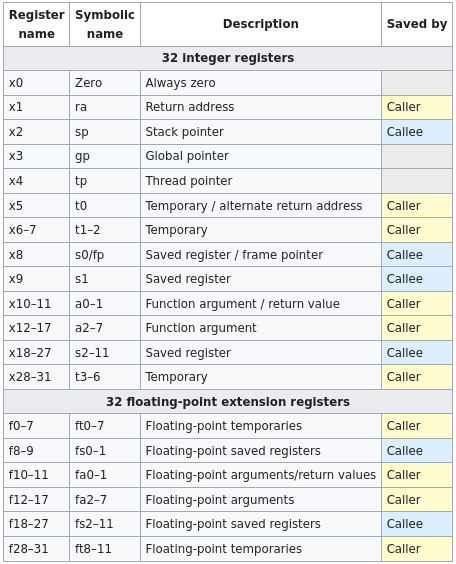
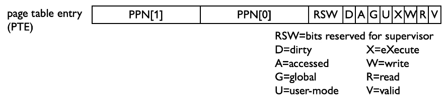

# Computer Design

## Clock Trees

On a computer chip, the clock signal is carried to each component using buffers which maintain the current over long distances. These buffers cause some delay to the signal.

In order for the clock signal to reach all components on a chip at the same time, a wiring arrangement called a **clock tree** is used, based on the *H-tree* fractal.

## RISC-V

### Registers

RISC-V has 32 32-bit integer registers in the base ISA, named `xn` where $n \in [0, 31]$ (as well as the `pc` etc.). The zero register `x0` always contains a value of `0x00000000`. The other registers are general-purpose, but the symbolic names and conventional uses are described in the following table:

### Instruction set

#### Instruction types

The instructions in the RISC-V instruction set can be grouped into six different families:

These are:
- R-type - Register-to-register
- I-type - Immediate
- U-type - Upper immediate
- S-type - Store
- B-type - Branch
- J-type - Jump

The instruction is encoded in the opcode, and possibly the `funct3` and `funct7` fields (where present). The source and destination registers are always found in the same place if they are used.

#### R-type (register-to-register)

The R-type instructions are instructions that operate only on registers, storing a function of two source registers to some destination register. They are the most numerous instruction type, due to the extra `funct7` field.

They can be used for:this
- Arithmetic operations - `ADD`, `SUB`
- Logical operations - `XOR`, `OR`, `AND`
- Shifts - `SLL`, `SRL` (logical shifts), `SRA` (arithmetic shift)
- Comparisons - `SLT` (set `rd` to $1$ if less than), `SLTU` (unsigned version)

#### I-type (immediate)

The I-type instructions have analogues for the R-type instructions, but now one of the source registers is replaced by a 12-bit sign-extended immediate. Since there is no `funct7` field, there are far fewer possible I-type instructions than R-type.

They are named the same as the R-type instructions, but with the suffix `-I`, e.g. `ADDI`, `XORI`, `SLTUI` etc. There is no `SUBI` instruction, since a negative value can simply be given as the immediate, and then added.

In addition to the R-type counterparts, there are:
- Load - `LB`, `LH`, `LW` (load byte, half-word, word), `LBU`, `LHU` (unsigned)

These instructions load the contents of memory address `rs1 + imm` into `rd`, so the immediate functions as an address offset.

The `JALR` instruction is also technically an I-type instruction.

#### U-type (upper immediate)

The U-type instructions are used to form large constants. The immediate contains the upper $20$ bits of the constant, and the lower $12$ bits appended to this are all zero.

The U-type instructions are:
- `LUI` (load upper immediate), loads the constant into `rd`
- `AUIPC` (add upper immediate to PC), stores `pc + U_imm` into `rd`

`LUI` can be combined with an `ADDI` instruction to fill out the lower $12$ bits to form a 32-bit constant.

`AUIPC` can be combined with `JALR` to provide the lower $12$ bits in a jump instruction.

#### S-type (store)

The S-type instructions work similarly to the I-type load instructions, but instead of loading the value into `rd`, the store instructions store the contents of `rs2` to the memory address at `rs1 + imm`. This difference keeps the source and destination fields consistently aligned.

The instructions are:
- Store - `SB`, `SH`, `SW` (store byte, half-word, word)

#### B-type (branch)

The B-type instructions add a (possibly negative) immediate value to the program counter if `rs1` and `rs2` satisfy some comparison, i.e. `if (comparison) pc = pc + imm`. `imm` is signed with the lowest bit left out - it is always $0$, since there are no byte-wide instructions.

The instructions are:
- Branch - `BEQ`, `BNE`, `BLT`, `BGE` (signed), `BLTU`, `BGEU` (unsigned)

The other comparisons `BGT(U)`, `BLE(U)`, can be achieved by switching the order of `rs1` and `rs2`.

#### J-type (jump)

J-type instructions perform jumps to specified memory addresses, and store a return address in a register.

The instructions are:
- `JAL` (jump and link) - store `pc + 4` (next instruction) in `rd`, and set `pc = pc + imm`.
- `JALR` (jump and link register) - same as `JAL` but set `pc = rs1 + imm`

The `JALR` instruction is technically an I-type instruction. To make a call to a subroutine, `rd` is typically set to `ra`, and for a straightforward jump, `rd` can be set to `zero` in order to ignore the return address.

#### Pseudo instructions

These are instructions that don't have a direct machine code translation, but make the assembly code more human-readable.

- `JR rs` $\implies$ `JALR zero, rs, 0`
- `CALL label` $\implies$ `JAL ra, offset` (offset is calculated by the assembler)
- `RET` $\implies$ `JALR zero, ra, 0`
- `NOP` $\implies$ `ADD zero, zero, zero`
- `MV rd, rs` $\implies$ `ADDI, rd, rs, 0`
- `BEQZ rs, offset` $\implies$ `BEQ rs, zero, offset`
- `BGT rs, rt, offset` $\implies$ `BLT, rt, rs, offset`
- `LI rd, imm` $\implies$ [depends on the size of the immediate and the assembler]

## Pipelining

1. *Fetch* - load instruction at `pc` from memory, increment `pc`
2. *Decode* - unpack the machine code, fetch operands from the registers
3. *Execute* - perform arithmetic or logic operation
4. *Branch* - update `pc` for branch/jump
5. *Memory access* - read or write data for load/store
6. *Writeback* - write result to destination register

#### Fetch

Since the register fields never move, it is efficient to fetch the register values from the register file as soon as the instruction arrives, even if we don't need them for this particular instruction.

#### Decode

The opcode is the main indicator of the operation - if we need them then we can check the `funct` fields. We also need to extract the immediate value.

#### Execute

The operands are fed into the ALU, where the function code selects the function to be performed. This produces a result as well as the status flags.

#### Branch

Branch instructions modify the program counter. Unconditional branches are often handled in parallel with the decode or execute stages. If a branch needs to go a long way, it may be paired with an unconditional jump.

#### Memory access

An address will have been computed during execute. This is sent to memory, but the response can be time consuming due to latency in the memory hierarchy: a few cycles for a cache hit, possibly hundreds for a cache miss.

#### Writeback

Result from execute or memory access is written to a register.

## Caches

TODO

## OS support

### Virtual memory

Virtual memory gives the illusion that each application has its own address space. The processor/OS translate virtual memory to corresponding physical addresses in chunks of about 4KiB - when this fails this is called a **page fault**. Virtual memory may also be mapped onto the disk if physical memory is full - this is called **paging**.

#### Page tables

To translate from virtual to physical memory, the page table stores an array of page table entries (PTEs) for each virtual page number, which contain the physical page number (if that page is present). The page table register in the CPU points to the location of the page table in physical memory.

If the page has not been allocated, or it is on disk, then the page fault handler is invoked, and the OS needs to get involved.

On a page fault, the page must be fetched from disk by the OS, which may take millions of clock cycles. We therefore try to minimise the page fault rate, by using good page replacement algorithms, and fully associative mapping, where the page table in DRAM functions as a cache for the disk.

#### Translation Lookaside Buffer (TLB)

If we didn't have the TLB, address translation would seem to require extra memory accesses to lookup the physical address. However, access to page tables has good locality, so we can use a fast cache of 16-512 PTEs within the CPU, called the TLB. This takes only about 1 clock cycle for a hit, or 10-100 for a miss (0.01-1.0% of the time).

In the event of a TLB miss, we load the required PTE from memory and retry. This may be handled in hardware or software. The page table walker searches for the PTE in memory, and if it is found it gets put into the TLB, otherwise there is an exception.

#### In RV32I

The image above is the structure of a pointer to virtual address space in RV32I. Below is the structure of a page table entry. The bottom $12$ bits are used for flags, and the top $20$ bits contain the physical page number. The size of the PTE for RISC-V is therefore $4$ bytes.

##### Multilevel page table

A one-level page table would need to be very large, with most of it unused. Instead, the page table is represented as a tree, where the PPN field may contain a page, or a pointer to a page table in the next level of the tree. If the X, R, and W bits are all zero, then that indicates that the entry is a pointer to the next level.

The base of the tree is held in the `satp` register (superviser address translation/protection).

If either of the X or R bits are set, then the page pointed to is a superpage (where the lower 10 page bits are zero) otherwise it's a regular size page.

The first PTE lookup address is given by

$$
\text{satp.PPN $\cdot$ pagesize + VPN[1] $\cdot$ PTEsize}
$$

For subsequent pages, the lookup address is

$$
\text{PPN $\cdot$ pagesize + VPN[0] $\cdot$ PTEsize}
$$

The final address within the page is the PPN with the offset from the original address, or for a superpage: PPN[1], VPN[0], and then the offset.

##### Memory Protection

Virtual memory addressing provides some extra memory protections compared to physical memory: 

- Different applications are allocated their own virtual address space - the satp register can be changed on a context switch.
- Different applications can share parts of their virtual address space - this requires OS assistance.

##### Operating modes

Also available are privileged modes and instructions. Page tables may only be accessible in supervisor mode, aka kernel mode. RISC-V has 4 different operating modes:

0. User/application (U)
1. Supervisor (S)
2. Currently reserved
3. Machine (M)

These modes control access to the address space, privileged instructions, and control-status registers. A simple embedded system is likely to only use the machine mode; a secure embedded system may have machine and user modes, and a system that runs an OS may have the supervisor mode as well.

The user mode is where applications would run, using the application binary interface (ABI).

The supervisor mode would correspond to OS level processes, using the supervisor binary interface (SBI).

Machine mode programs could be a simple BIOS-style IO system.

##### Environment call

The `ECALL` instruction is used to call into a more privileged mode, e.g. by the ABI to transition from U-mode to S-mode. This stores the `pc` of the `ECALL` instruction in the `epc` register (exception program counter), which is hidden to U-mode. Parameters for this call may be stored in the registers.

The `SRET` instruction is then used to return from S-mode back to U-mode, e.g. by the OS. This sets `pc = epc` and performs the mode change.

There is also the `cause` register, which specifies the cause of the interrupt/exception:

 
