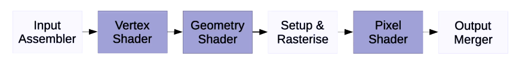

# Systems on Chip (SoCs)

An SoC is an ensemble of computing components grouped togethor onto a single chip in order to suit a particular application domain. These components may include

- Processors (CPU, GPU, DSP)
- Memory (ROM, RAM)
- Interconnects (bus, network on chip (NoC))
- External interfaces (USB, ethernet)
- Timing
- Cryptographic processors
- Machine learning processors

The precise selection of components allows efficient designs for power consumption and latency.

## Parallelism

### Flynn's taxonomy

Flynn's taxonomy is a classification of computer architectures based on the multiplicity of instruction streams and data streams. There are 4 basic classes:

- SISD - single instructions are fetched and executed on a single data stream.
- SIMD - single instructions operate on multiple streams of data at once. Often used for vectorised computing.
- MISD - multiple instructions operate on the same data stream. Often used for fault detection.
- MIMD - multiple instructions operate on multiple instruction streams at once. Used in multicore processors and distributed systems.

### Amdahl's law

Amdahl's law shows the expected performance increase of a program as the number of cores increase. It is based on the amount of time it takes for a program to process a fixed workload. For a program with a parallelisable proportion $p$, running on $n$ cores, the speedup is given by

$$
\text{speedup}(n) = \frac{1}{1-p+p/n}
$$


This implies that we need to improving the parallelism of programs is more important than the number of cores available for improving performance.

### Gustafson's Law

Gustafson's law is another measure of the speedup given by multiple cores, but this time it assumes that the workload of the program increases to fill the time freed by the speedup, in an attempt to model real-life uses. In this case, the program is given a fixed amount of time to do as much processing as it can. The speedup is then given by

$$
\text{speedup}(n) = 1 + p(n - 1)
$$


This implies that the workload that can be processed per unit time increases linearly with the number of processors, and with the amount of parallelism.

## Memory Requirements

On chip memory is much better than off-chip for latency and bandwidth, and may be cheaper. However, there may not be enough space on the chip for much memory.

One way to use off-chip memory is chip stacking, where the memory chip is placed above the SoC, with solder balls making connections between the two. This allows the SoC and memory to be tested separately before joining.

Another way is called 3D die stacking, where the silicon wafers are placed directly together with silicon vias connecting them. This approach has better latency, but the modules cannot be tested separately, so may have fewer working results. This is less of an issue as yield rates of dies increase.

### DRAM

A DRAM **cell** consists of one transistor and one capacitor, as opposed to SRAM which a more complex design. This means that it is suitable for large blocks of memory. The capacitor leaks charge over time, so it will need a periodic refresh.


The wordline selects the cell for reading or writing, and the bitline contains either the data written in or the data read out, depending on the operation.

DRAM cells are organised into **arrays**, where the rows are wordlines, and the columns are bitlines. Each array array provides a single bit to the output. The output from the bitlines needs to be amplified by *sense amps*, because the capacitors have low charge. The sense amps continue to store the most recently accessed row. A group of arrays is called a **bank**.


A group of banks is called a **device**. Each bank within the device operates independently, so multiple banks can be read and written to concurrently.


A group of devices is called a **rank**. All the devices in a rank operate together, but each rank is independent.

#### DRAM Commands

DRAM is controlled by commands sent to it by the **memory controller**, which handles DRAM accesses It converts processor requests into DRAM commands. These are:

- Row access - move data to sense amps then back.
- Column read - move data from sense amps to bus.
- Column write - move data from bus to sense amps.
- Precharge - reset sense amps and bitlines, preparing to read or write data.
- Refresh - read out data into sense amps  then restore.

#### Page policy

In order to access a different row, the sense amps must be reset.

In an close-page policy, a reset and pre-charge is performed automatically after each access. This makes sense if the memory accesses have little locality. Alternatively, an open-page policy only resets when accessing a different row. This makes sense if the memory accesses are sequential. The downside here is that the DRAM controller must then explicitly send the reset command, which is less efficient.

The memory controller must be aware of the time taken for each command, in order to minimise the time taken. These timings are often given in the name of the DRAM, e.g

*DDR4-1600 11-11-11-28*

- 1600 million transfers per second
- column address strobe $t_{CAS} = 11$ DRAM clock cycles
- row to column delay $t_{RCD} = 11$ DRAM clock cycles
- row precharge $t_{RP} = 11$ DRAM clock cycles
- row access strobe $t_{RAS} = 11$ DRAM clock cycles

The key DRAM timings are summarised below

| Timing | Description                                  |
| ------ | -------------------------------------------- |
| $t_{\text{BURST}}$ | time that a data burst takes on the data bus |
| $t_{\text{CAS}}$   | column address/access strobe - time between column access command and the start of data from the DRAM device |
| $t_{\text{CMD}}$   | Time that a command takes to go from the controller to devices |
| $t_{\text{RAS}}$   | Row address/access strobe - time between row access command and data restoration in the DRAM array |
| $t_{\text{RC}}$    | Row cycle - time interval between accesses to different rows in the same bank, so $t_{\text{RC}} = t_{\text{RAS}} + t_{\text{RP}}$ |
| $t_{\text{RCD}}$   | Row to column command delay - time between row access and data ready at the sense amplifiers |
| $t_{\text{RP}}$    | Row precharge - time for an array to be precharged for another row access |
| $t_{\text{WR}}$    | Write recovery - minimum time between a write burst and start of precharge |

## Multiple Cores

For multicore systems, there needs to be a way for the cores to communicate information. One way to do this is shared memory.

### Shared memory

With shared memory, all cores see the memory as a single address space, where writes by one core are eventually seen by others. This means that a read will get the value written by the latest write. This allows intuitive use by programmers, and simple communication.

Usually memory is very slow, so caches are employed. Caches of different levels may be shared or private. Caches at different levels may also be shared between subsets of cores, rather than all of them.

Shared caches have good use of space, and data shared between cores are faster than main memory, however one core may dominate the space. Private caches guarantee that each core has enough space, and may be faster to access.

#### Cache inclusion

Caches at different levels may or may not contain the same data as caches at other levels. There are three options for this.

- Inclusive - data in the L1 cache is guaranteed to be in the L2 cache.
- Exclusive - data in the L1 cache is guaranteed **not** to be in the L2 cache.
- Non-inclusive non-exclusive (NINE) - no guarantees.

#### Cache coherence

With a write-back cache system, it may be that a shared L2 cache is not updated by one core, and the wrong value is read by another core. Equally with a write-through cache, values written through to higher caches need to be propagated back to other cores, and write-through makes a lot of unnecessary traffic on the bus.

The solution is given by a **cache coherence protocol**, which is run by the hardware, and ensures that all cores read the most up-to-date value for each memory address. This protocol is run on each cache line, using their associated status bits.

We assume that caches can see other cores' transactions, via a **snoopy bus**, so that they can take action if necessary.

##### MSI protocol

In the MSI protocol, data items in a cache can have in one of three statuses:

- Modified - The only up-to-date copy is in this cache, the value in memory is stale.
- Shared - The copy in this cache matches the one in memory, and in other caches.
- Invalid - There is no copy in this cache.

If a core wants to perform a local read while the status of the line is M or S, then the L1 cache can simply return the data as in a normal read hit. If the line status is I, then this is a read miss, and we must initiate a bus read to bring it into the cache.

If another cache is holding the data in M state, then it flushes the data back to memory, and transitions into S state. Then the data is fed from memory back into the first cache in S state. If the data is in another cache in S state, or it isn't in any of the other caches, then the data can simply be read from memory and put in S state.

If a core makes a local write, and the status of the line is M, then we can just write it to the cache like a normal write hit. If the status of the line is S, then we send an upgrade request to the other caches, to let them know that their value is not up-to-date.

When they receive an upgrade request, any caches that hold a copy in S state transition to I. Then the writing cache transitions to M, and does a usual write hit.

If there is a local write while the status is I, then this is a write miss, and we initiate an exclusive bus read to bring it into the cache.

When they snoop an exclusive bus read, the other caches perform the same as in a regular bus read, except now they invalidate their copies after any other action.

Below is a state transition diagram summarising the above.


This protocol guarantees that if one cache has the data in state M, then all other caches must not have it (state I). It also guarantees that if one cache has data in state S, then no caches may have it in state S.

##### Cache to cache sharing

As an extension to the MSI protocol, we may also allow caches which have an item to provide it, instead of going to main memory. This is generally a speed improvement.

#### Limitations

The MSI protocol is simple, but it sends many invalidates for thread-private data, particularly in sequential programs. The solution is to add an Exclusive state, which is used when no other cores will need access to the data again, and allows local write without having to send upgrade requests.

Snoopy protocols don't scale very well, so directory-based schemes may be used instead.

#### Memory Consistency

Cache coherence ensures that the data read from an address is the same as the last data that was written to that address, but it doesn't say anything about the order in which writes (or reads) to different memory addresses will happen.

In high performance cores, it is possible that read and write operations will be reordered by the processor, resulting in unexpected behaviour.

A memory consistency model defines the order in which reads and writes from one core can be seen by others. **Relaxed consistency** is where loads and stores to different addresses can be reordered, but those to the same address cannot. We want the appearance of **sequential consistency**, where all reads and writes from one processor are seen in the order that they occur in the program.

In single threaded applications, or when we are accessing thread-private data, we don't care about the ordering of instructions. But when accessing shared data, it becomes important. Since the processors themselves may have relaxed consistency, we will need to constrain the processor to fix the ordering.

##### Memory Barriers

A memory barrier (memory fence) is an instruction which guarantees the ordering of memory instructions within a core, so that all memory operations before the barrier complete before any operations after the barrier can begin. In RISC-V, this is called `FENCE`

### Atomic operations

#### Read-Modify-Write (RMW)

An RMW instruction is the most basic class of atomic operation, which allow you to read a memory location, and write to it without being interrupted.

Atomic exchange is where a value in a register is swapped with a value in memory. This can be difficult in RISC machines, and can lead to deadlock with the cache coherence protocol. We therefore implement this in two halves.

##### Load-Linked / Store conditional (LL/SC)

In RISC-V, these instructions are called `lr` and `sc`:

```riscv
  lr r0, X
  sc r1, X
```

`lr` will load the value at `X` into `r0`, and place a reservation on X. If any write occurrs on `X`, the reservation is removed. Then, `sc` will only write the value in `r1` back to `X` if that reservation is still valid. The `r1` will then contain a $1$ on success, and a $0$ on failure.

This means that the store will only succeed if the value has not been modified since the load.

This paradigm can then be used to create other fundamental synchronisation primitives, such as fetch-and-add, spin locks,

```riscv
exchange:
  mv    r3, r0
  lr    r4, 0(r1)
  sc    r3, 0(r1)
  beqz  r3, exchange
  mv    r0, r4

fetchadd:
  lr    r4, 0(r1)
  add   r4, r4, 1
  sc    r4, 0(r1)
  beqz  r4, fetchadd
  
lock:
  lr    r4, 0(r1)
  beqz  r4, lock    # check if lock was zero previously
  mv    r3, 0
  sc    r3, 0(r1)
  beqz  r3, lock    # check that our write went through
  fence
  
unlock:
  fence
  mov   r3, 1
  sw    r3, 0(r1)
```

This implementation of the lock causes less bus traffic than if we had tried to check for nonzero after the store. We also add a `fence` so that instructions after the lock cannot be executed prematurely.

## GPU

### Graphics Pipeline

This shows a simple graphics pipeline. The blue sections are programmable, and the white sections are a fixed function in hardware.



### Execution

CPUs are designed to optimise single-threaded performance. This means that they aim to extract instruction-level parallelism.

GPUs on the other hand are designed for throughput. Individual thread performance is not critical, so there is not much focus on instruction-level parallelism, and each core is relatively simple. The number of these cores is the more important thing.

##### SIMT

SIMT is similar to SIMD from Flynn's taxonomy, but for GPUs. Each processor runs many threads concurrently, each with its own registers and memory. However, each thread executes the same instructions, but on different data items.

The difference between SIMT and SIMD is that SIMD only has one thread of control that operates on all the data items at once, whereas SIMT has multiple threads which each operate on one data item.

#### DAXPY loops

```c
double a;
for (int i = 0; i < 1024; i++) {
    Z[i] = a*X[i] + Y[i];
}
```

Above is an example of a DAXPY loop. Each iteration of the loop sets `Z = (double) aX + Y`, or "Double A X Plus Y", hence DAXPY. The key thing to notice about this loop is that each iteration is entirely independent of one another, and is rife for parallelism.

In particular, the loop exhibits a large amount of data-level parallelism. Since the iterations are all independent, but the instructions performed on each is exactly the same, we can amortise the cost of instruction fetch and decode, and execute them all at the same time.

Using SIMT, we can now parallelise this loop like so:
```c
void daxpy() {
    int i = calculate_index();
    Z[i] = a*X[i] + Y[i];
}
daxpy<<<256, 4>>>();
```
Here we call the loop 256 times, each time on 4 different threads at once, which run in a synchronised fashion. This process of running a group of threads in synchrony is called a warp, and typically runs more threads than 4, often 32.

We run into a problem if there is any conditional branching within the function body, since then the threads aren't all running the same instructions any more.

In this case, we can use conditional execution, where an instruction is only executed if some condition is true. This condition is held in a **predicte register**, which is a boolean value. If the predicate register is false, then no computation is performed by that thread. This is obviously slightly inefficient. The predicates may be set by hardware, or by specialised instructions.


If all of the threads have no predicate set, then the branching section can just be skipped, but the most inefficient case is when some threads branch and others don't. This means that code should be written to avoid this situation as much as possible.

Nested if statements can also be handled by the hardwar by using a stack of predicates.

#### Stalls

Whenever threads in the GPU need to perform a high latency operation such as accessing main memory, or if the one warp needs to wait for some others for synchronisation, there will be a stall. Usually we have to wait if we get a stall in just one of the threads in a warp.

Instead, we can switch to executing a different warp while we wait for the first one, in multithreading style. In order to support this, we need to be able to save the state of the processors in the warp, so we simply add more state to each warp.

The additional threads allow us to hide the latencies of the operations, but the extra state takes up space on the chip.

#### Scheduling

The warp scheduler is responsible for scheduling warps. The compiler guarantees that each warp is independent, with no fixed ordering, so the selection is only based on which warps have their operands ready.

### GPU Memory

There are different hierarchies of memory within the GPU, which balance the need for isolation vs shared data. Modern GPUs also have caches, which reduce the bandwidth requirements for DRAM, even though multithreading hides the latency.

Each thread is allocated private local memory, which is used for the stack frame, and register spill. This is stored in external DRAM, but can be cached.

Each multithreaded processor has its own shared memory, which can be used for communication between threads. This is stored within the processor itself, and have high bandwidth.

There is also global GPU memory which is available to all processors on the GPU, as well as the system processor. There may also be memories for constants, and textures, which can be optimised since they may be read only to the GPU.

### GPU programming

There are several well-known languages for GPU programming:

- OpenGL
- DirectX
- BrooxGPU
- CUDA
- OpenCL

We will focus on CUDA and OpenCL.

#### CUDA

CUDA is developed by Nvidia, and is a C-like language, with some C++ constructs.

The programmer must specify which code must run on the CPU, and which on the GPU, by using `__device__` and `__global__` for the GPU, and `__host__` for the CPU.

##### Terminology

Kernel - A program or function, designed to be executed in parallel
CUDA thread - A single stream of instructions from a kernel
Warp - A group of threads that are executed together
Thread block - A set of threads that execute the same kernel, and can cooperate
Grid - A set of thread blocks that execute the same kernel

Variables in GPU functions are stored in GPU memory, and can be accessed across all the GPU processors.

To call a GPU function, the dimensions (how many grids and thread blocks) are specified with `f<<<n_grids, n_blocks>>>()`. The example DAXPY code from earlier may look like this in CUDA:

```c
__device__
void daxpy(int n, double a, double *X, double *Y) {
  int i = blockIdx.x * blockDim.x + threadIdx.x;
  if (i < n)
    Y[i] = a*X[i] + Y[i];
}

__host__
int nblocks = (n + 255) / 256;
daxpy<<<nblocks, 256>>>(n, 2.0, X, Y);
```

#### OpenCL (Open Compute Language)

OpenCL is a heterogeneous programming framework, which can run on CPUs, GPUs, DSPs, FPGAs, etc. It is based on 4 different models, based on abstract architectures, which remove vendor-specific implementations.

##### Platform model

An OpenCL platform consists of one host and one or more devices. Devices are divided up into compute units, which are then divided into processing elements. The devices correspond to the GPU processors, and the compute units correspond to the threads. A system may have multiple platforms, each with different characteristics.

The function `clGetPlatformIDs` is used to discover the set of available platforms. It must be called twice, first to get the number, then you allocate the memory and call it again, when it will populate the array.

Similarly, the `clGetDeviceIDs` function gets the available devices.

##### Execution model

Defines how the host interacts with devices. For this we need a context, which is an abstract environment for the execution, which manages

- memory objects
- interaction betwen host and device
- programs and kernels on each device

There is one **command queue** for each device, which allows the host to send commands to the devices. They can be in-order, or out-of-order where commands can be rearranged for efficiency. Barriers allow queues to be synchronised.

Events are wrapper objects for commands, which specify command dependencies. Each event has a wait list, which specifies the events that the command depends on, and a status for the command (queued, ready, submitted, running, ended, complete)

##### Kernel programming model

Kernels are what actually runs on the device, and are syntactically like a C function. Each kernel contains the body of a loop. They express parallelism at a fine granularity, which allows efficient mapping to a wide range of underlying hardware.

A **work-item** is the basic unit of concurrency, analagous to a CUDA thread. Each work item is one iteration of the loop.

The number of work-items to create is expressed as an n-dimensional range (NDRange) called an index space, of either 1,2,3 dimensions.

Work items within an NDRange are grouped into smaller units called **work-groups**, with the same dimensions as the index space.

Kernels are compiled at runtime, which allows fitting to a specific device, but adds to startup time.

##### Memory model

OpenCL uses an abstract memory model, to account for different devices, which defines the memory consistency model.

Memory is either classified as host or device memory. Device memory is accessible to all kernels, and is either global, constant (like global, but can be accessed simultaneously), local, or private, similar to the memory structure mentioned earlier.

Generally OpenCL is much more verbose, but can support multiple different processor architectures and vendors.
