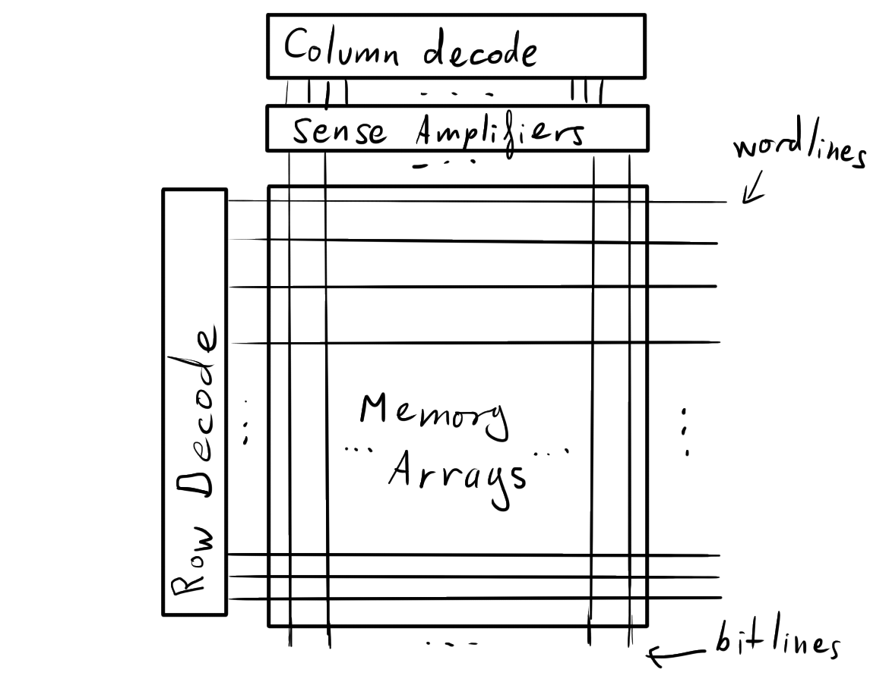

##### Ellie Makin (erm67)

## Computer Design Supervision 3

### 2008 Paper 6 Question 2

a) Reduced/Complex Instruction Set Computer. CISC architectures have complex instruction sets, often with many versions for each instruction, and focus on reducing the number of instructions per program. RISC architectures generally have a smaller instruction set, and focus on optimising the performance of that small set. This usually means that the corresponding processor architecture is much simpler, but also since the instructions are less complex, the IPS and clock speed are generally much higher, and the CPI is much lower.
In practice, the time per program may be similar, since CISC architectures require fewer instructions.

b) With variable width instructions, it is likely that an operand stack would result in higher code density, since the source and destination registers don't need to be specified in each instruction, meaning they can be much smaller widths. This may make the program run slower than a register machine, since register access is much faster than cache or memory access.

c) An accumulator machine is similar to a register machine with only one register. In this case, the source and destination registers don't have to be specified, since there is only one option, meaning that the instruction width is probably about the same as for a stack machine. There is one limitation on accumulator machines, which is that they can't hold multiple values at once, so additional load and store instructions are necessary to perform more complicated operations, reducing the code density.

### 2016 Paper 5 Question 3

a) (i)

- SISD - simple single core processor with single data stream
- SIMD - a vectorised processor, where a single instruction operates on multiple data streams at once
- MISD - multiple instruction streams operating on the same data stream, often used for fault detection in security-critical systems
- MIMD - multiple cores operating concurrently on separate data streams, used in multicore processors and distributed systems.

(ii) Amdahl's law estimates the time taken to run a program with a fixed workload on an increasing number of cores. For a program where a proportion $p$ is parallel, running on $n$ cores, the speedup factor is given by
$$
\text{speedup} = \frac{1}{1 - p + \frac p n}
$$
For the example given, this is
$$
\text{speedup} = \frac{1}{1 - 0.8 + \frac{0.8}{16}} = 4
$$

### 2018 Paper 5 Question 3

a) (i) A DRAM cell consists of a transistor, and a capacitor with one end grounded. The gate of the transistor is connected to a wordline, which enables the cell, and one of the other legs is connected to a bitline, for reading and writing to the cell.

(ii) DRAM cells are arranged into rectangular arrays, with multiple word lines and bit lines running in orthogonal directions. Several arrays together are called a bank. Multiple banks together are called a device. Each bank within a device can be operated independently. Multiple devices together are called a rank. All the devices in a rank are operated together, but separate ranks function independently.

(iii) In a closed-page buffer policy, the DRAM is reset and the sense amps are pre-charged automatically after every memory access. This benefits a sporadic, non-localised access pattern, such as pointer thasing. In an open-page buffer policy, this is only done when the row being accessed changes. This benefits a localised or sequential access pattern, such as iteration through an array.

### 2017 Paper 5 Question 3

a) A processor with multiple cores, which all access the same address space in main memory. This means that any memory access by one of the cores is guarateed to return the value most recently written to that address.

b) 

Private L2 caches:

- If one core wants to communicate with another, this must be done by way of main memory, which is very slow, and is an impediment if the cores are sharing a lot of information (writing/reading the same addresses)
- May reduce the number of cache misses if one of the cores has a tendency to pollute the shared cache, since it guarantees that each core has its own L2 cache space.
- May be faster to access a smaller cache size.

Shared L2 cache:

- Allows cores to share information quickly
- Allows cores to use cache space that others aren't using.

c) 
(i) Not valid - when one cache transitions to state M, all others become invalid
(ii) Valid - this combination will happen if the same data is read by all the caches without writing it.
(iii) Valid - this is the default combination before any cache reads or writes memory.
(iv) Not valid - for the same reason as (i)

d) 
(i) When a core writes to private data that is already in its cache, it sends a BusRdX request, despite the fact that no other caches contain the data. In sequential programs, this may cause a significant amount of unnecessary traffic. This can be overcome with the Exclusive state, as in the MESI protocol.
(ii) The data must first be flushed to main memory, and then read out again by the reading cache. This is inefficient, since it is likely faster for the other cache to just provide the requested data itself, rather than going to memory twice. This is also addressed by the MESI protocol.

### Additional questions

1. In virtual memory addressing, each application can be assigned its own virtual address space, by allocating each its own page table, and simply changing the value of the `satp` register on a context switch.

2. Operating modes are levels of privilege in the processor that control access to privileged memory addresses, instructions, and registers. In RISC-V, these are the User, Supervisor, and Machine modes, and the `ECALL` instruction is used to transition into a more privileged mode, passing arguments stored in the register file, and storing the `pc` of the ecall in the `epc` register. This may be e.g. a call to the OS for a certain operation. The OS would then return operation to user mode by using the `SRET` instruction.

3. 
- Inclusive - any data item in the L1 cache is guaranteed to be in the L2 cache.
- Exclusive - any data item in the L1 cache is guarenteed **not** to be in the L2 cache.
- NINE (neither inclusive nor exclusive) - no guarantees.

4. BusRdX is used whenever data needs to be fetched from the memory for writing, and means that all the other caches should invalidate that data. BusRd is used when there is just a simple read.
