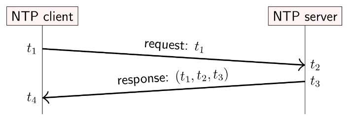

# Distributed Systems

## Introduction

As opposed to concurrent systems, distributed systems are systems spread across multiple machines in a network, which do not share an address space.

Distributed systems assume that the connections between nodes in the network may fail at any point, so we aim for *fault tolerance* - we want the system as a whole to continue working, even if some parts are faulty.

## Computer Networking

We use an abstraction of network communication, where each device is a node, and messages are passed between these nodes. This allows us to ignore the exact form that the underlying network takes.

### Reliability problems

#### Two generals

What a shitty name. Basically, two nodes connected by a message channel need to perform an action at the same time, but the time is not decided yet. They can only send messages between them, and cannot see when the other performs the action. The catch is that the messages sending process is unreliable, and the messages may not get through to the recipient.

It turns out that this problem is not solvable with complete certainty using a finite number of messages. The limitation here is referred to as **no common knowledge**.

This issue is not the same if the actions can be revoked, such as in the case of an online shop, if a card is charged but the order is not delivered, then the payment can be refunded.

#### Byzantine generals problem

BUBBUBBUBUBUByzantine. This problem is different than the previous problem. The nodes must agree to perform the action at the same time, but now:

- there may be more than 2 nodes, each connected to all others
- we assume that all the message channels are perfectly reliable
- some of the nodes are malicious, and will try to undermine the plans of the other nodes, possibly collaborating with each other.
- the non-malicious nodes must still come to an agreement.

It turns out that the number of malicious nodes must be less than $1/3$ of the total number of nodes in order for an agreement to be reached. So in order to account for one malicious node, there must be at least $4$ nodes in total.

### System models

#### Link behaviour

We may model the reliability of message passing in a network in one of these ways:

- Reliable - a message is recieved iff it is sent. The messages may be reordered though.
- Fair-loss - Messages may be lost, duplicated or reordered. If a message is sent again and again, it will eventually get through.
- Arbitrary links - A malicious adversary may interfere with messages however they like. This is technically how the internet works.

By changing the message passing protocols of the messages, we can actally effectively transform the less reliable links into more reliable ones.

If we keep retrying and ignoring duplicates in the fair loss model, it becomes a reliable link. If we use an encryption such as TLS in the arbitrary model, then we can be sure that if a message gets through then it is genuine. This obviously doesn't work if the adversary blocks all messages.

A **network partition** or netsplit is where a link between two nodes is broken, so the network may be divided in two for a period of time.

#### Node behaviour

We may model the failure of nodes in a number of ways:

- Crash-stop - A node may crash at any moment, and will stop running forever
- Crash-recovery - A node may crash at any moment, but it may resume executing at some time in the future.
- Byzantine - A node may deviate from the expected algorithm, and could do anything, including crashing or malicious behaviour.

A non-faulty node is called *correct*.

#### Timing behaviour

We may model the timing of the message passing in one of the following ways:

- Synchronous - The message latency is no greater than some known upper bound.
- Asynchronous - Messages can be delayed arbitrarily long periods of time, nodes can pause execution at any time, there are no timing guarantees.
- Partially Synchronous - The system is occasionally asynchronous for some unknown finite amounts of time, and is synchronous otherwise.

A message may be asynchronous if it is lost and must be retried, if there is network congestion, or if there is a network reconfiguration.

Similarly, a node's execution may be interrupted if there are OS scheduling issues, if some stop-the-world garbage collection needs to occur, or a page fault/swap occurs.

Real time operating systems (RTOS) provide scheduling guarantees, but most distributed systems do not use this.

#### Availability

The proportion of time that a service is available for is called the **uptime**, and is often quantified using a number of nines, e.g. "four nines" is $99.99\%$ uptime.

The **service-level objective** (SLO) is the availability that the service is aiming for in theory. The **service-level agreement** (SLA) is a contract for the actual availability of the system, which must be met.

### Faults and failures

A **failure** is where the system as a whole is not working.

A **fault** is where some part of the system is not working: a **node fault** or a **network fault**.

A **single point of failure** is a part of the network whose fault leads to failure.

**Fault tolerance** is where the system avoids failure, despite faults in some parts.

#### Fault tolerance

A **fault detector** (or failure detector) is an algorithm that detects whether another node is faulty. This may or may not be **perfect**: where it detects a fault iff a fault has occurred.

The typical implementation for fault detection in the case of a crash-stop or crash-recovery is to simply use a timeout system. However, this is not perfect unless the system is synchronous, since the test message for the timeout may be lost or delayed for other reasons, and these cannot be distinguished by the sender.

A timeout is an **eventually perfect** failure detector, which may initially label a node wrong, such as in the case of a timeout, or if it hasn't realised that the node has crashed yet, but eventually it will label a node as crashed iff it has actually crashed.

This is still enough to be able to build some useful algorithms.

### Distributed time and clocks

Distributed systems need to measure time for various puposes:

- Schedulers, timeouts, failure detectors etc.
- Performance measurements
- Log files and databases
- Data with timeout validity
- Determining the order of events

There are two types of clock used:

- Physical clocks - measure elapsed time
- Logical clocks - count numbers of events

#### Clock designs

One way to make a clock is using a piezo-electric quartz crystal, which will produce pulses of electricity at a certain frequency when a voltage is applied to it. These are mostly accurate to within 50ppm (a few minutes per year), and their accuracy varies with temperature.

A more accurate clock is the atomic clock, which uses caesium atoms. These are much more expensive, costing thousands of pounds. Alternatively, the timing information from the atomic clocks for GPS signals can be decected instead.

#### Standard timing

**International Atomic Time** (TAI) is defined based on an atomic clock so that one day is $24 \cdot 60 \cdot 60$ seconds. **Universal Coordinated Time** (UTC) is based on TAI, but occasionally adds or removes leap seconds, to account for astronomical discrepancies in the length of one day. The addition or subtraction of these seconds is decided by astronomers based on observations about the rotation of the earth.

Rather than deal directly with these complicated timings, **Unix time** measures the number of seconds since the start of January 1st 1970. 

For the most part, software ignores leap seconds when converting between unix time and UTC, but in OSes and distributed systems, they become important.

Famously on 30th June 2012, a bug in the Linux kernel caused livelock in many internet servers.

A pragmatic solution to this leap second issue is to "smear" the leap second out over the course of a day when they are changed.

#### Synchronisation

Most computers use a quartz clock to keep track of time, but this will gradually drift out of sync with standardised time. The solution is to periodically get the current time from a server which has a more accurate time source, using the **Network Time Protocol** (NTP).

##### NTP

NTP arranges the clock servers into a hierarchy:

- Stratum 0 - An accurate time source (atomic clock or GPS reciever)
- Stratum 1 - synced directly with a stratum 0 device
- Stratum 2 - synced with a stratum 1 device
- etc.

A server may contact multiple servers and discard outliers, or make multiple requests to remove random network delay.

This can reduce the latency to a few milliseconds, but may not be so good on poor connection.

The way that the protocol works is that the client sends a request to the server which contains the client timestamp $t_1$ at which it was sent. The server then records the server time $t_2$ when it recieved this message, and sends a response containing $t_1, t_2$ and the server time of the response $t_3$. The client then records the client time $t_4$ when it recieves the response.

Using these 4 timestamps, the client can deduce the total amount of time that the messages spent in the network:
$$
\delta = (t_4 - t_1) - (t_3 - t_2)
$$
since $(t_1, t_4), (t_2, t_3)$ were respectively measured with the same clocks. Then we assume that the request and response times were the same, so the client can estimate that the server time when it received the response was
$$
t_3 + \frac \delta 2
$$
The best estimate for the client's clock skew is then
$$
\begin{aligned}
\theta  &= t_3 + \frac \delta 2 - t_4 \\
        &= \frac{t_2 - t_1 + t_3 - t_4}{2}
\end{aligned}
$$

Then the client can apply the skew correction to its own clock, depending on how large the skew is:

- If $\theta < 125$ms, then **slew** the clock, meaning to slightly change the speed by up to 500 ppm, so that the clocks are in sync within about 5 mins.
- If $125 \le \theta < 1000$ms, then **step** the clock, meaning to immediately reset the clock to the right timestamp.
- If $1000 \le \theta$, then **panic**, meaning to do nothing, and leave it for a human to resolve.

This has implications for writing code, since if the clock is stepped between two time measurements, then the elapsed time may be incorrect.

The solution is to use the time from a **monotonic clock**, which is a separate clock which gives the time since e.g. the machine bootup, and is not tampered with.

#### Message ordering

If our network doesn't guarantee that messages are sent in order, we may find that messages arrive in the wrong order. Even if the clocks are synced with NTP, it may be that the error is large enough that the messages are ordered incorrectly.

We define something called a **happens-before relation**, which defines a partial ordering of **events**, where $a$ happened before $b$ iff one of the following is true:

- $a$ literally happened before $b$ on the same node
- $a$ and $b$ correspond respectively to the sending and recieving of the same message.
- there exists some message $c$ such that $a \rightarrow c$ and $c \rightarrow b$.

If neither $a \rightarrow b$ nor $b \rightarrow a$, then they are concurrent, written $a \Vert b$.

This ordering guarantees that if two events are concurrent, then neither of them can possibly have caused the other.
