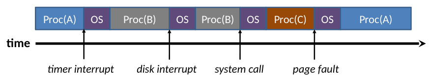
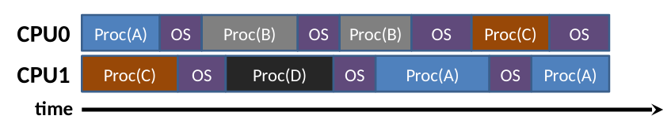

# Concurrent and Distributed Systems

## Introduction

### Concurrent vs Distributed Systems

**Concurrent** systems run multiple processes on the same machine, probably using the same memory device.

**Distributed** systems run multiple processes across multiple machines in a network, which communicate with each other.

Similar interests and concerns:
- *Scalability* of the system.
- Masking *communications latency*
- Observing/enforcing *order of execution*
- *Correctness* (lack of bugs) in presence of concurrency.

Differences:
- Underlying functionality (shared memory vs message passing)
- Distributed systems encounter *communications failure*
- Distributed systems (may) encounter *unbounded latency*
- Distributed systems have *distributed time* (not all device clocks are synchronised)

The number of cores in a computer has taken off in recent years, allowing for massively parallel systems.

## Concurrent Systems

Concurrency allows us to
- Do computation and IO at the time on a single machine.
- Improve responsiveness and simplify code structuring in genuinely concurrent applications, like games or audio applications, or e.g. garbage collection in Java.
- Enable greater performance of multiple CPUs

### Reading

- "Operating Systems, Concurrent and Distributed Software Design", Jean Bacon and Tim Harris, Addison-Wesley 2003
- "Designing Data-Intensive Applications", Martin Kleppmann, O’Reilly Media 2017
- "Modern Operating Systems", (3rd Ed), Andrew Tannenbaum, Prentice-Hall 2007
- "Java Concurrency in Practice", Brian Goetz and others, Addison-Wesley 2006

These contain more detailed implementations of algorithms discussed in this course.

### Types of concurrency

A computer may appear to be doing multiple things at once, even if it isn't really, by time sharing a single core, using process scheduling.

It may also be *true parallelism*, for example:
- Direct Memory Access (DMA) between memory and IO devices while the CPU executes code.
- Two CPUs executing code at the same time.

In the second case we have genuine concurrency on a *hardware* level. In the all of these cases we have concurrency from the *programming perspective*.

#### Single Core

**Process-OS** concurrency occurs when a process is run on a single CPU. The process runs until it blocks, or is interrupted, then the operating system runs for a while before returning to the process.

**Inter-process** concurrency refers to concurrency of multiple different processes on a single CPU. The OS will run between each process during a switch.



**Intra-process** concurrency is concurrecy of multiple threads within one process. The OS does not necessarily need to run during switches.

We will generally assume this kind of concurrency to be *non-deterministic*, and assume worst-case behaviour.

#### Multi-Core

Most modern systems have multiple CPUs, or at least have other processing elements, allowing for genuine concurrency.



The OS runs on both CPUs, and different threads of the same process can run on different CPUs as well.

### Threading methods

#### 1 to $n$ (user-level threading)

This is a fairly old-fashioned approach where the kernel only handles whole process scheduling, and a **userspace library** within the process implements $n$ threads, and handles context switching, scheduling, sychronisation, etc. The userspace library may be the JVM, or a threading library.

Advantages:
- Light threading overhead - creation/termination/switching are fast.
- Application-specific scheduling is possible - the switching may be optimized for a certain language.
- OS independent

Disadvantages:
- If one thread blocks, all threads are blocked
- There are no hardware mechanisms to stop one thread dominating the others.
- The threads cannot use multiple CPUs.

#### 1 to 1 (kernel-level threading)

A process starts with one thread, and can request more with system calls. The kernel manages context-switching, scheduling etc. of all threads.

Advantages:
- Handles problems with one thread being slow/blocking
- Easy to use multiple CPUs

Disadvantages:
- Higher overhead
- Less portable (but most OSes support this today)

#### $m$ to $n$ (hybrid threading)

The kernel provides a process with $m$ kernel threads, called **activations**, where $m$ is the number of CPUs in the machine. The userspace then schedules $n$ userspace threads (typically $n > m$) onto the available activations.

When one userspace thread blocks, the kernel can provide a fresh activation to the userspace, which sidesteps the blocking issue from user-level threading. When the thread wakes up, the kernel then hands it back to the userspace which schedules it on an activation.

This method is adaptible to the exact hardware specifications of a given machine.

It is no longer present in most mainstream OSes, and has been replaced by **Virtual Machine Monitors* (VMMs) in which each virtual CPU is an activation.

### Problems in concurrency

A **critical section** is a section of code which should never be executed by more than one thread at the same time.

In order to ensure this, we employ **mutual exclusion**, where if one thread is executing a critical section, all other threads are prohibited from entering it.

#### Mutual exclusion

One way to achieve mutual exclusion is to only allow one particular thread to ever execute the critical section, but this limits concurrency.

Another method is to disable context switching whenever the critical section is being executed, but this does not work across multiple CPUs, and can cause other problems:
- If a sleep call is made in the critical section, it can never be woken up by the timer interrupt
- If the critical section is large, the granularity of the switching may cause delays to real-time processes
- It also affects threads that aren't trying to enter the critical section.

A better method is to use a mutual exclusion lock, mutex or **spin lock** for each critical section, which is a global variable indicating whether the section is being executed or not.

For a spin lock `L`, the functions `lock(L)` and `release(L)` can be implemented as follows:
```py
def lock(L):
    while not read_and_set(L):
        continue

def unlock(L):
    L = 0
```
where `read_and_set()` is an **atomic operation**, which cannot be interrupted.

This method is still not perfect, since the looping (spinning) section can waste CPU time.
