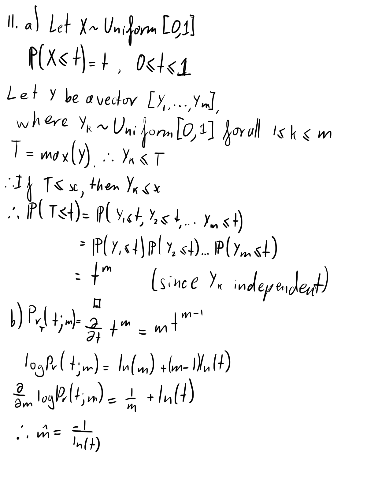
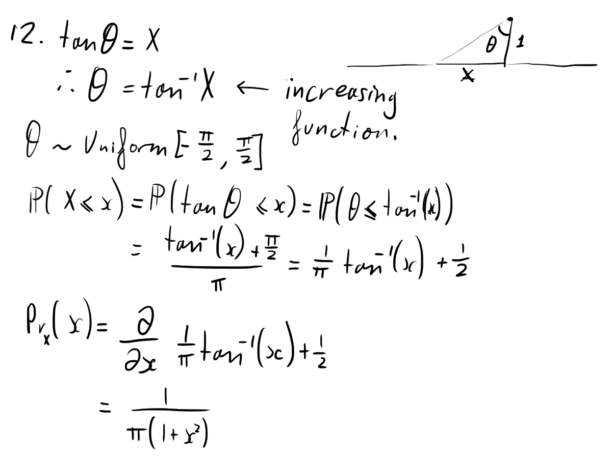
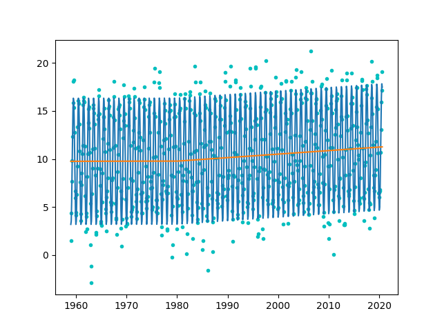

##### Ellie Makin (erm67)

### Data Science supervision 2

#### Example sheet 1 (continued)

8. We can use the linear model

$$
\textbf{temp} = \alpha\mathbf{1} + \beta_1 \sin(2 \pi \mathbf{t}) + \beta_2 \cos(2 \pi \mathbf{t}) + \sum_{d \in \text{decades}} \gamma_d \mathbf{u}_d
$$

Where $\mathbf{u}_d$ is the one-hot coded vector for each decade $d$.

We can fit it with the following python code:

```python
temp,t,u = data['temperature'], data['year'], data['decade']
decades = [f'decade_{d}s' for d in range(1950,2010,10)]
us = [np.where(u==d,1,0) for d in decades]
X = np.column.stack([t]+us)
model = sklearn.linear_model.LinearRegression()
model.fit(X, temp)
```

9. These vectors are not linearly independent, since $g_1 + g_2 = e_1 + e_2 + e_3$. A linearly independent subset that spans the same feature space can be formed by removing any one of the vectors.

10. Linear model, using the vectors from the previous question:

$$
1_{outcome="find"} \approx \alpha_f \mathbf{g_1} + \alpha_m \mathbf{g_2} + \beta_a \mathbf{e_1} + \beta_b \mathbf{e_2} + \beta_w \mathbf{e_3}
$$

The parameters of this model are not identifiable, since the feature vectors are not linearly independent, as mentioned in the previous question. We can fix this by changing the terms:

$$
1_{outcome="find"} \approx \alpha_m \mathbf{g_2} + \beta_b \mathbf{e_2} + \beta_w \mathbf{e_3} + \gamma \mathbf{1}
$$

The parameters $\alpha_m$, $\beta_b$, $\beta_w$, $\gamma$ can then be interpreted as follows:

- $\gamma$ - the baseline probability that something is found on an asian female.
- $\alpha_m$ - the difference in probability of a find if the subject is male rather than female.
- $\beta_b$ - the difference in probability of a find if the subject is black rather than asian.
- $\beta_w$ - the difference in probability of a find if the subject is white rather than asian.





13. 

```python
import scipy.optimize
import numpy as np
import pandas

url = 'https://www.cl.cam.ac.uk/teaching/2021/DataSci/data/iris.csv'
iris = pandas.read_csv(url)

SL, PL = iris['Sepal.Length'], iris['Petal.Length']
n = len(SL)

def mean_square_error(theta):
    a, b, c = theta
    g = np.exp(c)
    p = a*np.ones(n) - b*np.power(SL, g)
    e = PL - p
    return sum(e**2) / n

mle = scipy.optimize.fmin(mean_square_error, [0,0,0])
print(mle)
```
<br><br><br><br>
Output:
```
Optimization terminated successfully.
         Current function value: 0.825438
         Iterations: 143
         Function evaluations: 265
[-1.12008643 -0.11596586  0.74508047]
```

14. Linear model:

$$
\textbf{temp} = \alpha\mathbf{1} + \beta_1 \sin(2 \pi \mathbf{t}) + \beta_2 \cos(2 \pi \mathbf{t}) + \gamma_1 \mathbf{1}_{t\le1980}(\mathbf{t} - \mathbf{1980}) + \gamma_2 \mathbf{1}_{t>1980}(\mathbf{t} - \mathbf{1980})
$$

Code:

```python
import matplotlib.pyplot as plt
import numpy as np
import pandas
import sklearn.linear_model

url = 'https://www.cl.cam.ac.uk/teaching/2021/DataSci/data/climate.csv'
climate = pandas.read_csv(urlresult)
climate = climate.loc[(climate.station=='Cambridge')].copy()
climate['t'] = climate.yyyy + (climate.mm-1)/12
climate['temp'] = (climate.tmin + climate.tmax)/2

t, temp = climate['t'], climate['temp']
pi = np.pi

X = np.column_stack([
    np.sin(2*pi*t),
    np.cos(2*pi*t),
    (t<=1980)*(t-1980),
    (t>1980)*(t-1980)
])
model = sklearn.linear_model.LinearRegression()
model.fit(X, temp)
a, (b1, b2, g1, g2) = model.intercept_, model.coef_

def f(x):
    return a + g1*(x <= 1980)*(x-1980) + g2*(x>1980)*(x-1980)

plt.plot(t, temp, 'c.')
plt.plot(t, model.predict(X))
plt.plot(t, f(t))
plt.show()
```

Plot:



15. a) We would expect to see a set of points with normally distributed $y$ coordinates, with mean $0$.

b) Python code:

```python
import numpy as np
import pandas
import sklearn.linear_model

url = 'https://www.cl.cam.ac.uk/teaching/2021/DataSci/data/heteroscedasticity.csv'
data = pandas.read_csv(url)
data = data.sort_values('x')
x, y = data['x'], data['y']

X = np.column_stack([x, x**2])
model = sklearn.linear_model.LinearRegression()
model.fit(X, y)
a, (b, g) = model.intercept_, model.coef_

print([a, b, g])
```

This outputs: `[0.558842759705021, -2.1735168574388015, 0.32068203540595236]`

16. For the first model, I would expect parameters $(\alpha, \beta_1, \beta_2)=(0, 1, 1)$. In the case of the second model, the feature vectors are linearly dependent ($f_1 = f_2 + f_3$), so the parameters are not identifiable.

17. $\alpha$ is the baseline probability that the outcome is a find if the person is white. The parameters $\beta_k$ are then the difference in probability of a find for a person of race $k$ compared to a white person.
