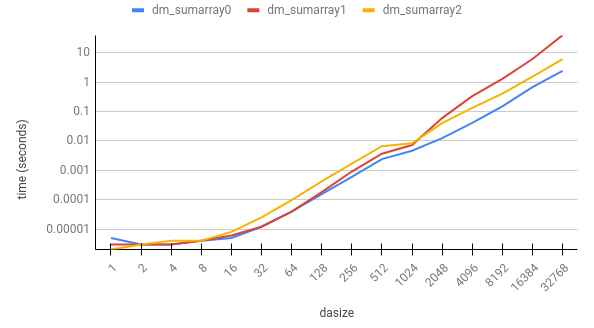

##### Ellie Makin (erm67)

# C/C++ supervision work 2

## Example sheet 1

### Lecture 5

1. **Define a nest of one or more `union` and `struct` forms where a 32-bit integer and a 64-bit integer respectively alias a 32-bit float and a 64-bit double. Demonstrate the different behaviours arising from casting between `int` and `float` types and reading a different alias from the one written.**

```c
#include <stdio.h>
#include <inttypes.h>

typedef struct s {
    union {
        int32_t i;
        float f;
    } data32;
    union {
        int64_t i;
        double d;
    } data64;
} S;

int main()
{
    S s_int = { 204648531, 18436744072709551614 };
    printf("f: %f, d: %f\n", s_int.data32.f, s_int.data64.d);
    
    S s_float = { 1122.340163525, 44555666777888.9990121 };
    printf("i32: %d, i64: %ld\n", s_float.data32.i, s_float.data64.i);

    return 0;
}
```

output:
```
$ ./a.out 
f: 0.000000, d: -7997728803029403255810972979... (cont.)
i32: 1122, i64: 44555666777889
```

Generally, unless a near-maximum integer is used, aliasing an integer to a float or double is likely to give a very small positive number, since the exponent and sign fields will remain zero. Aliasing floats to integers seems a little more consistent, in that they just get rounded to the nearest integer, although I can't think why that would be, unless I've introduced a cast in the `printf` by accident.

2. If a field of less than 4 bytes is followed by a field of 4 bytes or more in a struct, then the compiler will align the beginning of the second field with the next multiple of 4 bytes. This also applies to multiple fields whose total size is less than 4 bytes, e.g. 3 `char`s in a row.

### Lecture 6

1. 

```c
#include <stdlib.h>

struct binary_tree {
    struct binary_tree *parent;
    int value;
    struct binary_tree *left;
    struct binary_tree *right;
};
typedef struct binary_tree btree;

void heapify(int *arr, int size, btree **t)
{
    if (size <= 0)
        return;
        
    *t = calloc(1, sizeof (btree));
    (*t)->value = arr[0];
    
    for (int j = 1; j < size; j++)
    {
        // calculate depth
        int index = j+1;
        int depth = 0;
        while (index >>= 1)
            depth++;
        
        // follow path to new node
        btree *current = *t;
        int d;
        for (d = depth - 1; d > 0; d--) {
            if ((j+1) & (1 << d))
                current = current->right;
            else
                current = current->left;
        }
        
        // create new node
        if ((j+1) & (1 << d)) {
            current->right = calloc(1, sizeof(btree));
            current->right->value = arr[j];
            current->right->parent = current;
            current = current->right;
        }
        else {
            current->left = calloc(1, sizeof(btree));
            current->left->value = arr[j];
            current->left->parent = current;
            current = current->left;
        }
        
        // sift up
        int temp_int;
        while (current->parent != NULL) {
            if (current->parent->value < current->value) {
                temp_int = current->parent->value;
                current->parent->value = current->value;
                current->value = temp_int;
            }
            current = current->parent;
        }
    }
}
```

2. Arrays can be used (and typically *are* used) to represent heaps, with the children of the node at index $n$ found at indices $2n+1$ and $2n + 2$. This is likely to give a more effient implementation, since the pointer chasing in the version above is not very efficient.

3. *Can we go through this in the supervision, I spent ages on q1 already and don't feel like fiddling with this question.*


### Lecture 8

1. The figures below show the outcome of one sample test.
```csv
dasize, dm_sumarray0, dm_sumarray1, dm_sumarray2
1,      0.000005,     0.000003,     0.000002
2,      0.000003,     0.000003,     0.000003
4,      0.000003,     0.000003,     0.000004
8,      0.000004,     0.000004,     0.000004
16,     0.000005,     0.000006,     0.000008
32,     0.000012,     0.000012,     0.000025
64,     0.000039,     0.000039,     0.000096
128,    0.000155,     0.000181,     0.000421
256,    0.000595,     0.000905,     0.001676
512,    0.002402,     0.003655,     0.006567
1024,   0.004600,     0.007236,     0.008240
2048,   0.012334,     0.059464,     0.039780
4096,   0.041032,     0.332484,     0.131969
8192,   0.147864,     1.284955,     0.403113
16384,  0.668647,     6.076124,     1.524296
32768,  2.412785,     39.344240,    6.017373
```



Firstly, it is pretty obvious that `dmsumarray0` is quicker than the other two, since it is kind to the cache by keeping its memory accesses close together, and also is more pipelineable. Other than that, I can see three interesting things to say about this graph:

1. Up until `dasize` $\approx 16$, the overhead of the function calls and the granularity of the measurements is more significant than any performance increase of the functions themselves, so the results there don't mean that much to us.

2. The kink at `dasize` $= 1024$ corresponds to $1024 \times 1024 \times 4B = 4MiB$. This lines up with my L3 cache size, probably. The reason I'm not sure is because I used three different tools to inspect the cache sizes on my machine, and they said three different things (The one I trust most said this: `L1d cache: 128 KiB, L1i cache: 128 KiB, L2 cache: 1 MiB, L3 cache: 8 MiB`)

3. After that same point, `dm_sumarray1` begins to perform worse than `dm_sumarray2`. I think this is because now that the L3 cache is not able to help out as much with memory access, the lost pipelining optimisations become less of a drawback than having to retrieve values from main memory.

## 2018 P4Q1

a) (i) The function doesn't handle `y = 0`, nor does it handle `x = LONG_MIN, y = -1` (causing an overflow).

(ii)

```c
#include <stdint.h>
#include <limits.h>

int64_t divide(int64_t x, int64_t y)
{
    if (y == 0 || (x == LONG_MIN && y == -1))
        return 0;
    else
        return x / y;
}
```

b) (i) `i` is uninitialized, so the behaviour of this function is undefined, and the while loop will not stop at the null character, since it compares with `>=` instead of `>`, and this program will probably segfault.

(ii)
```c
size_t strlen(const char *s)
{
    size_t i = 0;
    while (s[i] > 0)
        i++;
    return i;
}
```
c)
```c
void rotate(int len, int *array, int k)
{
    int brrby[len]; 
    for (int j = 0; j < len; j++)
        brrby[(j + k) % len] = array[j];
    for (int j = 0; j < len; j++)
        array[j] = brrby[j];
    return;
}
```

## 2019 P4Q1

a)
```c
Node *node(int n, Node **children)
{
    Node *new_node = malloc(sizeof *new_node);
    new_node->flag = false;
    new_node->size = n;
    new_node->children = children;
    return new_node;
}
```

b)
```c
Node *example(void)
{
    Node *n_1 = node(1, malloc(1 * sizeof(Node)));
    Node *n_2 = node(2, malloc(2 * sizeof(Node)));
    n_1->children[0] = n_2;
    n_2->children[0] = n_2;
    n_2->children[1] = n_1;
    return n_1;
}
```

c)
```c
typedef struct nodelist Nodelist;
struct nodelist {
    Node *head;
    Nodelist *tail;
}
```

d)
```c
Nodelist *cons(Node*head, Nodelist *tail)
{
    Nodelist *new_list = malloc(sizeof *new_list);
    new_list->head = head;
    new_list->tail = tail;
    return new_list;
}
```

e)
```c
Nodelist *reachable(Node *node)
{
    if (node->flag == true)
        return NULL;
    node->flag = true;
    Nodelist *list = cons(node, NULL);
    for (int jChild = 0; jChild < node->size; jChild++)
    {
        Nodelist *child_list = reachable(node->children[jChild]);
        while (child_list != NULL)
        {
            list = cons(child_list->head, list);
            Nodelist *temp = child_list;
            child_list = child_list->tail;
            free(temp);
        }
    }
    return list;
}
```

f)
```c
void free_node(Node *node)
{
    Nodelist *list = reachable(node);
    while (list != NULL) {
        free(list->head->children);
        free(list->head);
        Nodelist *temp = list;
        list = list->tail;
        free(temp);
    }
}
```
